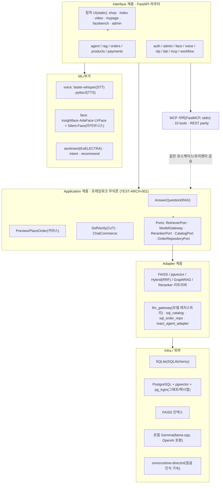
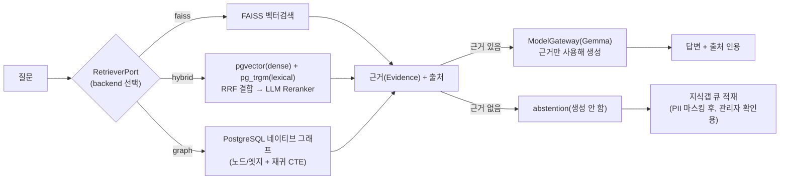
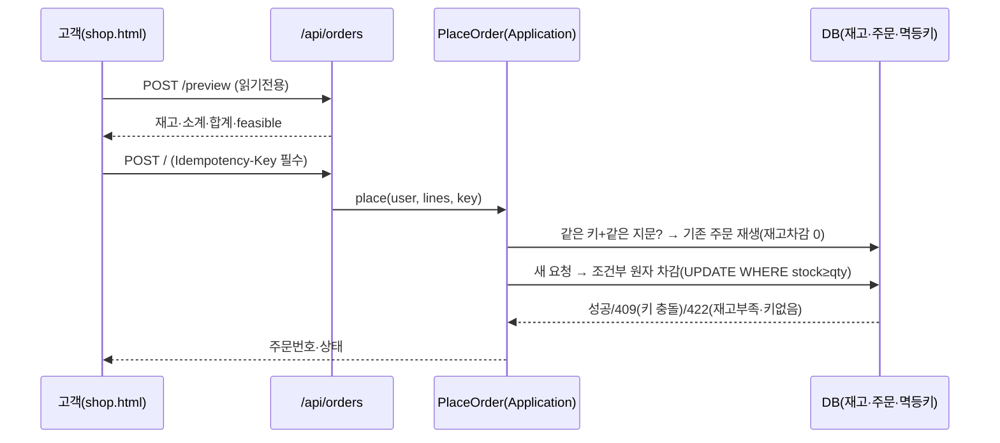
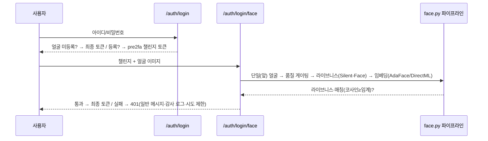
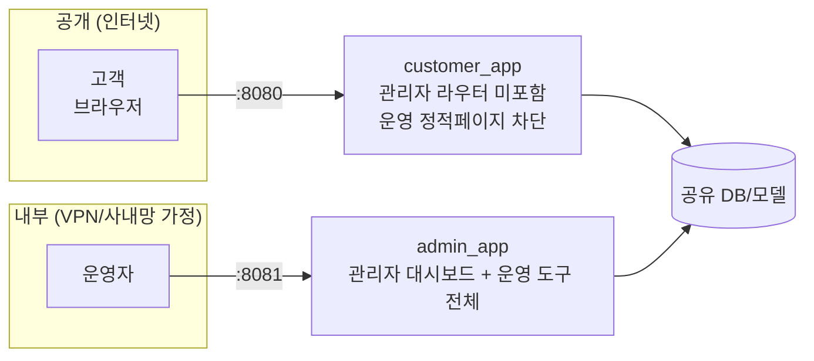

# 바로봄 AI 커머스·지식 상담 플랫폼 — 시스템 아키텍처 설계 보고서

> 제출물 요구사항 "시스템 아키텍처 설계 보고서(다이어그램 반드시 포함)" 대응 문서.
> 다이어그램은 Mermaid로 작성돼 GitHub/GitLab·호환 뷰어에서 바로 렌더된다.

## 1. 개요

RAG 기반 문서 질의응답을 코어로, 커머스 승인 루프·AI 에이전트(ReAct+CoT)·MCP·RBAC 관리자와
음성/화상 상담·얼굴 로그인 2차 인증까지 통합한 로컬 우선(무API키 기본) 플랫폼이다. 설계 원칙은
**개념적 Clean Architecture + 무폴백(RULE.md)**: 오류를 그럴듯한 가짜 결과로 대체하지 않고
정의된 타입(ConfigError/InfraError/LLMOutputError/ValidationErr…)으로 명시적으로 실패시킨다.

## 2. 계층형 아키텍처 (Clean Architecture)

핵심: **Application 계층은 FastAPI·SQLAlchemy·LangChain·openai를 import하지 않는다**(정적 스캔
테스트 TEST-ARCH-001로 강제). 유스케이스는 포트(인터페이스)에만 의존하고, 구체 기술(FAISS vs
pgvector vs 그래프)은 어댑터가 갈아끼운다 — 그래서 같은 `AnswerQuestion`이 4가지 리트리버를 모두
재사용한다.

## 3. RAG 질의응답 파이프라인

무폴백 포인트: 근거가 없으면 **생성하지 않고 abstention**(환각 억제)하고, 답 못한 질문은
PII를 마스킹해 지식갭 큐에 남겨 운영자가 보강한다.

## 4. 커머스 승인 루프 (Preview → Approve, 멱등)

`Idempotency-Key`는 필수(서버 UUID 폴백 금지) — 무폴백을 위해 계약을 의도적으로 강화했다.

## 5. 얼굴 로그인 2차 인증 (opt-in)

게이트 순서와 무폴백: 어느 단계든 실패하면 토큰을 발급하지 않으며, 얼굴 실패 시 비밀번호만으로
폴백하지 않는다. `stage`(full/pre2fa) 클레임으로 2차 인증 미완료 토큰은 보호 리소스 접근을 막는다.

## 6. 기술 스택

| 영역 | 선택 | 근거 |
|---|---|---|
| API | FastAPI | 라우터 단위 fail-closed 의존성(예: 관리자 require_admin) |
| RAG | FAISS + pgvector(RRF Hybrid) + GraphRAG + LLM Reranker | 학습 트랙 넓게, 포트로 교체식 |
| LLM | 로컬 Gemma(llama-cpp, OpenAI 호환) · 모델 레지스트리 | 무API키 기본, 모델ID 하드코딩 금지 |
| DB | SQLite(코어) + PostgreSQL/pgvector/pg_trgm(학습 트랙) | 무료 PG 한 곳에 벡터·그래프·렉시컬 통합 |
| 에이전트 | ReAct 루프 + CoT SelfVerify | 미지지 초안 차단, 인젝션 경계 방어 |
| MCP | FastMCP(stdio) 10 tools | REST와 유스케이스/프리젠터 공유(parity) |
| 음성 | faster-whisper(STT, CPU int8) · pyttsx3(TTS, SAPI5) | 로컬·무API키 |
| 얼굴 | insightface(검출/정렬) + AdaFace(인식, 기본) + Silent-Face(라이브니스) | 저품질 특화 AdaFace, DirectML 7× 가속(Iris Xe) |
| 보고서 | reportlab(PDF, 한글 폰트 임베딩) | 관리자 요약 보고서 생성/저장/인쇄 |

## 7. 고객 웹 ↔ 운영 도구 분리 (실제 프로덕션 패턴)

실무에서는 고객 사이트와 관리자 대시보드를 **별도 서비스/포트/서브도메인**으로 나누고, 관리자
쪽은 VPN·사내망·IP 화이트리스트 뒤에 둬 공개 인터넷에 노출하지 않는다. 이 프로젝트는 그 패턴을
**두 개의 ASGI 앱 + 두 포트**로 축소 재현한다.

- `customer_app`(8080): `/api/admin/*`이 **물리적으로 404**(라우터를 싣지 않음). 운영 정적 페이지
  (admin/facebench/mcp/rag/orders)도 404. 실측: 8080에서 `/api/admin/orders`→404, `/static/admin.html`
  →404, `/static/shop.html`→200.
- `admin_app`(8081): 관리자 대시보드 + 운영 도구 전체. 실측: `/api/admin/orders`→401(인증필요),
  `/static/admin.html`→200.
- 실행: `python -m scripts.run_customer_server` / `python -m scripts.run_admin_server`.
  (`run_dev_server.py`의 전체 앱은 테스트·개발 편의용.)

## 8. 관측성·보안·거버넌스

- **관측성**: 요청별 trace_id(X-Trace-ID) + run_events(요약만, 원문·PII 금지).
- **RBAC**: role을 JWT에 넣지 않고 매 요청 DB 조회(강등 즉시 반영). 관리자 라우터 전역
  `require_admin` fail-closed. 관리자 승격은 **CLI 전용**(UI 버튼 없음, 권한상승 사고 방지).
- **PII**: 지식갭·이벤트는 마스킹 후 저장, 출력 시 마스킹이 값을 바꾸면 조용히 덮지 않고 감사
  이벤트를 남긴다(무폴백).
- **거버넌스**: plans/history/reports append-only, 각 Phase마다 Codex 교차검증.

## 9. 한계 (정직 기록)

- 얼굴 라이브니스는 단일 모델(앙상블 아님)·헤드리스 환경에서 실 웹캠 라이브 정확도 미검증.
- DirectML은 Windows 전용(비Windows는 plain onnxruntime로 CPU).
- MCP stdio 임베딩 도구 지연은 우회책(근본원인 미특정).
- 시연영상은 별도(본 문서 범위 밖).

---
- 실행/재현: `python -m scripts.manage migrate|seed|ingest` → `python scripts/run_dev_server.py`
- 화면 캡처: `docs/index.html`(갤러리), `docs/screenshots/`
