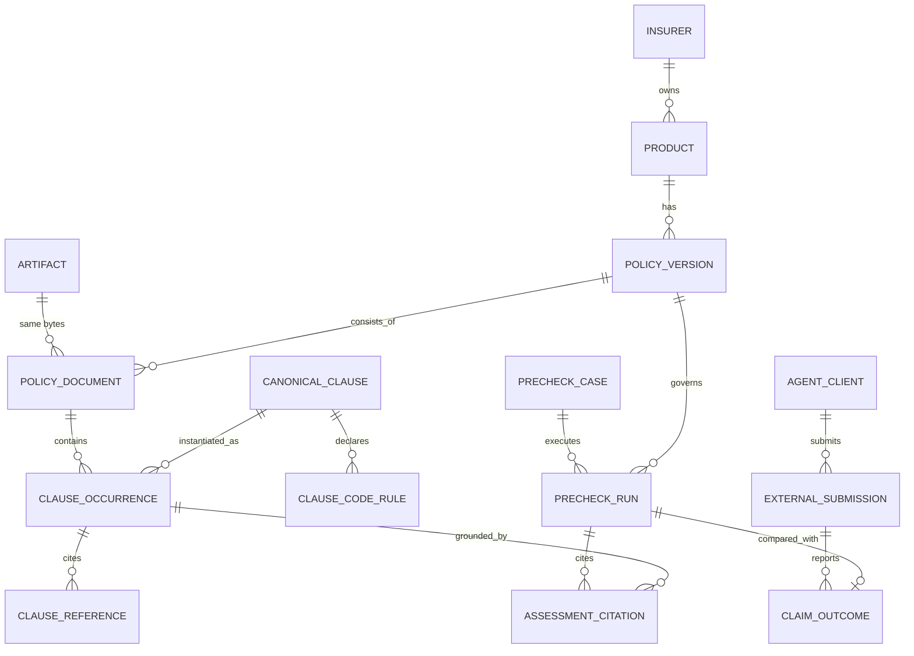

# ERD 및 스키마

대상 **김지혜(백엔드)** · 전원 참고 · 코덱스 교차검증

---

## 0. 설계의 뼈대 세 가지

이 셋이 나머지를 결정한다.

### ① 조항의 **내용**과 **수록**을 나눈다

실측: 조항 12,534개 중 서로 다른 내용은 4,860개. **75%가 중복**이고,
한 조항이 최대 **73개 문서**에 실린다.

```
canonical_clause   내용이 정체성 (content_hash UNIQUE). 본문·임베딩을 한 번만 저장
clause_occurrence  어느 문서 어느 쪽에 실렸나. 인용은 반드시 이쪽을 가리킨다
```

**임베딩은 canonical 에, 인용은 occurrence 에.**
그래야 "이 조항이 개정되면 어느 상품이 영향받나"를 물을 수 있고,
동시에 "2019년 약관 41쪽"이라고 정확히 댈 수 있다.

### ② 날짜는 **노드가 아니라 관계**에 붙는다

```
[조항 내용 abc…]  "제9조 지급보험금의 계산"
      ↑ 수록 (2015-01-01 ~ 2017-03-31)
      ↑ 수록 (2017-04-01 ~ 2021-06-30)      ← 날짜는 여기
[약관 문서]
```

조문이 개정되면 내용이 달라져 해시가 달라진다 → 자동으로 다른 노드가 된다.
**개정 이력이 저절로 보존된다.**

### ③ 외부에서 온 것은 **급을 나눈다**

약관 조항과 남의 에이전트가 준 사례를 같은 테이블·같은 인덱스에 두지 않는다.
자세한 것은 [03_에이전트_데이터_축적_설계.md](03_에이전트_데이터_축적_설계.md).

---

## 1. ERD



---

## 2. 테이블

### 2-1. 약관 쪽

| 테이블 | 핵심 컬럼 | 비고 |
|---|---|---|
| `insurer` | `id`, `name`, `slug` | 12곳 |
| `product` | `id`, `insurer_id`, `name`, `product_line` | `product_line` = standard/senior/simplified_issue |
| `policy_version` | `id`, `product_id`, `sale_start`, `sale_end`, `generation`, `date_confidence`, `generation_confidence`, `generation_review` | **판정의 단위** |
| `artifact` | `sha256` PK, `bytes`, `page_count` | 파일 실체. 같은 바이트는 한 줄 |
| `policy_document` | `id`, `policy_version_id`, `artifact_sha256`, `doc_type`, `excluded_reason`, `parse_status`, `extractor` | `doc_type` = 약관/사업방법서/상품요약서 |
| `canonical_clause` | `content_hash` PK, `title`, `body`, `embedding vector(1536)` | **75% 중복이 여기서 접힌다** |
| `clause_occurrence` | `id`, `document_id`, `content_hash`, `qualified_no`, `section`, `clause_no`, `page_from`, `page_to`, `char_offset` | **인용이 가리키는 곳** |
| `clause_reference` | `id`, `src_occurrence_id`, `raw_text`, `target_occurrence_id`, `resolution_status`, `resolver_version` | 준용 관계. 미해결도 남긴다 |
| `clause_code_rule` | `id`, `content_hash`, `code_lo`, `code_hi`, `kind`, `quote` | KCD 범위. `kind` = exclude/exception/mention |

### 2-2. 판정 쪽

| 테이블 | 핵심 컬럼 | 비고 |
|---|---|---|
| `precheck_case` | `id`, `subject_hash`, `insurer`, `enrolled_on`, `kcd_codes[]`, `created_at` | `subject_hash` — 원문 개인정보 대신 해시 |
| `precheck_run` | `id`, `case_id`, `policy_version_id`, `verdict`, `abstained`, `reason_code`, `rule_engine_version`, `extractor`, `trace_id`, `latency_ms` | **재현에 필요한 버전을 전부 담는다** |
| `assessment_citation` | `run_id`, `occurrence_id`, `quote`, `tier` | 인용. `tier` = policy_clause/external_report/statistics |

### 2-3. 외부 에이전트 쪽

| 테이블 | 핵심 컬럼 | 비고 |
|---|---|---|
| `agent_client` | `id`, `name`, `api_key_hash`, `scopes[]`, `rate_limit` | 인증·권한 |
| `external_submission` | `id`, `client_id`, `idempotency_key`, `payload jsonb`, `received_at` | **원본 그대로** 보존 |
| `claim_outcome` | `id`, `submission_id`, `insurer`, `enrolled_on`, `kcd_codes[]`, `outcome`, `verification`, `precheck_trace_id` | `verification` = unverified/self_reported/document_backed/confirmed |

---

## 3. DDL 핵심부

```sql
-- 조항 내용: 같은 내용은 한 줄
CREATE TABLE canonical_clause (
    content_hash  char(64) PRIMARY KEY,
    title         text NOT NULL DEFAULT '',
    body          text NOT NULL,
    char_length   int  NOT NULL,
    embedding     vector(1536)
);

-- 조항 수록: 인용이 가리키는 곳
CREATE TABLE clause_occurrence (
    id            bigserial PRIMARY KEY,
    document_id   bigint  NOT NULL REFERENCES policy_document(id),
    content_hash  char(64) NOT NULL REFERENCES canonical_clause(content_hash),
    qualified_no  text NOT NULL,          -- '보통약관/제9조'
    section       text NOT NULL DEFAULT '',
    clause_no     text NOT NULL,
    page_from     int  NOT NULL,
    page_to       int  NOT NULL,
    UNIQUE (document_id, qualified_no, page_from)
);
CREATE INDEX ON clause_occurrence (content_hash);

-- ★KCD 범위는 내용에 붙는다. 같은 조항이면 같은 규칙이다.
CREATE TABLE clause_code_rule (
    id            bigserial PRIMARY KEY,
    content_hash  char(64) NOT NULL REFERENCES canonical_clause(content_hash),
    code_letter   char(1)  NOT NULL,
    code_lo       int      NOT NULL,      -- 4  (F04)
    code_lo_sub   int,                    -- NULL 이면 3자리 범위
    code_hi       int      NOT NULL,
    code_hi_sub   int,
    kind          text     NOT NULL CHECK (kind IN ('exclude','exception','mention')),
    quote         text     NOT NULL DEFAULT ''
);
CREATE INDEX ON clause_code_rule (code_letter, code_lo, code_hi);

-- 판정 실행: 재현 가능해야 한다
CREATE TABLE precheck_run (
    id                  bigserial PRIMARY KEY,
    case_id             bigint REFERENCES precheck_case(id),
    policy_version_id   bigint REFERENCES policy_version(id),
    verdict             text NOT NULL,
    abstained           bool NOT NULL DEFAULT false,
    reason_code         text,
    rule_engine_version text NOT NULL,
    extractor           text NOT NULL,
    trace_id            char(16) NOT NULL,
    latency_ms          int,
    created_at          timestamptz NOT NULL DEFAULT now()
);
CREATE INDEX ON precheck_run (trace_id);
```

---

## 4. 결정 사항과 근거

| 결정 | 근거 |
|---|---|
| 별도 그래프DB(Neo4j)를 쓰지 않는다 | 준용 엣지가 약 30만개. Postgres 재귀 CTE로 충분하고, `pgvector` 와 갈라지면 "유사 조항 + 그 조항이 준용하는 조항"을 **한 번에 조인할 수 없다** |
| 임베딩은 `canonical_clause` 에만 | 75% 중복을 그대로 넣으면 임베딩 비용·인덱스가 4배가 되고, 검색 결과가 같은 내용으로 도배된다 |
| 인용은 `clause_occurrence` 를 가리킨다 | 약관 버전·쪽수를 대야 사용자가 원문을 확인한다 |
| `clause_reference` 에 미해결도 남긴다 | 조용히 버리면 "준용을 몇 개 못 따라갔나"를 셀 수 없다 |
| 개인정보는 `subject_hash` 로 | 질병기호는 민감정보다. 원문은 별도 보존기간·삭제 가능하게 |

---

## 5. 준용 순회 제한

준용을 따라갈 때 **다른 시점 버전으로 넘어가면 안 된다.**

```sql
WITH RECURSIVE walk(occ_id, depth) AS (
    SELECT id, 0 FROM clause_occurrence WHERE id = $1
  UNION ALL
    SELECT r.target_occurrence_id, w.depth + 1
    FROM walk w
    JOIN clause_reference r ON r.src_occurrence_id = w.occ_id
    JOIN clause_occurrence o ON o.id = r.target_occurrence_id
    JOIN policy_document d ON d.id = o.document_id
    WHERE w.depth < 3
      AND d.policy_version_id = $2   -- ★같은 약관 버전 안에서만
)
SELECT * FROM walk;
```

`policy_version_id` 로 묶지 않으면 2019년 약관을 보다가 2024년 조항으로 넘어간다.
