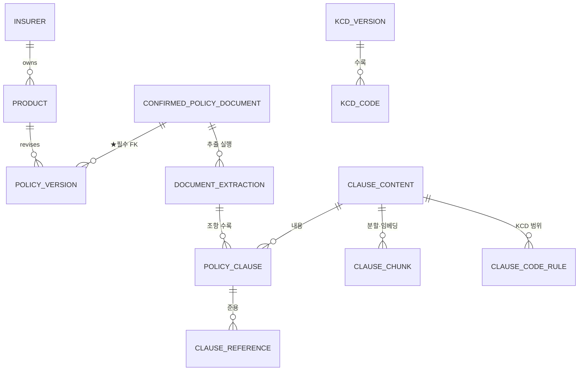
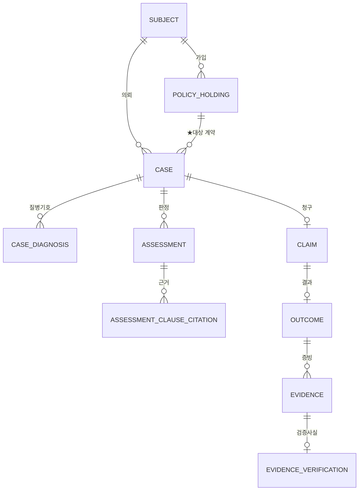

# ERD 및 스키마

대상 **김지혜(백엔드)** · 전원 참고 · **코덱스 3라운드 교차검증 완료(2026-08-02)**

> ★**2026-08-02 전면 개정.** 이전 판(15테이블 · `canonical_clause`/`clause_occurrence`)은
> 어느 설계도 아니었다. 근거와 실측은 [교차검증 리포트](../reports/2026-08-02_ERD_핸드오프_교차검증_리포트.md).
> 상위 설계: [ERD 현행 v4 통합](../plans/2026-08-02_0700_ERD_현행_v4_통합.md)

---

## 0. 먼저 읽을 것 — 지금 이 스키마로 적재하면 0행이다

| 사실 | 값 |
|---|---|
| 전처리 통과 | 1,240문서 |
| **확정(`confirmed`) 문서** | **0건** |
| 확정 매니페스트 커버리지 | 573행 / 코퍼스 1,703 (**34%**) |
| 최다 격리 사유 | "세대 판정 규칙셋이 아직 없습니다" 555건 |

`policy_version.confirmed_document_id` 가 **NOT NULL FK** 이므로
확정 문서가 없으면 약관 버전 행을 만들 수 없다 → `policy_clause` 도 0행이다.

**이건 버그가 아니라 FK가 의도대로 작동하는 것이다.**
적재 선행조건은 다음 순서다.

```
세대 규칙셋 확정 → 매니페스트를 1,367건으로 확장 → 사람이 확정(identified_by)
                                                  → confirmed_policy_document 적재
```

★**확정 절차를 우회하는 임시 경로를 만들지 않는다.** SHA별로 확정된 것부터 점진 적재는 된다.

> ⚠ 현재 판정 코드(`app/adapters/manifest_policy_resolver.py`)는 이 절차를 **우회한다.**
> `data/raw/manifests/` 를 읽고 `identification_status` 를 보지 않아 1,361건을 돌려준다.
> P0 차단 항목이다(§9).

---

## 1. 설계의 뼈대 넷

### ① 확정과 추출을 나눈다

```
confirmed_policy_document   원본 파일이 무엇이고 누가 확정했나 (sha256 · source_url · identified_by)
document_extraction         그 파일을 어느 추출기·스키마로 돌렸나 (s4_pymupdf-1.28.0 · parse_status)
```

`data/extracted/{보험사}/s{스키마}_{추출기}/` 경로 규칙이 이미 있다(CLAUDE.md §1).
v3→v4 재실행 때 산출물이 **공존해야 했다** — DB도 같아야 한다.

★**"가장 큰 `sN` 폴더를 자동 선택"하지 않는다.** 문서별로 `accepted` 인 extraction 하나를 지정한다.

### ② 내용과 수록을 나눈다

```
clause_content   내용이 정체성 (content_hash PK). 본문·임베딩·KCD 범위를 한 번만 저장
policy_clause    어느 extraction 어느 쪽에 실렸나. ★인용은 반드시 이쪽을 가리킨다
```

실측(v4 전량 1,367문서):

| 해시 정의 | 고유 | 중복률 |
|---|---:|---:|
| 현행 구현 `section+title+body` | 51,740 | 59.9% |
| `title+body` | 46,998 | 63.6% |
| **★확정 `title+content`** (조 머리 제거) | **46,022** | **64.3%** |

분모 129,086 (`page_fallback` 439 제외). 한 조항 최대 **172개 문서**에 재사용.

★**`content_hash` 에 `section` 과 조 번호를 넣지 않는다.**
수록 문맥이 내용 정체성에 섞이면 같은 조항이 다른 해시가 된다.
(현행 `to_clauses.py:242` 는 둘 다 넣고 있다 — P0 수정 대상)

### ③ ★식별키는 `ordinal` 이다. `qualified_no` 가 아니다

```
UNIQUE (document_extraction_id, ordinal)     ← 유일성
policy_clause_id (uuid)                      ← 인용이 가리키는 것
qualified_no                                 ← 표시·검색 전용. 유일하지 않다
```

실측 — `qualified_no` 는 **식별자가 될 수 없다**:

```
문서 내 qualified_no 중복      31,085건 / 1,181문서 (86%)
번호만 남긴 키 충돌            71,707건 / 1,191문서 (87%) · 한 키 최대 96조항
```

원인은 조 번호 재시작이 **아니다.** 부(section) 탐지 입도가 특약보다 굵어
서로 다른 특약 여러 개가 한 라벨 아래 뭉친다. 실제 예:

```
p.73  보험료 자동납입 특별약관/1.   "보험료 납입"              324자
p.73  보험료 자동납입 특별약관/1.   "특별약관의 체결 및 효력"   798자
```

> ★그래서 `(policy_version_id, section_id, clause_no)` 로는 **안 된다.**
> `qualified_no` 가 이미 `"{section}/{clause_no}"` 이고 section 라벨은 문서 내 유일하므로
> 그 키는 `(문서, qualified_no)` 와 동치다. 31,085건이 그대로 남는다.

★`ordinal` 은 **extraction 안에서만** 유효하다. 재추출하면 바뀐다.
추출 버전을 넘나드는 영속 식별자로 쓰지 않는다 — 그건 `content_hash` 의 몫이다.

### ④ 외부에서 온 것은 급을 나눈다

약관 조항은 회사가 공시한 계약 내용이고, 외부 보고는 주장이다.
같은 인덱스에 넣으면 검색에서 섞이고, 섞이면 인용에서 구분할 수 없다.
→ `ops.interaction_log` 에는 **`core` 로 가는 FK가 없다.** 판정 근거가 될 수 없는 구조다.

---

## 2. 물리 구조 — DB 2개

```
┌──────────── insurance_real ────────────┐   ┌──────────── insurance_demo ────────────┐
│  core.*   약관 코퍼스 (복제본)          │   │  core.*   약관 코퍼스 (복제본)          │
│  app.*    실제 케이스·증빙  ★PII 있음   │   │  app.*    합성 케이스  ★PII 없음        │
│  ops.*    운영·거버넌스                 │   │  ops.*    운영·거버넌스                 │
└────────────────────────────────────────┘   └────────────────────────────────────────┘
      /v1/cohorts  (n=0 → 미공개)                  /v1/demo/cohorts  (SYNTHETIC 표시)

  ✗ 두 DB를 UNION 하는 뷰·쿼리·롤을 만들지 않는다
  ✗ postgres_fdw · dblink 미설치
  ✗ is_synthetic boolean 컬럼으로 대체하지 않는다  ← 그게 사고의 원인
```

**테이블 수**: 정의 **27개 + 뷰 1**. 세 스키마를 두 DB에 모두 두므로 물리 **54테이블 + 뷰 2**.

> ★이전 판의 "물리 32개"는 산술 오류였다(`app` 만 복제한 계산인데 그림은 전부 복제).
> 코덱스가 지적했고 확인했다.

**대가 — 정직 기록**: DB를 나누면 약관 코퍼스를 두 벌 유지해야 한다.
`assessment_clause_citation` 의 FK가 같은 DB 안에 있어야 강제되기 때문이다.
조항 13만 행 규모에서 **저장 비용보다 FK 강제력이 더 가치 있다**고 판단했다.

---

## 3. 테이블 27개

| 스키마 | 수 | 테이블 |
|---|---|---|
| `core` | 12 | `insurer` · **`confirmed_policy_document`** · **`document_extraction`** · `product` · `policy_version` · **`clause_content`** · `policy_clause` · `clause_chunk` · **`clause_code_rule`** · **`clause_reference`** · `kcd_version` · `kcd_code` |
| `app` | 10 + 뷰1 | `subject` · `policy_holding` · `case` · `case_diagnosis` · `assessment` · `assessment_clause_citation` · `claim` · `outcome` · `evidence` · **`evidence_verification`** + `cohort_stats`(VIEW) |
| `ops` | 5 | `agent_client` · `interaction_log` · `consent` · `admin_user` · `audit_log` |

### 이전 판(22개)에서 달라진 것

| 변경 | 근거 |
|---|---|
| `insurer` 부활 | 같은 회사가 이미 slug(`nhlife`)와 표시명(`NH농협생명`)으로 동시에 존재하고, 크롤러·매니페스트·산출물이 갈라 쓴다. 문자열 하나가 아니다 |
| **`document_extraction` 신설** | 추출기 버전이 바뀌면 조항이 통째로 달라진다. v3→v4가 그랬다 |
| **`clause_content` 신설** | 64.3% 중복. 임베딩·KCD 범위를 129,086번이 아니라 46,022번만 계산한다 |
| **`clause_code_rule` 신설** | 약관이 KCD 코드를 직접 쓴다(§5). 담을 자리가 없었다 |
| **`clause_reference` 복원** | 준용 순회를 핵심 기능으로 약속했는데 엣지 테이블이 없었다 |
| `generation` 을 `product` → `policy_version` | 같은 상품의 개정 버전이 세대 경계를 넘는다 |

---

## 4. `core` — 12



### `core.insurer` — 12행
`id uuid PK · slug text UNIQUE · legal_name · display_name · kind(general/life) · active bool`

★`kind` 로 삼성화재(손보)와 삼성생명(생보)이 같은 코드가 되지 않게 한다.

### ★`core.confirmed_policy_document` — 확정된 문서만 들어온다

| 컬럼 | 타입 | 비고 |
|---|---|---|
| id | uuid PK | |
| **sha256** | text UNIQUE NOT NULL | 같은 파일이 두 번 들어오지 않는다 |
| **source_url** | text NOT NULL | ★근거 보존 |
| **fetched_at** | timestamptz NOT NULL | |
| http_status / bytes / pages | int | 수집 당시 사실 |
| insurer_id | uuid FK → insurer | |
| **identified_by** | uuid NOT NULL FK → `ops.admin_user` | ★**확정에는 반드시 사람 이름이 붙는다** |
| **identified_at** | timestamptz NOT NULL | |
| identification_note | text | 무엇을 근거로 확정했나 |
| license / redistributable | text / bool | 기본 `false` |

**`status` 컬럼이 없다.** 행이 존재하는 것이 곧 "확정됨"이다. enum은 `UPDATE` 로 뚫린다.

### ★`core.document_extraction` — 추출 실행 하나

| 컬럼 | 타입 | 비고 |
|---|---|---|
| id | uuid PK | |
| confirmed_document_id | uuid NOT NULL FK | |
| **extractor** | text NOT NULL | `pymupdf/1.28.0` |
| **schema_version** | int NOT NULL | 4 — UNIQUE(confirmed_document_id, schema_version, extractor) |
| **parse_status** | enum NOT NULL | `ok` / `suspect` / `failed` — ★**기본값 없음. 누락은 fail-closed** |
| failure_reason | text | `no_clause_heads` 등. **상태가 아니라 이유다** |
| **approval** | enum NOT NULL | `candidate` / `accepted` / `rejected` — 문서당 `accepted` 는 1건 |
| numbering | enum | `article` / `numbered` / `none` / `ambiguous` |
| parse_warnings | jsonb | `[{code, detail}]` |
| toc_pages | int[] | |
| unmapped_glyph_count · control_removed_count · pua_removed_count | int NOT NULL DEFAULT 0 | ★**세어서 보고할 수 있어야** 하므로 컬럼 |
| unmapped_glyphs | jsonb | `{"U+F02BA": 1207, …}` |
| extracted_at | timestamptz | |

실측 분포 (1,367 extraction):

```
parse_status  ok 1,240 · suspect 108 · failed(no_clause_heads) 19
numbering     article 1,073 · numbered 275 · none 19
parse_warnings 길이초과 108 · 조항부족 3
unmapped_glyphs 187문서 · 23종 · 5,749회
```

> ★`unmapped_glyphs` 는 항 번호 `①②③` 가 보조 PUA로 깨진 문서를 가리킨다.
> **187문서에서 "제N항"을 특정할 수 없다.** 이걸 안 남기면 인용 정밀도의 한계를 알 수 없다.
> ⚠ 현재 `to_clauses.py` 는 이 값을 다음 단계로 **전달하지 않는다**(P0 수정 대상).

### `core.product`
`id uuid PK · insurer_id FK · product_code text UNIQUE · name · line(medical_indemnity 등)`

★불변 대리키를 PK로 쓴다. 업무 코드를 PK로 쓰지 않는다.
★**`product_code` 안에 세대를 박지 않는다** — 코드 형식이 값을 강제하게 된다.

### ★`core.policy_version` — 이 모델의 중심

| 컬럼 | 비고 |
|---|---|
| id uuid PK | |
| **confirmed_document_id** uuid **NOT NULL** FK | ★확정 문서 없이는 행을 만들 수 없다. **UNIQUE 를 걸지 않는다** — 한 문서를 여러 버전이 공유한다 |
| product_id uuid FK | |
| version_label | UNIQUE(product_id, version_label) |
| variant | `standard` / `contract_conversion` / `conversion_resume` / `child_conversion` |
| **valid_from / valid_to** | ★적용 구간. 사고일·가입일을 여기 맞춘다 |
| sales_from / sales_to | 판매 기간 |
| **date_confidence** enum NOT NULL | `exact` / `month` / `unknown` |
| **generation** smallint **NULL 허용** | 1~5세대 |
| generation_source / generation_confidence | `sale_start` / `product_code` / `manual` / `""` |

★**`generation` 을 NULL 허용으로 두는 것이 이 표에서 가장 중요하다.**
모르는 세대를 숫자로 채우면 그 오류가 판정까지 간다.
판정에서 참조할 수 있는 것은 `date_confidence <> 'unknown'` 인 버전뿐이다.

### ★`core.clause_content` — 내용은 한 번만

| 컬럼 | 비고 |
|---|---|
| **content_hash** char(64) PK | `sha256(hash_version ‖ norm(title) ‖ norm(content))` — ★**section·조 번호 제외** |
| hash_version | 정규화 규칙이 바뀌면 재현되게 |
| title / body / char_length | |

46,022행. 여기에 임베딩·KCD 범위·청크가 붙는다.

### `core.policy_clause` — 수록(occurrence). ★인용이 가리키는 곳

| 컬럼 | 비고 |
|---|---|
| id uuid PK | ★**인용은 이 ID를 가리킨다** |
| document_extraction_id uuid NOT NULL FK | |
| policy_version_id uuid FK (비정규화) | 검색 단계에서 버전 게이트가 걸리게 |
| **ordinal** int NOT NULL | **UNIQUE(document_extraction_id, ordinal)** |
| content_hash char(64) FK → clause_content | |
| qualified_no · section · clause_no | **표시·검색 전용. 유일하지 않다** |
| **kind** enum NOT NULL | `coverage`/`exclusion`/`definition`/`limit`/**`unclassified`** |
| **citeable** bool NOT NULL | `page_fallback` 은 `false` — 판정 근거로 못 쓴다 |
| locator jsonb | `{page_from, page_to, char_offset}` |
| paragraph_count · table_count · tables_on_pages jsonb | ★보장한도·자기부담금이 표에 있다 |

★**`kind` 는 v4가 채우지 못한다.** 조항 분류 필드가 산출물에 없다.
`unclassified` 로 넣고 **버전 있는 후처리**로 채운다. 없는 분류를 지어내지 않는다.

### `core.clause_chunk` — 검색 전용
`id · content_hash FK · policy_version_id(비정규화) · chunk_index · text · embedding vector(N) · token_count · chunk_type`

- `chunk_type='page_fallback'`(439청크/10문서)은 **검색엔 쓰되 판정 근거로는 쓰지 않는다.**
  → 문장으로 두지 않고 **`assessment_clause_citation` 이 `citeable=true` 인 조항만 가리키게** 강제한다.
- `embedding` 차원은 임베딩 모델 확정 후 고정한다(미확정).

### ★`core.clause_code_rule` — 약관에서 뽑은 KCD 범위
`id · content_hash FK · code_letter · code_lo/code_lo_sub · code_hi/code_hi_sub · kind(exclude/exception/mention) · quote · source_span · extractor_version · confidence`

★**`kcd_code` 와 다르다.** `kcd_code` 는 국가 표준 분류표고, 이건 **우리가 약관에서 추출한 파생물**이다.
`extractor_version` 이 붙어야 규칙이 바뀌었을 때 과거 판정이 재현된다.
구현: `app/core/domain/kcd_ranges.py`

### `core.clause_reference` — 준용
`id · src_clause_id FK · raw_text · target_clause_id FK NULL · resolution_status · resolver_version`

★**미해결도 남긴다.** 조용히 버리면 "준용을 몇 개 못 따라갔나"를 셀 수 없다.

### `core.kcd_version` / `core.kcd_code`
`kcd_version`: `label`(제8차 등) · `effective_from/to`
`kcd_code`: `kcd_version_id FK · code · name_ko` — ★**UNIQUE(kcd_version_id, code)**

처방전에 `J20.9` 만 적혀 있어도 **어느 차수의 J20.9인지**가 정해져야 약관과 맞출 수 있다.

---

## 5. ★약관이 KCD 코드를 직접 쓴다

이 프로젝트의 핵심 자산 — 외부 KCD 표 없이 면책 판정이 된다.

```
② 회사는 '한국표준질병사인분류'에 따른 다음의 의료비에 대해서는 보상하지 않습니다.
   ① 정신 및 행동장애(F04∼F99). 다만, F04∼F09, F20∼F29, F30∼F39, F40∼F48,
      F51, F90∼F98과 관련한 치료에서 발생한 …요양급여에 해당하는 의료비는 보상합니다.
   ⑤ 비만(E66)   ⑥ 요실금(N39.3, N39.4, R32)
```

| 코드 | 판정 | 근거 |
|---|---|---|
| `F32` 우울증 | 조건부 | F04∼F99 면책이나 F30∼F39 예외에 든다 |
| `E66` 비만 | 면책 | 단일 코드로 명시 |
| `N39.3` 요실금 | 면책 | 세분류 지정 |
| `N39.0` | 목록 없음 | N39.3만 면책이다. 세분류가 다르면 안 든다 |
| `S72` 대퇴골 골절 | 목록 없음 | **보장된다는 뜻이 아니다** |

> ⚠ **`표본 300문서 중 239개(80%)에 코드가 있다`는 v3·표본 기준이다.**
> v4 전량으로 재측정하지 않았다. 용량·우선순위 결정에 이 값을 쓰지 않는다.

---

## 6. `app` — 10 + 뷰 1 · **P1 계약 초안**

> ★**실행 가능한 DDL이 아니다.** `insurance_real` 은 아직 0행이고 실제 지급결과 수집 경로가 없다.
> 구현은 P1이지만, **알려진 결함은 지금 고쳐서 넘긴다** — 행이 0개인 지금이 가장 싸다.



| 테이블 | 핵심 |
|---|---|
| `subject` | `age_band · sex · retention_until · deleted_at` — ★**생년월일을 저장하지 않는다.** `(생년월일+질병코드+보험사)` 면 개인이 특정된다 |
| `policy_holding` | `subject_id · product_id · policy_version_id · enrolled_on` — 적용 약관 확정의 **결과**가 여기 저장된다 |
| `case` | `subject_id NULLABLE`(1회 익명) · **`policy_holding_id`** · `incident_on` · `channel` · `agent_client_id` |
| `case_diagnosis` | `kcd_code_id FK · ocr_confidence · user_corrected · corrected_at` — OCR 값과 **사용자 승인 값을 구분** |
| `assessment` | `policy_version_id` · `verdict`(4단) · `missing_documents jsonb` · `rule_engine_version` · `abstained` · `abstain_reason` |
| ★`assessment_clause_citation` | 아래 |
| `claim` / `outcome` | `claimed_on · claimed_amount` / `decision(approved/partial/denied) · paid_amount` |
| `evidence` | `outcome_id · doc_type · sha256 · stored_ref · consistency_checked_at · consistency_result jsonb` |
| ★`evidence_verification` | `evidence_id UNIQUE · result · **verification_method NOT NULL** · verified_by · verified_at` — **append-only** |

★`case.policy_holding_id` 를 **직접** 둔다. 이전 판은 `case → subject → policy_holding` 으로 조인해
한 subject가 계약을 여럿 가지면 **한 outcome이 여러 상품 그룹에 들어갔다**(코덱스 지적, 확인됨).

★**`consistent` 는 컬럼이고 `verified` 는 행이다.** 정합성은 재검사되는 계산 결과지만,
검증은 **사람이 책임진 불변 사실**이다.

### ★`app.assessment_clause_citation` — 가장 중요한 제약

```sql
CREATE TABLE app.assessment_clause_citation (
  assessment_id     uuid REFERENCES app.assessment(id),
  policy_clause_id  uuid,
  citeable          bool NOT NULL DEFAULT true CHECK (citeable),
  -- ★복합 FK: citeable=false 인 조항은 참조 자체가 불가능하다
  FOREIGN KEY (policy_clause_id, citeable)
      REFERENCES core.policy_clause (id, citeable),
  role       text  NOT NULL CHECK (role IN ('ground','exclusion')),
  -- 감사 재현용 스냅샷
  content_hash char(64) NOT NULL,
  quote        text     NOT NULL,
  locator      jsonb    NOT NULL,
  PRIMARY KEY (assessment_id, policy_clause_id)
);
```

**판정 근거로 인용할 수 있는 것은 `core.policy_clause` 하나뿐이다.**
상호작용 로그·FAQ·다른 사용자의 답변은 **FK가 없어서 못 넣는다.**
`page_fallback` 조항도 **복합 FK로 차단된다** — 문장이 아니라 구조다.

> 승격 경로: 지식갭 → 사람 검수 → 문서화 → `core` 등재 → **그때부터 인용 가능**.

### ★`app.cohort_stats` (VIEW) — 집계 게이트

```sql
CREATE VIEW app.cohort_stats AS
SELECT d.kcd_code_id,
       ph.product_id,
       ph.policy_version_id,                                          -- ★그룹키에 버전
       pv.generation,
       count(DISTINCT o.id)                                        AS n,
       count(DISTINCT o.id) FILTER (WHERE o.decision='approved')   AS approved_n,
       count(DISTINCT o.id) FILTER (WHERE o.decision='denied')     AS denied_n,
       'verified_real'::text                                       AS data_source
FROM app.outcome o
JOIN app.claim          c  ON c.id  = o.claim_id
JOIN app.case           ca ON ca.id = c.case_id
JOIN app.case_diagnosis d  ON d.case_id = ca.id
JOIN app.policy_holding ph ON ph.id = ca.policy_holding_id          -- ★직접 조인
JOIN core.policy_version pv ON pv.id = ph.policy_version_id
WHERE EXISTS (                                    -- ★★검증 게이트
  SELECT 1 FROM app.evidence e
  JOIN app.evidence_verification v ON v.evidence_id = e.id
  WHERE e.outcome_id = o.id AND v.result = 'verified'
)
GROUP BY 1,2,3,4;
```

★**`policy_version_id` 가 그룹키에 있어야 "약관 버전 roll-up 금지"가 지켜진다.**
이전 판은 `product_id, generation` 으로만 묶어 스스로 그 금지를 위반했다.

`insurance_demo` 는 동일하되 `data_source='synthetic'`. **두 뷰를 UNION 하지 않는다.**

API가 덧붙이는 것: `min_sample_met` · `warnings[]` · `as_of` · `match_level`.
**`warnings[]` 상시 포함**: 생존 편향(사후 보정 불가) · 소표본 · **에이전트 간 중복 미검출**.

---

## 7. `ops` — 5 · **P1 계약 초안**

| 테이블 | 핵심 | 왜 |
|---|---|---|
| `agent_client` | `api_key_hash · rate_limit_rpm · status · disabled_at` | 에이전트는 사람보다 수백 배 빠르게 호출한다 |
| ⚠ `interaction_log` | `channel · actor_kind · question_masked · answer · abstained · gap_status · promoted_ref` + ★**`source_event_id`** | ★**`core` 로 가는 FK가 없다** = 판정 근거가 될 수 없다. 중복 방지 `UNIQUE(agent_client_id, source_event_id)` 가 **여기** 걸린다 |
| `consent` | ★**`subject_id FK` 단방향** · `purpose · policy_version · granted_at · revoked_at · retention_until` | 목적별·버전별 복수 동의를 표현한다 |
| `admin_user` | `login · role` | 관리자 승격은 **CLI 전용, UI 버튼 없음** |
| ★`audit_log` | `actor_id · actor_type · action · target_table · target_id · before/after jsonb · created_at` | **누가 언제 무엇을 `verified` 로 바꿨나** |

★`subject.consent_id` 를 없애고 `consent.subject_id` 한 방향으로 둔다(이전 판은 양방향이라 모호했다).

★`audit_log` 는 **append-only 권한**으로 만든다(앱 롤에 `UPDATE`/`DELETE` 없음).
`before/after` 에 민감정보가 남을 수 있으므로 **보존기간과 redaction 규칙을 첫 행을 받기 전에 정한다.**
`subject.deleted_at` 만으로는 삭제권이 완결되지 않는다.

★**중복 방지의 1차 방어선은 ID가 아니라 `evidence_verification` 이다.**
중복 제출이 들어와도 **검수를 통과해야 `n` 이 오른다.**

---

## 8. 준용 순회 — 반드시 버전 안에 가둔다

```sql
WITH RECURSIVE walk(clause_id, depth) AS (
    SELECT id, 0 FROM core.policy_clause WHERE id = $1
  UNION ALL
    SELECT r.target_clause_id, w.depth + 1
    FROM walk w
    JOIN core.clause_reference r ON r.src_clause_id = w.clause_id
    JOIN core.policy_clause   pc ON pc.id = r.target_clause_id
    WHERE w.depth < 3
      AND pc.policy_version_id = $2   -- ★같은 약관 버전 안에서만
)
SELECT * FROM walk;
```

`policy_version_id` 로 묶지 않으면 2019년 약관을 보다가 2024년 조항으로 넘어간다.

**왜 별도 그래프DB를 안 쓰나**: 준용 엣지가 약 30만개다. Postgres 재귀 CTE로 충분하고,
`pgvector` 와 갈라지면 "유사 조항 + 그 조항이 준용하는 조항"을 **한 번에 조인할 수 없다.**

> ⚠ `상호참조 72,099개 · 2/3이 문서 밖` 은 **v3·표본 400문서** 기준이다. v4 재측정 안 했다.

---

## 9. ★P0 차단 — 문서만 고쳐서는 안 되는 것

아래는 **런타임이 이미 틀린 것**이다. 스키마를 만들기 전에 고친다.
전체 목록과 근거: [교차검증 리포트 §8](../reports/2026-08-02_ERD_핸드오프_교차검증_리포트.md)

| 위치 | 무엇을 |
|---|---|
| ★`citation_guard.py:55,113` | 번호만 남긴 키로 `set`/`dict` 를 만들어 **87% 문서에서 검증이 무력**하다. ID 우선 해소 · 후보 **목록** 유지 · 복수면 `ambiguous` 기권 |
| ★`citation_guard.py:128-141` | quote 불일치를 경고 → **폐기 사유**로 |
| ★`manifest_policy_resolver.py:34-78` | `data/raw/manifests` → **confirmed catalog**. 확정 절차 우회 중 |
| `ports/precheck.py:74-91` | `clause_id = sha12/qualified_no` → extraction/ordinal 기반 ID |
| `usecases/precheck.py:279` | 그 ID로 dedup → **서로 다른 조항이 조용히 사라진다** |
| `file_clause_store.py:108,164` | `parse_status` 기본값 `"ok"` → 실패/미상 (fail-open) |
| `file_clause_store.py:45-75` | 전역 최신 `sN` 자동선택 → 문서별 `accepted` extraction |
| `to_clauses.py:242` | 해시에서 section·조 번호 제거 + `ordinal` 출력 + `normalized.*` 전달 |

**회귀 테스트 없이 고치지 않는다** — 같은 번호 2개면 `ambiguous`, quote 불일치면 실패,
미확정 문서면 abstain.

---

## 10. 알려진 한계

| 항목 | 상태 |
|---|---|
| **확정 문서 0건** | `core` 전체가 0행. §0 |
| `suspect` 108건 | 판정 제외. 임계값 30,000자가 p95(31,017자)에 근접 — 표본 검수 후 조정 |
| section 탐지 입도 | 특약보다 굵다. 원인은 특정했으나 안 고쳤다 |
| 항 번호 `①②③` | 187문서에서 보조 PUA로 깨져 **"제N항"을 특정할 수 없다** |
| 표 의미 부착 | 셀만 뽑았다. **보장 한도·자기부담금이 표에 있다** |
| 준용 해소 | 아직 안 따라간다 |
| 임베딩 검색 | 없다. 낱말 포함 검색만 |
| 질병명→코드 | 없다. 코드 입력만 받는다 |
| `clause_chunk.embedding` 차원 | 모델 미확정 |
| 층화 표본 검수 | 안 했다(코덱스 권고 30~50건) |
| v3 표본 수치 | `72,099 상호참조` · `KCD 80%` — 재측정 안 함. **출처 병기해 남긴다** |

---

## 11. 만드는 순서

| 단계 | 내용 |
|---|---|
| **P0-a** | §9 코드 수정 + 회귀 테스트 |
| **P0-b** | DB 2개 + 롤 분리 · `core.*` 12개 · `ops.admin_user`/`audit_log`/`consent` |
| **P0-c** | 세대 규칙셋 → 매니페스트 확장 → **사람 확정** → 코퍼스 적재 |
| ★**P1 수직슬라이스** | `case`·`claim`·`outcome`·`evidence`·**`evidence_verification`**·`cohort_stats` |
| **P2** | `subject`·`policy_holding`·`assessment`·`assessment_clause_citation`·`case_diagnosis` |
| **P3** | `agent_client`·`interaction_log` |

**P1이 먼저인 이유**: 전형적 실패가 "크롤링·RAG부터 만들고 수직 슬라이스를 미루는 것"이다.
첫 통합 대상은 **증빙 1건이 검수되어 집계를 바꾸는 흐름**이어야 한다.

### P2 이후로 미룬 것
`rider` · `rider_holding` · `kcd_mapping` · `policy_application` · `api_call_log`

**미룬 것이지 해결한 것이 아니다.** 특히 `policy_application` —
갱신형 계약·중도 특약변경이 들어오면 한 계약에 본약관 버전과 특약 버전이 달라지는데,
지금 구조는 그걸 표현할 수 없다.
