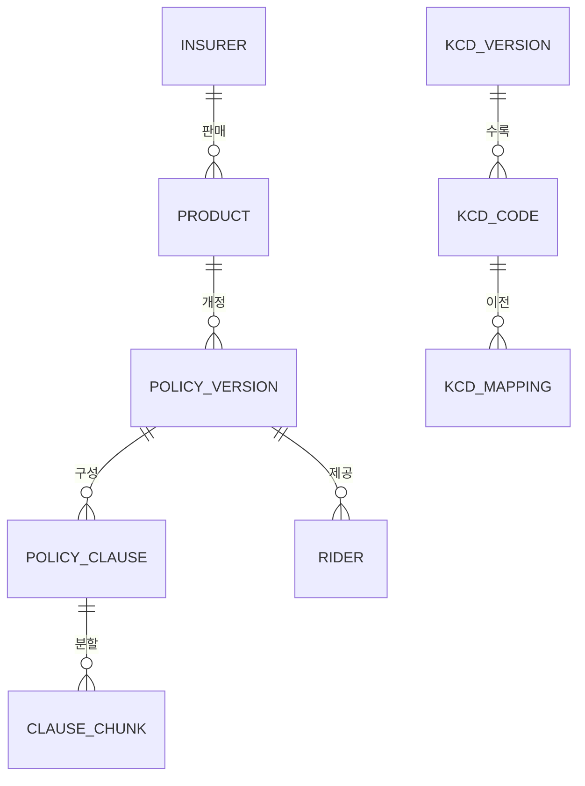
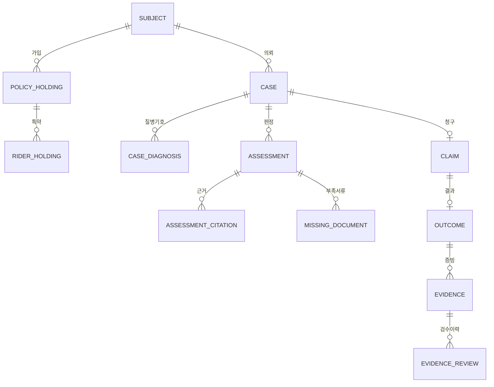
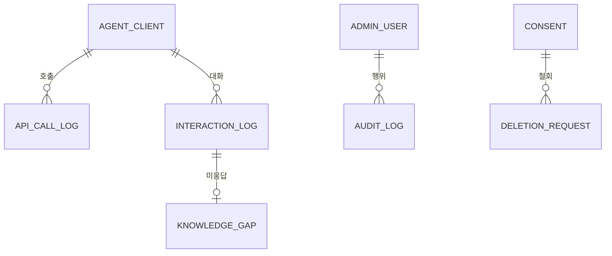

# ERD · 데이터 모델 (v4.0 부속)

> ⚠ **이 문서는 현행이 아니다.** 2026-08-02 부로
> [`ERD 현행판 v4`](2026-08-02_0700_ERD_현행_v4_통합.md) 가 대체한다.
> ★특히 아래 **§1~§6은 v1 기준 서술**이며 §0-1이 6군데를 개정했다 —
> 그 두 층을 평탄화한 것이 현행판이다. **이 문서를 직접 구현 근거로 쓰지 말 것.**
> 이력 참조용으로만 남긴다.

- 작성: 2026-07-31
- 근거: [`v4.0 전환계획`](2026-07-23_1000_v4.0_보험보장_사전검토_전환계획.md) · [`구성요소 지도`](2026-07-31_1700_시스템_구성요소_지도.md) · [`MVP 선정`](2026-07-31_1600_MVP_기능선정.md)
- 대상 DB: PostgreSQL + pgvector

---

## 0. 이 ERD가 지키려는 것 — 규칙이 아니라 구조로

지금까지 정한 원칙 중 **문서에 적어두면 사람이 어기는 것**들이 있다.
그것들을 **스키마에서 불가능하게** 만드는 것이 이 설계의 목적이다.

| 원칙 | 문서로만 두면 | 스키마로 강제하면 |
|---|---|---|
| 합성/실제를 섞지 않는다 | `WHERE is_synthetic=false` 한 번 빠뜨리면 섞인다 | **스키마 자체를 분리** — 조인하려면 권한이 없어서 못 한다 |
| 상호작용 로그를 판정 근거로 쓰지 않는다 | 나중에 "이것도 근거로 쓰면 좋겠다"가 된다 | **인용 테이블의 FK가 약관 조항뿐** — 물리적으로 못 넣는다 |
| `consistent`는 집계에 안 들어간다 | 집계 쿼리 하나 잘못 쓰면 들어간다 | **집계 뷰 정의에 `status='verified'`를 박는다** |
| 확인 안 된 약관으로 판정하지 않는다 | 급하면 쓰게 된다 | `identification_status='confirmed'` 아니면 판정이 참조 못 하게 |

---

## 0-1. ★v2 개정 — 코덱스 독립설계 반영 (2026-07-31)

코덱스에게 **이 문서를 보여주지 않고** 같은 제약으로 ERD를 독립 설계하게 했다.
결과가 **여러 지점에서 이 초안보다 강했고**, 아래를 개정한다.

| # | 초안(v1) | 개정(v2) | 왜 |
|---|---|---|---|
| 1 | 스키마 분리 (`real` / `synth`) | ★**DB 자체를 분리** (`insurance_real` / `insurance_demo`), `postgres_fdw`·`dblink` 미설치 | 스키마 분리는 **두 권한을 다 가진 롤이 있으면 JOIN이 된다.** DB가 다르면 한 쿼리에서 물리적으로 못 붙인다 |
| 2 | `evidence.status` enum + CHECK | ★**가변 상태 컬럼을 없애고** `evidence_consistency` · `evidence_verification`을 **각각 불변 사실 테이블**로 | `UPDATE` 한 번이면 통계가 오염된다. 사실 테이블이면 **행이 존재하느냐**가 곧 상태이고, 코호트 기여 행이 `evidence_verification`을 **FK로 참조**해야만 생성된다 |
| 3 | `policy_version.identification_status` enum | ★`policy_version` → `confirmed_policy_document` **필수 FK** | enum은 `UPDATE`로 뚫린다. FK면 **`ambiguous_document`에서는 버전 행 자체를 만들 수 없다** |
| 4 | `assessment_citation` 한 테이블 | `assessment_clause_citation` + `assessment_evidence_citation` **둘로 분리** | 판정은 조항뿐 아니라 **검증된 증빙**도 인용해야 한다. 종류별 테이블이면 다형 참조가 끼어들 여지가 없다 |
| 5 | 버전 매칭을 애플리케이션(Resolver 포트)에서 | **constraint trigger**로 DB에서도 검사 | 애플리케이션만 막으면 마이그레이션·수동 INSERT로 뚫린다 |
| 6 | 처방전 원본 "미보존" (문서 규칙) | ★원본 컬럼 **자체를 두지 않고** `raw_destroyed_at NOT NULL` | 컬럼이 있으면 언젠가 채운다 |

### DB 분리의 대가 — 정직하게

DB를 나누면 **약관 코퍼스(조항·임베딩)를 두 벌 유지해야 한다.**
`assessment_clause_citation`의 FK가 같은 DB 안에 있어야 강제되기 때문이다.
코퍼스를 한 DB에 두고 공유하면 FK를 못 걸고, 그러면 개정 3·4의 강제력이 사라진다.

**선택: 코퍼스를 복제한다.** 약관 수십 건 규모에서 저장 비용보다 **FK 강제력이 더 가치 있다.**

### 코덱스가 지적한, 이 초안이 저지른 실수

> "증빙 테이블에 `status='verified'`만 둔다 — 상태 UPDATE 한 번으로 통계가 오염된다."

**v1이 정확히 이 실수를 했다.** `outcome.status` + CHECK 제약으로 막았다고 생각했지만,
CHECK는 "verified면 method가 있어야 한다"만 보장할 뿐 **UPDATE 자체를 막지 못한다.**

### 아직 반영 판단이 남은 것 — 코호트 매칭 키

코덱스 안: `policy_version_id + KCD 3자리 + treatment_class + rider`, **성별·나이는 키에서 제외**
(재식별 위험 + 소표본 분할).

★그런데 **팀 MVP 기능 3번이 "연령대 카테고리 통합"을 요구**한다. 보험 지급은 실제로 연령에 따라 다르다.
→ **절충**: 연령대는 **기본 키에서 빼되, 표본이 충분할 때만 켜는 선택 차원**으로 둔다.

코덱스의 다음 두 규칙은 **그대로 채택**한다.
- **표본이 모자랄 때 즉석에서 조건을 하나씩 빼지 않는다.** 미리 정의한 **단 하나의 roll-up**만 허용하고,
  무엇을 완화했는지 `match_level`로 반환한다. (즉석 완화는 p-hacking이다)
- ★**약관 버전 roll-up은 금지.** 세대·개정판을 섞는 것은 표본 부족보다 위험하다.

### 코덱스가 짚은 "가장 먼저 깨질 부분" — 채택

> **약관 적용기간 모델.** `valid_from/valid_to` · 판매기간 · 계약 갱신 · 특약 개정 · 보장개시일은
> **같은 시간축이 아니다.** 갱신형 계약이나 중도 특약 변경이 들어오면
> **한 계약에 적용되는 본약관 버전과 특약 버전이 달라질 수 있다.**

v1은 `policy_holding`에 `policy_version_id` 하나만 뒀다 — **이 경우를 표현할 수 없다.**
→ 적용 결과를 `policy_application`으로 분리해 **`matcher_version`과 함께 불변 저장**하고,
특약별 적용 버전을 따로 가질 수 있게 한다. `is_current` 같은 컬럼으로 단순화하지 않는다.

> 아래 §1~§6은 v1 기준 서술이다. **위 6개 항목은 v2가 우선한다.**

---

## 1. 스키마 3개 — ★합성/실제 물리 분리

```
┌──────────────────────────────────────────────────────────────┐
│  core   공유 참조 — 사실 자료 (보험사·상품·약관·조항·KCD)       │
│         읽기 전용에 가깝다. 합성이든 실제든 같은 약관을 본다    │
└───────────────┬──────────────────────────┬───────────────────┘
                │ FK (읽기)                 │ FK (읽기)
┌───────────────▼────────────┐  ┌───────────▼──────────────────┐
│  real                       │  │  synth                       │
│  실제 사용자 케이스·증빙·결과 │  │  합성 케이스·증빙·결과        │
│  ★PII 있음, 접근 제한        │  │  ★PII 없음, 데모용            │
│  DDL 동일                    │  │  DDL 동일                     │
└─────────────────────────────┘  └──────────────────────────────┘
      ↓ real.cohort_stats                ↓ synth.cohort_stats
   /v1/cohorts  (n=0이면 미공개)      /v1/demo/cohorts  (SYNTHETIC 표시)

  ✗ real 과 synth 를 UNION 하는 뷰·쿼리·롤은 만들지 않는다
  ✗ is_synthetic 같은 boolean 컬럼으로 대체하지 않는다 ← 그게 사고의 원인
```

**왜 boolean 컬럼이 아니라 스키마인가**
`is_synthetic BOOLEAN`으로 두면 분리가 **모든 쿼리 작성자의 주의력**에 달린다.
스키마를 나누면 **DB 롤 권한**이 대신 지켜준다. 집계 서비스 계정은 `real`에만,
데모 계정은 `synth`에만 접근한다. 실수로 섞으려면 권한 에러가 난다.

---

## 2. `core` — 참조 데이터



### `core.insurer`
| 컬럼 | 타입 | 비고 |
|---|---|---|
| id | uuid PK | |
| name | text NOT NULL | 삼성화재 등 |
| kind | enum | `general`(손보) / `life`(생보) |
| homepage_host | text | robots 점검 대상과 연결 |
| robots_verdict | enum | `allowed`/`disallowed`/`unknown` — 확인불가는 금지 |
| robots_checked_at | timestamptz | |

### `core.product`
| 컬럼 | 타입 | 비고 |
|---|---|---|
| id | uuid PK | |
| insurer_id | uuid FK → insurer | |
| name, product_code | text | |
| line | enum | `medical_indemnity`(실손) 등 |
| generation | smallint NULL | 1~5세대. **NULL 허용** — 모르면 모른다고 둔다 |

### ★`core.policy_version` — 이 모델의 중심
| 컬럼 | 타입 | 비고 |
|---|---|---|
| id | uuid PK | |
| product_id | uuid FK → product | |
| version_label | text NOT NULL | |
| **valid_from / valid_to** | date | ★적용 구간. 여기에 사고일·가입일을 맞춘다 |
| sales_from / sales_to | date | 판매 기간 |
| **identification_status** | enum NOT NULL | `unidentified` / `ambiguous` / `confirmed` |
| identified_by / identified_at | uuid / timestamptz | 사람이 확정한 기록 |
| **source_url** | text | ★근거 보존 |
| **fetched_at / http_status / sha256** | | ★robots 원문 보관과 같은 원칙 |
| license / redistributable | text / bool | 재배포 가능 여부 — 기본 `false` |
| freshness_expires_at | timestamptz | 신선도 게이트 |
| | | **UNIQUE(product_id, version_label)** |

> 판정에서 참조할 수 있는 것은 `identification_status='confirmed'`뿐이다.
> `ambiguous`는 사람 검수 큐로만 간다. **받아왔다는 이유로 안다고 하지 않는다.**

### `core.policy_clause`
| 컬럼 | 타입 | 비고 |
|---|---|---|
| id | uuid PK | |
| policy_version_id | uuid FK | |
| clause_no, title, body | text | |
| **kind** | enum NOT NULL | `coverage`(보장) / `exclusion`(면책) / `definition` / `limit` |
| locator | jsonb | `{page, char_from, char_to}` — 인용 위치 |

> ★`kind='exclusion'`이 **컬럼으로 존재해야** "조항과 면책을 함께 인용"이 쿼리로 강제된다.
> 본문 텍스트에서 면책을 찾아내는 방식이면 누락을 테스트할 수 없다.

### `core.clause_chunk`
`id · clause_id FK · chunk_index · text · embedding vector(1024) · token_count`
— **인덱스는 `policy_version_id`까지 비정규화**해 두어야 신선도 게이트가 검색 단계에서 걸린다.

### `core.rider` (특약)
`id · policy_version_id FK · rider_code · name · is_optional`

### `core.kcd_version` / `core.kcd_code` / `core.kcd_mapping`
| 테이블 | 핵심 |
|---|---|
| `kcd_version` | `label`(제8차 등) · `effective_from/to` |
| `kcd_code` | `kcd_version_id FK` · `code` · `name_ko` — ★**UNIQUE(kcd_version_id, code)**. 코드만으로는 유일하지 않다 |
| `kcd_mapping` | `from_code_id` · `to_code_id` · `relation`(`same`/`split`/`merge`) · `note` |

> 처방전에 `J20.9`만 적혀 있어도, **어느 차수의 J20.9인지**가 정해져야 약관과 맞출 수 있다.

---

## 3. `real` / `synth` — 케이스·판정·사실 (DDL 동일, 스키마만 다름)



### `subject` — 피보험자
| 컬럼 | 비고 |
|---|---|
| id uuid PK | |
| **age_band** | `30-39` 등. ★**생년월일을 저장하지 않는다** |
| sex | 코호트 매칭에 필요한 최소치 |
| consent_id | FK → `ops.consent` |
| retention_until / deleted_at | 보존기간·삭제 |

> `synth` 스키마의 `subject`는 같은 구조지만 **생성된 값**이며 PII가 아니다.

### `policy_holding` — 가입 계약
`id · subject_id FK · product_id FK(core) · **policy_version_id FK(core)** · enrolled_on`
→ ★**적용 약관 확정의 결과가 여기 저장된다.** 판정 때마다 다시 추론하지 않는다.

### `rider_holding`
`policy_holding_id FK · rider_id FK(core) · enrolled_on` — 특약 가입 여부는 **면책 판단의 입력**

### `case` — 사전검토 요청
| 컬럼 | 비고 |
|---|---|
| id · subject_id FK | |
| **incident_on** | 사고일 — 약관 버전 매칭의 기준 |
| channel | `web` / `agent` |
| agent_client_id | FK → `ops.agent_client` (에이전트가 왔으면) |

### `case_diagnosis`
`case_id FK · kcd_code_id FK(core) · **ocr_confidence** · **user_corrected** bool · corrected_at`
→ ★OCR이 뽑은 값과 **사용자가 승인한 값을 구분**해서 남긴다.

### `assessment` — 판정 결과
| 컬럼 | 비고 |
|---|---|
| id · case_id FK | |
| **policy_version_id FK(core)** | ★어느 약관으로 판정했는지가 결과의 일부 |
| **verdict** enum | `likely_covered` / `unlikely` / `needs_documents` / `needs_expert` — **4단, 이진 금지** |
| rule_engine_version | 규칙 바뀌면 과거 판정이 재현되게 |
| abstained bool / abstain_reason | ★**안 한 것과 못 한 것을 구분** |
| as_of timestamptz | |

### ★`assessment_citation` — 여기가 가장 중요한 제약
```sql
CREATE TABLE real.assessment_citation (
  assessment_id uuid REFERENCES real.assessment(id),
  clause_id     uuid REFERENCES core.policy_clause(id),  -- ★FK가 이것뿐
  role          text NOT NULL CHECK (role IN ('ground','exclusion')),
  locator       jsonb NOT NULL,
  PRIMARY KEY (assessment_id, clause_id)
);
```
**판정 근거로 인용할 수 있는 것은 `core.policy_clause` 하나뿐이다.**
상호작용 로그·FAQ·다른 사용자의 답변을 근거로 넣으려면 **FK가 없어서 못 넣는다.**
"그러지 말자"는 규칙이 아니라 **넣을 수 없는 구조**다.

> 승격 경로: 지식갭 → 사람 검수 → 문서화 → `core`에 등재 → **그때부터 인용 가능**.

### `claim` / `outcome` — 사실
| 테이블 | 컬럼 |
|---|---|
| `claim` | `id · case_id FK · claimed_on · claimed_amount` |
| **`outcome`** | `id · claim_id FK · decision`(`approved`/`partial`/`denied`) · `paid_amount` · `decided_on` · **`status`** · **`verification_method`** · `verified_by` · `verified_at` |

```sql
-- 검증됐다고 주장하려면 방법을 반드시 밝혀야 한다
ALTER TABLE real.outcome ADD CONSTRAINT verified_needs_method
  CHECK (status <> 'verified' OR verification_method IS NOT NULL);
```

### `evidence` / `evidence_review`
| 테이블 | 컬럼 |
|---|---|
| `evidence` | `id · outcome_id FK · doc_type · sha256 · stored_ref · submitted_at · consistency_checks jsonb · status` |
| `evidence_review` | `id · evidence_id FK · from_status · to_status · method · reviewer_id · reason · created_at` — **append-only** |

**상태 전이는 이 4개뿐이다.**
```
submitted ──정합성 검사──▶ consistent ──발행처 확인 or 관리자 교차검증──▶ verified
    │                          │                                          │
    └──────────────────────────┴───────── 실패 ────────────────────────────▶ rejected
```

### ★집계 뷰 — `consistent`가 못 들어오게
```sql
CREATE VIEW real.cohort_stats AS
SELECT d.kcd_code_id, ph.product_id, p.generation,
       count(*) AS n,
       count(*) FILTER (WHERE o.decision = 'approved') AS approved_n,
       count(*) FILTER (WHERE o.decision = 'denied')   AS denied_n,
       'verified_real'::text AS data_source          -- ★뷰가 스스로 출처를 밝힌다
FROM real.outcome o
JOIN real.claim c  ON c.id = o.claim_id
JOIN real.case  ca ON ca.id = c.case_id
JOIN real.case_diagnosis d ON d.case_id = ca.id
JOIN real.policy_holding ph ON ph.subject_id = ca.subject_id
JOIN core.product p ON p.id = ph.product_id
WHERE o.status = 'verified'          -- ★★여기가 게이트. 뷰 밖에서 못 바꾼다
GROUP BY 1,2,3;
```
`synth.cohort_stats`는 동일하되 `data_source='synthetic'`.
**두 뷰를 UNION 하는 뷰는 만들지 않는다.**

응답 시 API가 덧붙이는 것: `min_sample_met`(n ≥ 임계), `warnings[]`(생존편향·선택편향),
`as_of`, `collection_path`.

---

## 4. `ops` — 운영·거버넌스 (공유, 합성/실제 밖)



| 테이블 | 핵심 컬럼 | 왜 필요한가 |
|---|---|---|
| `agent_client` | `name · api_key_hash · rate_limit_rpm · disabled_at` | ★에이전트는 사람보다 수백 배 빠르게 호출한다 |
| `api_call_log` | `agent_client_id · endpoint · called_at · status` | 레이트리밋·남용(분포 역추론) 탐지 |
| ⚠ `interaction_log` | `channel · agent_client_id · question_masked · answer · abstained · created_at` | ★**`core`로 가는 FK가 없다** = 판정 근거가 될 수 없다 |
| `knowledge_gap` | `interaction_log_id FK · masked_question · status`(`open`/`reviewed`/`promoted`/`rejected`) · `promoted_ref` | 승격은 사람 검수를 거친다 |
| ★`audit_log` | `actor_id · actor_type · action · target_table · target_id · before jsonb · after jsonb · created_at` | **누가 언제 무엇을 `verified`로 바꿨나** — 이 서비스에서 가장 중요한 로그 |
| `consent` | `subject_ref · purpose · granted_at · revoked_at · retention_until` | |
| `deletion_request` | `subject_ref · requested_at · completed_at · scope` | |
| `admin_user` / `role` | | 관리자 승격은 **CLI 전용, UI 버튼 없음** |

---

## 5. 전체 관계 요약

```
core.insurer → core.product → core.policy_version → core.policy_clause → core.clause_chunk
                                    │                       ▲
                                    │                       │ 인용 (유일한 근거 경로)
                                    ▼                       │
   real.policy_holding ──▶ real.case ──▶ real.assessment ───┘
        (적용 약관 확정)       │              │
                              ▼              └─▶ real.missing_document
                        real.case_diagnosis ──▶ core.kcd_code ──▶ core.kcd_version
                              │
   real.case ──▶ real.claim ──▶ real.outcome ──▶ real.evidence ──▶ real.evidence_review
                                    │                                      │
                                    └── status='verified' ──▶ cohort_stats │
                                                                            ▼
                                                                     ops.audit_log

   ops.interaction_log ──▶ ops.knowledge_gap ──(사람 검수)──▶ 문서화 ──▶ core 등재
        ✗ 판정 근거로 직접 연결되는 경로 없음
```

## 6. MVP에 만드는 테이블 / 나중 것

| 단계 | 테이블 |
|---|---|
| **P0 (먼저)** | `core.*` 전부 · `real`/`synth` 스키마 생성 + 권한 분리 · `ops.audit_log` · `ops.consent` |
| **P1 수직슬라이스** | `case` · `claim` · `outcome` · `evidence` · `evidence_review` · `cohort_stats` 뷰 |
| **P2** | `policy_holding` · `rider_holding` · `kcd_mapping` · `assessment` |
| **P3** | `policy_clause` · `clause_chunk` · `assessment_citation` |
| **P5/P7** | `agent_client` · `api_call_log` · `interaction_log` · `knowledge_gap` |

## 7. 아직 정하지 않은 것 (정직 기록)

- **`policy_holding`을 사용자 입력으로 받을지 증권 업로드로 받을지** 미정.
  MVP는 폼 입력이 안전하나, 그러면 "가입 상품"의 정확도가 사용자에게 달린다.
- **코호트 매칭 키의 세분도** — `(kcd_code, product, generation)`이 지금 안이지만,
  세분할수록 표본이 쪼개져 최소표본 게이트에 걸린다. **실제 데이터를 보기 전엔 정할 수 없다.**
- **`evidence.stored_ref`의 실제 저장소**(오브젝트 스토리지/로컬) 미정. 보존기간·삭제 경로와 함께 정한다.
- `real` 스키마에는 **아직 한 행도 없다.** 실제 지급 결과를 합법적으로 받을 경로가 없기 때문이며,
  이 ERD는 **그 경로가 생겼을 때 바로 받을 수 있는 형태**를 미리 만들어 둔 것이다.
