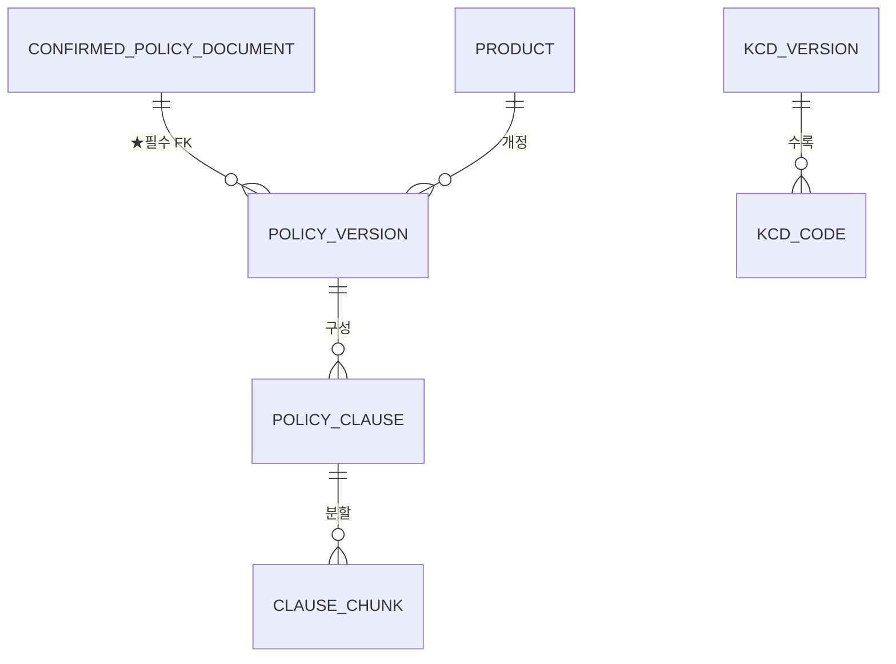
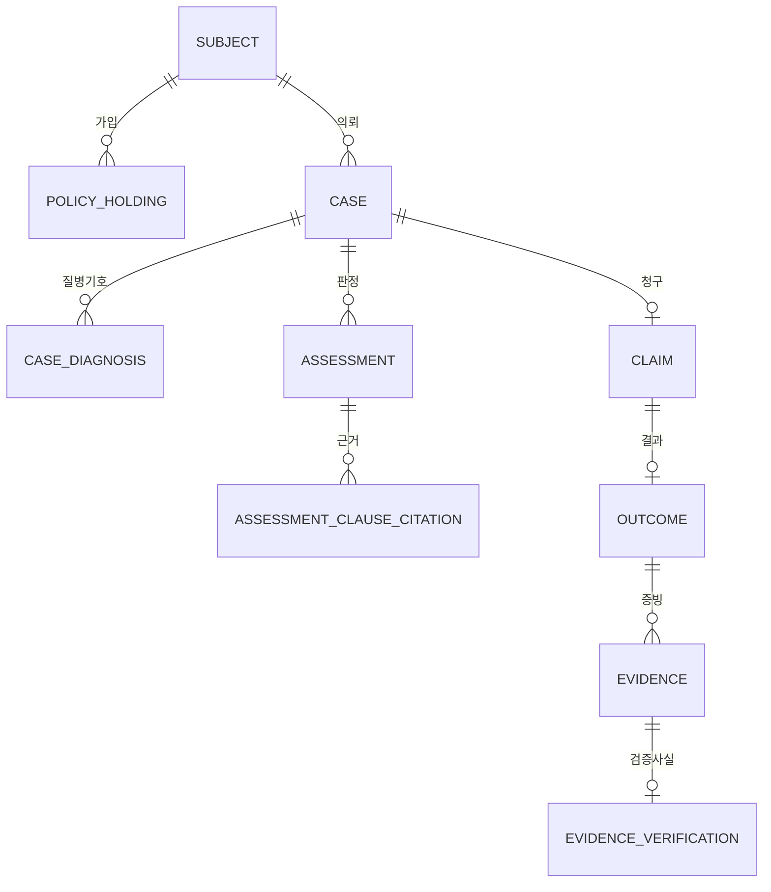

# ERD 현행판 v4 — v2(컬럼 정의) + v3(축소 결정) 통합

- 작성: 2026-08-02
- **이 문서가 현행이다.** [`ERD v2`](2026-07-31_1800_ERD_데이터모델.md) · [`ERD v3`](2026-07-31_2100_ERD_간소화_v3.md) 는 **이력으로만** 참조한다.

> ★**2026-08-02 정정 있음.** v4 전량 실측·코덱스 교차검증으로 아래가 뒤집혔다.
> 반드시 [교차검증 리포트](../reports/2026-08-02_ERD_핸드오프_교차검증_리포트.md)와 함께 읽는다.
>
> | 이 문서 | 정정 |
> |---|---|
> | §4 `(policy_version_id, section_id, clause_no)` 를 식별키로 | ❌ `qualified_no` 와 동치라 **31,085건 충돌 잔존**. → `UNIQUE(document_extraction_id, ordinal)` |
> | §4 `문서 내 중복 62,477건(s2 기준)` | s2 값. v4: `qualified_no` 중복 31,085 / 번호키 충돌 71,707 |
> | §4 `policy_clause.parse_status` 2값 | `suspect` 108건을 담지 못한다. → `document_extraction` 의 3값 |
> | §3 테이블 22개 · 물리 32개 | 27개 + 뷰1 / 물리 54 (32은 산술 오류) |
> | §4 `product.generation` | → `policy_version.generation` |
> | §5 `cohort_stats` | `case→subject→policy_holding` 조인 오배분 + `policy_version_id` 그룹키 누락 |
> | 누락 | `document_extraction` · `clause_content` · `clause_code_rule` · `clause_reference` · `insurer` |
>
> 확정본은 [핸드오프 02_ERD_및_스키마](../handoff/02_ERD_및_스키마.md).
- 대상 DB: PostgreSQL 16 + pgvector
- 상위: [`MVP 선정`](2026-07-31_1600_MVP_기능선정.md) · [`팀MVP6 구조설계`](2026-07-31_1900_팀MVP6_구조설계.md)

---

## 0. 왜 통합이 필요했나

v2와 v3를 나눠 읽으면 **한 테이블에 대해 서로 다른 답이 나온다.** 원인이 셋이었다.

| 문제 | 실제 내용 |
|---|---|
| v2 문서 안에 **두 개 층**이 있다 | v2 §0-1이 v1을 6군데 개정했는데, **§1~§6 본문은 v1 그대로 남아 있다.** v2 §75가 "§1~§6은 v1 기준 서술"이라고 밝혀 놓았지만, 읽는 사람이 §1의 다이어그램을 보면 이미 폐기된 안을 본다 |
| v3는 **차분 문서**다 | "무엇을 왜 뺐나"만 있고 **컬럼 정의가 없다.** 6.5KB인 이유 |
| 그래서 이름이 세 벌이다 | `assessment_citation`(v1) → `assessment_clause_citation`(v2 개정) / `evidence_review`(v1) → `evidence_verification`(v2 개정) |

**이 문서는 v1층을 걷어내고 v2 개정 + v3 축소를 한 벌로 평탄화한 것이다.** 새 설계가 아니다.

### 통합 과정에서 확인한 것 — 충돌이 아니었던 것

- **"v2는 스키마 분리, v3는 DB 분리"는 충돌이 아니다.** v2 §0-1 개정1이 이미 **DB 분리**를 택했고,
  v2 §1의 "스키마 3개" 다이어그램이 폐기된 v1층이다. → **DB 분리로 확정.**
- 마찬가지로 v3가 쓴 `assessment_clause_citation` · `evidence_verification` 은 v3가 새로 지은 이름이 아니라
  **v2 개정이 정한 이름**이다. → **v2 개정 이름으로 확정.**

---

## 1. 이 스키마가 강제하는 것 (v2 §0 유지)

문서에 적어두면 사람이 어기는 것을, **스키마에서 불가능하게** 만든다.

| 원칙 | 문서로만 두면 | 스키마로 강제하면 |
|---|---|---|
| 합성/실제를 섞지 않는다 | `WHERE is_synthetic=false` 한 번 빠뜨리면 섞인다 | **DB 자체를 분리** — 한 쿼리에서 물리적으로 못 붙인다 |
| 상호작용 로그를 판정 근거로 쓰지 않는다 | 나중에 "이것도 근거로 쓰자"가 된다 | **인용 테이블의 FK가 약관 조항뿐** |
| `consistent`는 집계에 안 들어간다 | 집계 쿼리 하나 잘못 쓰면 들어간다 | **집계 뷰가 `evidence_verification`을 조인** |
| 검증됐다고 주장하려면 방법을 밝힌다 | 빈칸으로 남는다 | `verification_method NOT NULL` |
| 확인 안 된 약관으로 판정하지 않는다 | 급하면 쓰게 된다 | **`policy_version → confirmed_policy_document` 필수 FK** — 확정 안 된 문서로는 버전 행을 못 만든다 |

> ★v2 개정2의 핵심: **가변 상태 컬럼(`status`)에 의존하지 않는다.**
> `UPDATE` 한 번이면 통계가 오염된다. **행이 존재하느냐**가 곧 상태여야 한다.

---

## 2. 물리 구조 — DB 2개

```
┌──────────────── insurance_real ────────────────┐  ┌──────────── insurance_demo ────────────┐
│  core.*    약관 코퍼스 (복제본)                  │  │  core.*    약관 코퍼스 (복제본)          │
│  app.*     실제 케이스·증빙·결과  ★PII 있음      │  │  app.*     합성 케이스·증빙·결과 ★PII 없음│
│  ops.*     운영·거버넌스                        │  │  ops.*     운영·거버넌스                 │
│  → app.cohort_stats  (data_source='verified_real') │  → app.cohort_stats (data_source='synthetic')│
└────────────────────────────────────────────────┘  └────────────────────────────────────────┘
        /v1/cohorts   (n=0 → 미공개)                        /v1/demo/cohorts  (SYNTHETIC 표시)

  ✗ 두 DB를 UNION 하는 뷰·쿼리·롤을 만들지 않는다
  ✗ postgres_fdw · dblink 미설치
  ✗ is_synthetic boolean 컬럼으로 대체하지 않는다  ← 그게 사고의 원인
```

**대가 — 정직 기록 (v2 §0-1 유지)**: DB를 나누면 **약관 코퍼스를 두 벌 유지해야 한다.**
`assessment_clause_citation` 의 FK가 같은 DB 안에 있어야 강제되기 때문이다.
조항 13만 행 규모에서 **저장 비용보다 FK 강제력이 더 가치 있다**고 판단해 복제를 택했다.

---

## 3. 테이블 22개 — 전체 목록

정의 22개이고, `app.*` 10개는 두 DB에 각각 만들어지므로 **물리 테이블은 32개**다.

| 스키마 | 수 | 테이블 |
|---|---|---|
| `core` | 7 | **`confirmed_policy_document`** · `product` · `policy_version` · `policy_clause` · `clause_chunk` · `kcd_version` · `kcd_code` |
| `app` | 10 + 뷰1 | `subject` · `policy_holding` · `case` · `case_diagnosis` · `assessment` · `assessment_clause_citation` · `claim` · `outcome` · `evidence` · **`evidence_verification`** + `cohort_stats`(VIEW) |
| `ops` | 5 | `agent_client` · `interaction_log` · `consent` · `admin_user` · `audit_log` |

> ★v3는 21개였다. **`confirmed_policy_document` 를 되살려 22개다**(2026-08-02 결정, §9-1).

### 3-1. 흡수된 테이블 (v3 §1) — 어디로 갔는지

| 없어진 테이블 | 어디로 |
|---|---|
| `insurer` | `core.product.insurer_name` · `insurer_kind` |
| ~~`confirmed_policy_document`~~ | ★**흡수 취소 — 별도 테이블로 되살렸다**(§9-1) |
| `missing_document` | `app.assessment.missing_documents jsonb` |
| `evidence_consistency` | `app.evidence.consistency_checked_at` + `consistency_result jsonb` |
| `knowledge_gap` | `ops.interaction_log.gap_status` + `promoted_ref` |
| `deletion_request` | `ops.consent.revoked_at` + `app.subject.deleted_at` |
| `actor_declaration_event` | `ops.interaction_log.actor_kind`(`declared`/`inferred`/`unknown`) |

> 판단 기준 (v3 §1): **테이블을 나눠야만 얻는 것은 FK를 걸 수 있다는 것뿐이다.**
> FK 대상이 아니면 컬럼으로 둔다. `evidence_verification` 이 분리돼야 하는 이유가 정확히 이것 —
> **집계 뷰가 그것을 조인**해야 하기 때문이다.

### 3-2. P2 이후로 미룬 것 (v3 §2)

`rider` · `rider_holding` · `kcd_mapping` · `policy_application` · `assessment_evidence_citation` · `api_call_log`

**미룬 것이지 해결한 것이 아니다.** 특히 `policy_application` 은 코덱스가 "가장 먼저 깨질 곳"으로
지목한 부분이다 — 갱신형 계약·중도 특약변경이 들어오면 한 계약에 본약관 버전과 특약 버전이
달라지는데, 지금 구조는 그걸 표현할 수 없다.

---

## 4. `core` — 참조 데이터 (7)



### ★`core.confirmed_policy_document` — 확정된 문서만 들어온다

| 컬럼 | 타입 | 비고 |
|---|---|---|
| id | uuid PK | |
| **sha256** | text **UNIQUE NOT NULL** | 같은 파일이 두 번 들어오지 않는다 |
| **source_url** | text NOT NULL | ★근거 보존 |
| **fetched_at** | timestamptz NOT NULL | |
| http_status / bytes / pages | int | 수집 당시 사실 |
| insurer_name | text NOT NULL | |
| **identified_by** | uuid **NOT NULL** FK → `ops.admin_user` | ★**확정에는 반드시 사람 이름이 붙는다** |
| **identified_at** | timestamptz NOT NULL | |
| identification_note | text | 무엇을 근거로 확정했나 |
| license / redistributable | text / bool | 기본 `false` |

**이 테이블에는 `status` 컬럼이 없다.** 행이 존재하는 것이 곧 "확정됨"이다.
확정되지 않은 문서는 **여기 들어오지 못하고** 검수 큐(현재 `data/catalog/*_document_manifest.jsonl`,
`identification_status` · `quarantine_reasons` 보유)에 남는다.

> ★`policy_version.confirmed_document_id` 가 **NOT NULL FK** 이므로,
> **확정되지 않은 문서로는 약관 버전 행 자체를 만들 수 없다.**
> "확인 안 된 약관으로 판정하지 않는다"가 규칙이 아니라 **구조**가 되는 지점이다.
>
> ★부수 효과: **1 문서 : N 버전**이 표현된다. 삼성화재 표지의
> `[계약전환용]` · `[전환·재개용]` · `[자녀보험전환용]` 처럼 한 PDF에 변형 표기가 복수인 경우가
> 매니페스트에 **이미 존재한다**(`quarantine_reasons: "변형 표기가 복수입니다"`).
> v3 §5가 "잃는 것"으로 적어둔 항목이 이 결정으로 함께 해소됐다.

### `core.product`
| 컬럼 | 타입 | 비고 |
|---|---|---|
| id | uuid PK | ★불변 대리키. 업무 코드를 PK로 쓰지 않는다 |
| product_code | text UNIQUE | 사람이 보는 업무 코드 (`SS4G-0001` 형식 논의 중) |
| insurer_name | text NOT NULL | `insurer` 테이블 흡수 |
| insurer_kind | enum NOT NULL | `general`(손보) / `life`(생보) — ★삼성화재/삼성생명이 같은 코드가 되지 않게 |
| name | text NOT NULL | |
| line | enum | `medical_indemnity`(실손) 등 |
| **generation** | smallint **NULL 허용** | 1~5세대 |
| **generation_source** | text | `sale_start` / `product_code` / `manual` / `""` |
| **generation_confidence** | enum | `exact` / `month` / `unknown` |

> ★`generation` 을 **NULL 허용**으로 두는 것이 이 표에서 가장 중요하다.
> 세대는 판매개시일에서 나오는데 날짜 신뢰도가 3등급이다([일자 처리 결정](../reports/2026-08-01_그래프DB_및_일자처리_결정.md) §4-4).
> 모르는 세대를 숫자로 채우면 CLAUDE.md §1 "지어내지 않는다" 위반이고, 그 오류가 판정까지 간다.
> **같은 이유로 `product_code` 안에 세대를 박지 않는다** — 코드 형식이 값을 강제하게 된다.

### ★`core.policy_version` — 이 모델의 중심
| 컬럼 | 타입 | 비고 |
|---|---|---|
| id | uuid PK | |
| **confirmed_document_id** | uuid **NOT NULL** FK → `confirmed_policy_document` | ★**이 FK가 핵심.** 확정 문서 없이는 행을 만들 수 없다 |
| product_id | uuid FK → product | |
| version_label | text NOT NULL | UNIQUE(product_id, version_label) |
| variant | enum | `standard` / `contract_conversion` / `conversion_resume` / `child_conversion` — 한 문서에서 갈리는 축 |
| **valid_from / valid_to** | date | ★적용 구간. 사고일·가입일을 여기 맞춘다 |
| sales_from / sales_to | date | 판매 기간 |
| **date_confidence** | enum NOT NULL | `exact` / `month` / `unknown` |

> `identification_status` enum은 **없앴다.** 확정 여부는 `confirmed_document_id` 의 존재로 표현되고,
> FK는 `UPDATE` 로 뚫리지 않는다. 수집·식별 메타(`source_url`·`sha256`·`fetched_at`)는
> `confirmed_policy_document` 로 옮겼다 — **문서의 사실이지 버전의 사실이 아니다.**
>
> 판정에서 참조할 수 있는 것은 `date_confidence <> 'unknown'` 인 버전뿐이다.
> **받아왔다는 이유로 안다고 하지 않는다.**

### `core.policy_clause`
`id · policy_version_id FK · clause_no · qualified_no · title · body · locator jsonb`

> ★★**2026-08-03 — 구현이 이 설계와 갈라졌다. 구현 쪽이 맞다.**
>
> 이 표는 `policy_version` 하나에 조항 하나를 매달아 **`body` 를 버전마다 복제**한다.
> 실측하니 그 복제가 감당이 안 된다 — s6 전량에서 조항 등장 **204,121** 중
> 고유 내용은 **69,422**(**중복 66.0%**), 한 조항이 최대 **170개 문서**에 실린다.
> DB 를 둘로 복제하는 §2 결정까지 곱하면 본문이 **약 40만 벌**이 된다.
>
> 이건 CLAUDE.md §1 *"정체성과 발생을 나눈다 — **내용이 같으면 같은 조항**이고
> 어느 문서에 언제 실렸는지는 **관계**에 붙인다"* 를 조항에 적용하지 않은 것이다.
> **ERD 자신의 원칙을 스스로 어긴 자리다.**
>
> 구현([`app/adapters/pgvector_clause_index.py`](../../app/adapters/pgvector_clause_index.py)
> `ensure_schema()`)은 **3계층**으로 쪼갰다.
>
> | 층 | 테이블 | 키 | 뜻 |
> |---|---|---|---|
> | 정체성 | `policy_clause_content` | `content_hash` PK | **본문 한 벌** |
> | 발생 | `policy_clause_occurrence` | `(content_hash, sha256, qualified_no, page_from)` | 어느 문서 · 어디에 실렸나 |
> | 청크 | `policy_clause_chunk` | `(content_hash, chunk_ix)` | 임베딩 단위 |
>
> ★조각을 이어 붙여 본문을 복원하지 않는다 — 겹침이 **토큰 기준**이라 글자 수로 자를 수 없다.
> 추측으로 복원하느니 `content` 에 원본을 둔다(구현 주석).
>
> **이 문서를 구현 이름으로 확정한다.** 이름을 세 벌로 만들지 않기 위해서다 — §0 이 겪은 문제다.
> 아직 정하지 못한 것: 위 3표에는 `kind`(`coverage`/`exclusion`…) · `parse_status` ·
> `locator.char_offset` 이 **없다.** 판정 게이트가 그 값들에 의존하므로
> **`occurrence` 에 붙일지 별도 표로 뺄지 결정해야 한다.**
> 컬럼 단위 현행은 항상 위 어댑터의 `ensure_schema()` 가 정본이다.

| 컬럼 | 비고 |
|---|---|
| **kind** enum NOT NULL | `coverage` / `exclusion` / `definition` / `limit` |
| **qualified_no** text NOT NULL | `{부}/{조}` — ★식별키는 `(policy_version_id, section_id, clause_no)` |
| **parse_status** enum NOT NULL | `ok` / `no_clause_heads` — 판정 근거 필터 |
| **content_hash** text NOT NULL | 중복 조항 식별. ★**번호를 넣지 않는다** |
| locator | `{page_from, page_to, char_offset}` |

> ★`kind='exclusion'` 이 **컬럼으로 존재해야** "조항과 면책을 함께 인용"이 쿼리로 강제된다.
> 본문 텍스트에서 면책을 찾아내는 방식이면 누락을 테스트할 수 없다.
>
> ★`qualified_no` 만으로는 유일하지 않다. 실측: 전처리 산출물에서 **문서 내 중복 62,477건**(s2 기준).
> 특별약관마다 조 번호가 1부터 다시 시작하기 때문이며, **`section_id` 를 키에 포함해야 한다.**

### `core.clause_chunk`
`id · clause_id FK · policy_version_id(비정규화) · chunk_index · text · embedding vector(N) · token_count`

- `policy_version_id` 를 비정규화해 두어야 **신선도·식별 게이트가 검색 단계에서 걸린다.**
- `chunk_type='page_fallback'` 인 청크는 **검색엔 쓰되 판정 근거로는 쓰지 않는다.**
- `embedding` 차원은 임베딩 모델 확정 후 고정한다 (현재 미확정 — §9).

### `core.kcd_version` / `core.kcd_code`
| 테이블 | 핵심 |
|---|---|
| `kcd_version` | `label`(제8차 등) · `effective_from/to` |
| `kcd_code` | `kcd_version_id FK · code · name_ko` — ★**UNIQUE(kcd_version_id, code)** |

> 처방전에 `J20.9` 만 적혀 있어도 **어느 차수의 J20.9인지**가 정해져야 약관과 맞출 수 있다.

---

## 5. `app` — 케이스·판정·사실 (10 + 뷰 1) · 두 DB에 동일 DDL



### `app.subject` — 피보험자
`id uuid PK · age_band · sex · consent_id FK(ops) · retention_until · deleted_at`

- ★**생년월일을 저장하지 않는다.** `(생년월일 + 질병코드 + 보험사)` 조합이면 개인이 특정된다.
- 이건 정확도를 위한 전처리가 아니라 **프라이버시 장치**다([팀MVP6](2026-07-31_1900_팀MVP6_구조설계.md) §2-3).
  "정확도 높이자"며 다시 세분화하면 그 순간 개인이 특정된다.
- `insurance_demo.subject` 는 같은 구조지만 **생성된 값**이며 PII가 아니다.

### `app.policy_holding` — 가입 계약
`id · subject_id FK · product_id FK(core) · policy_version_id FK(core) · enrolled_on`
→ ★**적용 약관 확정의 결과가 여기 저장된다.** 판정 때마다 다시 추론하지 않는다.

### `app.case` — 사전검토 요청
| 컬럼 | 비고 |
|---|---|
| id | uuid PK |
| **subject_id** FK **NULLABLE** | ★1회 익명 분석은 `NULL`. 이력·기여를 남기려면 필요 |
| **incident_on** | 사고일 — 약관 버전 매칭의 기준 |
| channel | `web` / `agent` |
| agent_client_id | FK → `ops.agent_client` (에이전트 경로면) |

### `app.case_diagnosis`
`case_id FK · kcd_code_id FK(core) · ocr_confidence · user_corrected bool · corrected_at`

→ ★OCR이 뽑은 값과 **사용자가 승인한 값을 구분**해서 남긴다.
질병명 → 코드는 **1:N이라 자동 확정하지 않는다** — 후보 N개 제시 → 사용자 선택 → 그 코드로 판정.

### `app.assessment` — 판정 결과
| 컬럼 | 비고 |
|---|---|
| id · case_id FK | |
| **policy_version_id** FK(core) | ★어느 약관으로 판정했는지가 결과의 일부 |
| **verdict** enum | `likely_covered` / `unlikely` / `needs_documents` / `needs_expert` — **4단, 이진 금지** |
| **missing_documents** jsonb | `missing_document` 테이블 흡수 |
| rule_engine_version | 규칙이 바뀌면 과거 판정이 재현되게 |
| abstained bool / abstain_reason | ★**안 한 것과 못 한 것을 구분** |
| as_of timestamptz | |

### ★`app.assessment_clause_citation` — 가장 중요한 제약
```sql
CREATE TABLE app.assessment_clause_citation (
  assessment_id uuid REFERENCES app.assessment(id),
  clause_id     uuid REFERENCES core.policy_clause(id),  -- ★FK가 이것뿐
  role          text NOT NULL CHECK (role IN ('ground','exclusion')),
  locator       jsonb NOT NULL,
  PRIMARY KEY (assessment_id, clause_id)
);
```
**판정 근거로 인용할 수 있는 것은 `core.policy_clause` 하나뿐이다.**
상호작용 로그·FAQ·다른 사용자의 답변을 근거로 넣으려면 **FK가 없어서 못 넣는다.**
"그러지 말자"는 규칙이 아니라 **넣을 수 없는 구조**다.

> 승격 경로: 지식갭 → 사람 검수 → 문서화 → `core` 등재 → **그때부터 인용 가능**.

### `app.claim` / `app.outcome` — 사실
| 테이블 | 컬럼 |
|---|---|
| `claim` | `id · case_id FK · claimed_on · claimed_amount` |
| `outcome` | `id · claim_id FK · decision`(`approved`/`partial`/`denied`) · `paid_amount` · `decided_on` |

> ★v1의 `outcome.status` / `verification_method` 컬럼은 **없앴다**(v2 개정2).
> 검증 사실은 아래 `evidence_verification` 이 **행의 존재**로 표현한다.

### `app.evidence` / ★`app.evidence_verification`
| 테이블 | 컬럼 |
|---|---|
| `evidence` | `id · outcome_id FK · doc_type · sha256 · stored_ref · submitted_at` + `consistency_checked_at` · `consistency_result jsonb` (`evidence_consistency` 흡수) |
| **`evidence_verification`** | `id · evidence_id FK UNIQUE · result`(`verified`/`rejected`) · **`verification_method` NOT NULL** · `verified_by` FK(ops.admin_user) · `verified_at` · `reason` — **append-only, UPDATE·DELETE 금지** |

```
submitted ──정합성 검사──▶ consistent ──발행처 확인 / 관리자 교차검증──▶ verified
    │        (evidence 컬럼)              │      (evidence_verification 행 생성)      │
    └──────────────────────────────────────┴──────── 실패 ──────────────────────▶ rejected
```

★**`consistent` 는 컬럼이고 `verified` 는 행이다.** 이 비대칭이 의도된 것이다 —
정합성은 재검사될 수 있는 계산 결과지만, **검증은 사람이 책임진 불변 사실**이다.

### ★`app.cohort_stats` (VIEW) — 집계 게이트
```sql
CREATE VIEW app.cohort_stats AS
SELECT d.kcd_code_id, ph.product_id, pr.generation,
       count(DISTINCT o.id)                                                   AS n,
       count(DISTINCT o.id) FILTER (WHERE o.decision = 'approved')            AS approved_n,
       count(DISTINCT o.id) FILTER (WHERE o.decision = 'denied')              AS denied_n,
       'verified_real'::text                                                  AS data_source
FROM app.outcome o
JOIN app.claim          c  ON c.id  = o.claim_id
JOIN app.case           ca ON ca.id = c.case_id
JOIN app.case_diagnosis d  ON d.case_id = ca.id
JOIN app.policy_holding ph ON ph.subject_id = ca.subject_id
JOIN core.product       pr ON pr.id = ph.product_id
WHERE EXISTS (                                    -- ★★여기가 게이트
  SELECT 1 FROM app.evidence e
  JOIN app.evidence_verification v ON v.evidence_id = e.id
  WHERE e.outcome_id = o.id AND v.result = 'verified'
)
GROUP BY 1, 2, 3;
```

`insurance_demo` 는 동일하되 `data_source='synthetic'`. **두 뷰를 UNION 하는 뷰는 만들지 않는다.**

> ★v2 §3의 뷰는 `WHERE o.status='verified'` 였는데, 그 컬럼은 v2 개정2가 없앴다.
> **v1층 잔재이므로 위 형태로 정정한다.** 통합 과정에서 발견한 실제 오류다.

API가 응답에 덧붙이는 것(뷰가 아니라 애플리케이션):
`min_sample_met`(n ≥ 임계) · `warnings[]` · `as_of` · `collection_path` · `match_level`

**`warnings[]` 에 상시 포함할 것:**
- 생존 편향 — 지급받은 사람이 더 많이 제보한다. **사후 보정 불가능한 구조적 편향**
- 소표본 — n과 구간을 항상 함께. 미달이면 비율 자체를 숨긴다
- **에이전트 간 중복 미검출** — §7 참조

---

## 6. `ops` — 운영·거버넌스 (5)

| 테이블 | 핵심 컬럼 | 왜 필요한가 |
|---|---|---|
| `agent_client` | `id · name · api_key_hash · rate_limit_rpm · status · created_at · disabled_at` | ★에이전트는 사람보다 수백 배 빠르게 호출한다 |
| ⚠ `interaction_log` | `channel · agent_client_id · actor_kind`(`declared`/`inferred`/`unknown`) · `question_masked · answer · abstained · gap_status`(`open`/`reviewed`/`promoted`/`rejected`) · `promoted_ref · created_at` | ★**`core` 로 가는 FK가 없다** = 판정 근거가 될 수 없다 |
| `consent` | `subject_ref · purpose · granted_at · revoked_at · retention_until` | `deletion_request` 흡수 |
| `admin_user` | `id · login · role` | 관리자 승격은 **CLI 전용, UI 버튼 없음** |
| ★`audit_log` | `actor_id · actor_type · action · target_table · target_id · before jsonb · after jsonb · created_at` | **누가 언제 무엇을 `verified` 로 바꿨나** — 이 서비스에서 가장 중요한 로그 |

---

## 7. 식별자 규칙 — 세션·사용자·에이전트

팀에서 나온 질문(`user_id` 를 세션 테이블에서 뺄까 / `session_id` 접두어로 실제·가상을 나눌까)에 대한 확정.

| 값 | 어디에 | 지속성 |
|---|---|---|
| `agent_client.id` | `ops` | 불변. 인증정보와 **분리** |
| `api_key_hash` | `ops.agent_client` | 교체 가능. 유출 시 이것만 갈아끼운다 |
| `subject.id` | `app` (DB별) | 동의·보존기간·삭제권이 붙는 쪽 |
| `case.id` | `app` | 분석 1건 |
| `source_event_id` | 제출 API | 중복 제출 차단 |

**확정 사항**

1. **`session` 테이블을 만들지 않는다.** 세션 흐름은 `ops.interaction_log` 가 받는다.
2. **`session_id` 접두어로 실제·가상을 구분하지 않는다.** DB 물리 분리(§2)가 그 역할이고,
   접두어는 v3 §3-1의 "절대 빼면 안 되는 것" 1번을 문자열 하나로 대체하는 것이다.
   로그 가독성 목적의 표기는 허용하되 **무결성을 거기에 의존하지 않는다.**
3. **`agent_client.id` 를 고객 식별자로 쓰지 않는다.** 인증 주체(누가 호출했나)와
   데이터 주체(누구의 데이터인가)는 다르다. 합치면 삭제권·동의가 깨진다.
   — CLAUDE.md §1 "정체성과 발생을 나눈다"의 같은 원칙.
4. **`principal` · `agent_subject_link` · pairwise subject identifier 는 만들지 않는다.**
   외부 AI 클라이언트가 아직 0개다. 필요해지면 `subject` 위에 얹는다.
5. **중복 방지는 MVP에서 한 겹만 둔다.**
   ```sql
   UNIQUE (agent_client_id, source_event_id)
   ```
   `claim_fingerprint`(HMAC 지문)는 만들지 않는다. 실제 코호트가 `n=0` 이라 막을 대상이 없다.
   ★**대신 못 막는다는 사실을 `warnings[]` 에 남긴다**(§5) — 서로 다른 에이전트가 같은 청구를
   올리는 것은 이 제약으로 못 막는다.
6. ★**중복 방지의 1차 방어선은 ID가 아니라 `evidence_verification` 이다.**
   중복 제출이 들어와도 **검수를 통과해야 `n` 이 오른다.** UNIQUE 제약은 검수자의 일을
   덜어주는 보조수단이지 게이트가 아니다. 이 순서를 뒤집으면 "정합성을 검증으로 표현"하는 것이
   되고, 그게 MVP §7-2가 경고한 제품 주장이 무너지는 세 가지 중 하나다.

---

## 8. 만드는 순서

| 단계 | 테이블 | 담당 |
|---|---|---|
| **P0** | DB 2개 생성 + 롤 권한 분리 · `core.*` 7개 · `ops.admin_user` · `ops.audit_log` · `ops.consent` | ③ |
| ★**P1 수직슬라이스** | `case` · `claim` · `outcome` · `evidence` · **`evidence_verification`** · `cohort_stats` 뷰 | ①③ |
| **P2** | `subject` · `policy_holding` · `assessment` · `assessment_clause_citation` · `case_diagnosis` | ① |
| **P3** | `agent_client` · `interaction_log` · `admin_user` | ④⑤ |

**P1이 먼저인 이유**: MVP §7-3이 경고한 전형적 실패가 "크롤링·RAG부터 만들고 수직 슬라이스를
미루는 것"이다. 첫 통합 대상은 **증빙 1건이 검수되어 집계를 바꾸는 흐름**이어야 한다.

### 작업량은 테이블 수에 비례하지 않는다

| 성격 | 테이블 | 실제 작업 |
|---|---|---|
| 적재만 (데이터 이미 있음) | `core` 7 | 적재 스크립트 1개. `confirmed_policy_document` 는 매니페스트에서 `identification_status='confirmed'` 인 것만 |
| ★로직·상태전이 | `case` `case_diagnosis` `assessment` `assessment_clause_citation` `evidence` `evidence_verification` `cohort_stats` | **여기가 전부** |
| 행 몇 개짜리 | `subject` `admin_user` `agent_client` `consent` `policy_holding` | `CREATE` + `INSERT` |
| INSERT만 | `interaction_log` `audit_log` | 로그 |
| 데모 DB에만 행 존재 | `claim` `outcome` | 실제 경로는 `n=0` |

---

## 9. 미해결 · 정직 기록

### 9-1. `confirmed_policy_document` — ★해결됨 (2026-08-02 결정)

**문제**: v3 §1이 이 테이블을 `policy_version` 의 `NOT NULL` 컬럼으로 흡수하며 *"효과가 같다"* 고 했는데,
**같지 않았다.** `source_url NOT NULL` 은 "출처가 있다"만 보장하고,
v2 개정3이 막으려던 `identification_status='confirmed'` 를 강제하지 못한다. enum은 `UPDATE` 로 뚫린다.

**결정: 테이블을 되살린다.** 검토한 대안은 constraint trigger 였으나 아래 이유로 기각했다.

| 근거 | 내용 |
|---|---|
| v3 자신의 기준 | v3 §1의 잣대가 *"테이블을 나눠야만 얻는 것은 FK를 걸 수 있다는 것뿐"* 인데, 이 테이블은 **정확히 FK 대상**이다(`policy_version` 이 참조). **자기 기준을 잘못 적용한 흡수였다** |
| 트리거는 꺼진다 | `ALTER TABLE … DISABLE TRIGGER` 한 줄, 마이그레이션 누락, 덤프·복원 시 유실. FK는 엔진이 항상 강제한다 |
| `UPDATE` 가 `INSERT` 가 된다 | 상태 enum을 뒤집는 건 일상 쿼리처럼 보이지만, 확정 문서 테이블에 행을 넣는 건 **의도적 행위**다. 감사 로그에서 성격이 다르다 |
| ★부수 효과 | **1 문서 : N 버전**이 표현된다. v3 §5가 "잃는 것"으로 적어둔 항목이 함께 해소된다 |

**비용**: 21 → 22. §9-2 후보 3개가 열려 있어 상쇄 가능하다.

> ★부수 효과는 가정이 아니다. 매니페스트에 이미 있다 —
> `quarantine_reasons: ["변형 표기가 복수입니다: ['contract_conversion', 'conversion_resume', 'child_conversion']"]`
> 흡수 상태로 두면 이 문서는 표현 자체가 안 된다.

**남은 구멍(정직 기록)**: FK는 "확정 테이블에 행이 있다"만 보장하고, 그 행이 **제대로 확정된 것인지**는
보장하지 못한다. 그래서 `identified_by` 를 `ops.admin_user` **NOT NULL FK** 로 두어
**확정에 반드시 사람 이름이 붙게** 했다. 그 이상은 사람 검수 절차의 몫이다.

### 9-2. 재검토 후보 3개 — 22 → 19 가능성

v3 §1의 잣대("FK 대상이 아니면 컬럼")를 다시 대면 통과가 애매한 것들:

| 테이블 | 의심 근거 |
|---|---|
| `core.kcd_version` | v3 §2가 "MVP는 한 차수만 쓴다"고 결정했다. 한 차수면 `kcd_code.version` 컬럼으로도 `UNIQUE(version, code)` 가 걸린다 |
| `app.policy_holding` | v2 §7이 "사용자 입력 vs 증권 업로드 **미정**"으로 남겨놨다. 미정 상태의 테이블을 지금 만들 이유가 약하다 |
| `app.claim` / `app.outcome` 분리 | `claim` 이 컬럼 3개고 `outcome` 과 1:1이다 |

**결정하지 않았다.** 줄이려면 여기부터 보되, §5의 `evidence_verification` · `assessment_clause_citation` ·
`cohort_stats` 와 §2의 DB 분리는 **건드리지 않는다**(v3 §3).

### 9-3. 그 밖에

- **코호트 매칭 키의 세분도** — `(kcd_code, product, generation)` 이 현재 안. 연령대는 기본 키에서 빼고
  **표본이 충분할 때만 켜는 선택 차원**으로 둔다. 표본이 모자랄 때 **즉석에서 조건을 하나씩 빼지 않는다**
  (p-hacking). 미리 정의한 **단 하나의 roll-up** 만 허용하고 `match_level` 로 무엇을 완화했는지 반환한다.
  ★**약관 버전 roll-up 은 금지** — 세대·개정판을 섞는 것은 표본 부족보다 위험하다.
- **`clause_chunk.embedding` 차원 미확정** — 임베딩 모델 비교가 끝나야 정한다. 모델을 바꾸면 인덱스
  전량 재구축 + 거리 임계값 재보정이 따라온다.
- **`evidence.stored_ref` 의 실제 저장소** 미정. 보존기간·삭제 경로와 함께 정한다.
- **처방전 원본 컬럼을 두지 않는다**(v2 개정6). 컬럼이 있으면 언젠가 채운다. `raw_destroyed_at NOT NULL`.
- **`insurance_real` 에는 아직 한 행도 없다.** 실제 지급 결과를 합법적으로 받을 경로가 없기 때문이며,
  이 ERD는 **그 경로가 생겼을 때 바로 받을 수 있는 형태**를 미리 만들어 둔 것이다.
- **DDL 파일이 아직 없다.** 이 문서는 설계이고, `.sql` 은 P0에서 작성한다.

---

## 참조

- [`ERD v2`](2026-07-31_1800_ERD_데이터모델.md) — 컬럼 정의 원본 (v1층 포함, **직접 참조 금지**)
- [`ERD v3`](2026-07-31_2100_ERD_간소화_v3.md) — 28 → 21 축소 결정 근거
- [`Codex ERD 독립설계`](../reports/2026-07-31_Codex_ERD_독립설계.md) — v2 개정의 입력
- [`MVP 기능선정`](2026-07-31_1600_MVP_기능선정.md) · [`팀MVP6 구조설계`](2026-07-31_1900_팀MVP6_구조설계.md)
- [`그래프DB·일자 처리 결정`](../reports/2026-08-01_그래프DB_및_일자처리_결정.md) — `generation` NULL 허용 근거
- [`판정 정직성·인용 검증 설계`](../reports/2026-08-01_판정_정직성_인용검증_설계.md) — `qualified_no` 대조 근거
