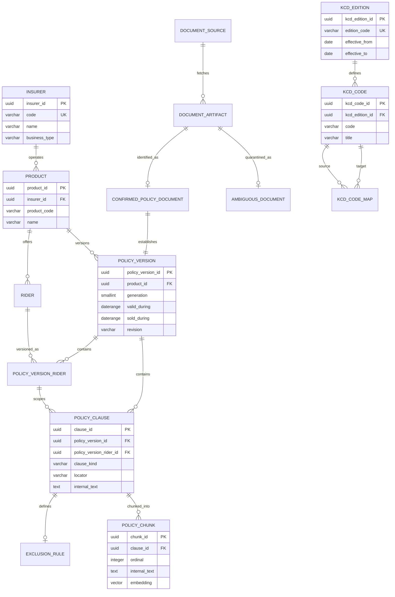
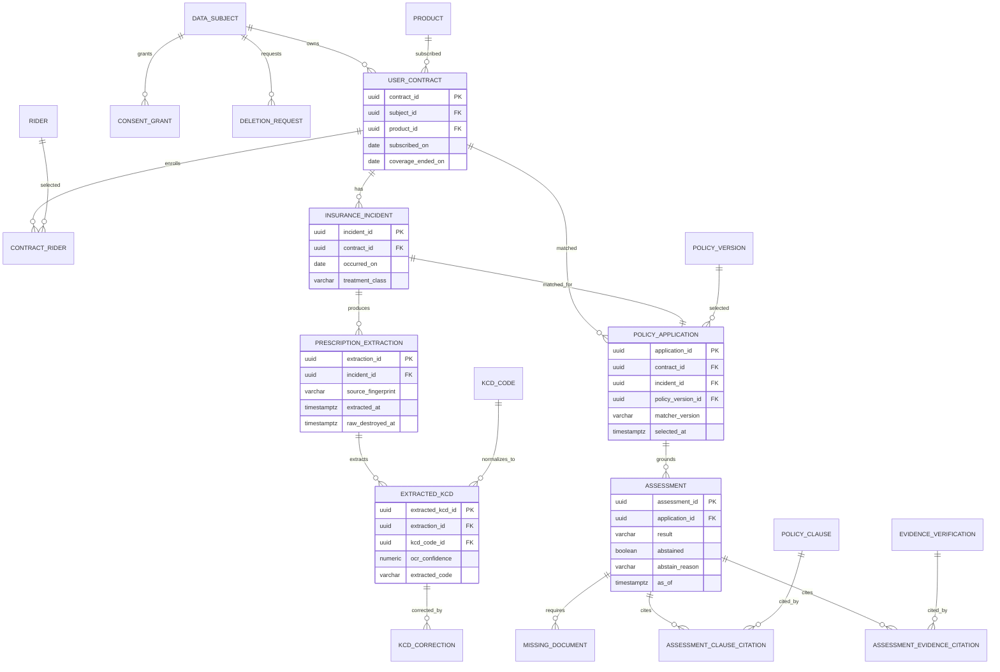
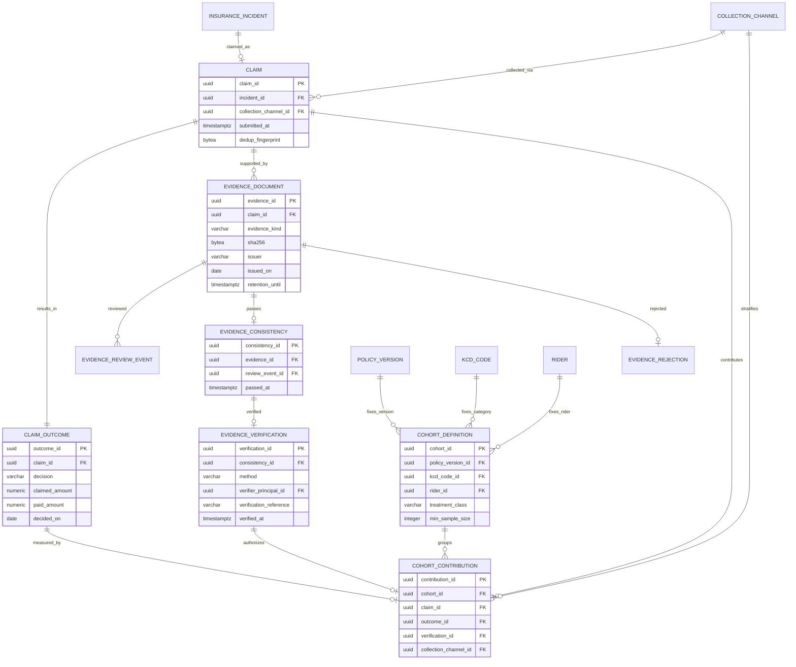
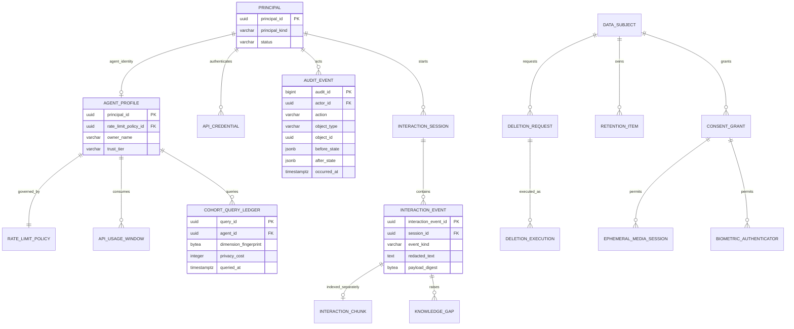

# Codex 독립 ERD 설계 원문 (2026-07-31)

- 목적: 우리 ERD 초안을 **보여주지 않고** 같은 제약으로 독립 설계하게 한 결과
- 반영 내역: [`ERD 문서 §0-1 v2 개정`](../plans/2026-07-31_1800_ERD_데이터모델.md)
- 원문 그대로이며 편집하지 않는다(중복 출력분만 제거).

---

## 0. 설계 선택

- 합성/실제 데이터는 **스키마가 아니라 PostgreSQL 데이터베이스 자체를 분리**한다.
  - `insurance_real`
  - `insurance_demo`
- 두 DB에 동일한 마이그레이션을 적용하되 계정·집계 뷰·API 프로세스·DSN을 분리한다.
- `postgres_fdw`, `dblink`는 설치하지 않는다.
- 실제 DB의 코호트 기여 행은 `evidence_verification`을 FK로 참조해야만 생성할 수 있다.
- `evidence.status` 같은 가변 상태 컬럼은 두지 않는다. `consistent`, `verified`를 각각 **불변 사실 테이블**로 표현한다.
- 판정 근거는 범용 `source_type/source_id` 구조를 쓰지 않고:
  - `assessment_clause_citation`
  - `assessment_evidence_citation`
  
  두 테이블로만 허용한다. 상호작용 로그를 참조할 FK 경로 자체가 없다.

---

# 1. ERD

## 1-1. 보험상품·약관·KCD·RAG



## 1-2. 사용자 계약·사고·처방전·사전판정



## 1-3. 청구·증빙 검수·코호트



## 1-4. 개인정보·에이전트·운영 로그



---

# 2. 주요 컬럼·타입·제약

표기: `NN`=NOT NULL, `UQ`=UNIQUE.

## 2-1. 상품·약관·KCD

| 테이블 | 주요 컬럼 및 제약 |
|---|---|
| `insurer` | `insurer_id uuid PK`, `code varchar(20) NN UQ`, `name varchar(100) NN UQ`, `business_type varchar(8) NN CHECK IN ('life','non_life')` |
| `product` | `product_id uuid PK`, `insurer_id uuid NN FK`, `product_code varchar(50) NN`, `name text NN`, `UQ(insurer_id, product_code)` |
| `rider` | `rider_id uuid PK`, `product_id uuid NN FK`, `rider_code varchar(50) NN`, `name text NN`, `UQ(product_id,rider_code)` |
| `document_source` | `source_id uuid PK`, `source_url text NN`, `fetched_at timestamptz NN`, `http_status int NN`, `sha256 bytea NN`, `terms_url text`, `license_text text`, `redistributable boolean NN`, `UQ(sha256)` |
| `document_artifact` | `artifact_id uuid PK`, `source_id uuid NN FK`, `object_key text NN UQ`, `mime_type text NN`, `byte_length bigint NN CHECK > 0`, `content_sha256 bytea NN UQ`; API 계정 SELECT 금지 |
| `ambiguous_document` | `artifact_id uuid PK/FK`, `reason text NN`, `candidates jsonb NN`, `quarantined_at timestamptz NN` |
| `confirmed_policy_document` | `artifact_id uuid PK/FK`, `insurer_id uuid NN FK`, `product_id uuid NN FK`, `generation smallint NN CHECK 1..5`, `valid_during daterange NN`, `sold_during daterange NN`, `confirmed_by uuid NN FK`, `confirmed_at timestamptz NN` |
| `policy_version` | `policy_version_id uuid PK`, `artifact_id uuid NN UQ FK confirmed_policy_document`, `product_id uuid NN FK`, `generation smallint NN CHECK 1..5`, `revision varchar(40) NN`, `valid_during daterange NN`, `sold_during daterange NN`, `UQ(product_id,generation,revision)` |
| `policy_version_rider` | `policy_version_rider_id uuid PK`, `policy_version_id uuid NN FK`, `rider_id uuid NN FK`, `waiting_period interval`, `coverage_limit numeric`, `UQ(policy_version_id,rider_id)` |
| `policy_clause` | `clause_id uuid PK`, `policy_version_id uuid NN FK`, `policy_version_rider_id uuid FK`, `clause_kind NN CHECK IN ('coverage','exclusion','definition','procedure','limit')`, `locator text NN`, `internal_text text NN`, `UQ(policy_version_id,locator)` |
| `exclusion_rule` | `clause_id uuid PK/FK`, `rule_code varchar(50) NN`, `rule_parameters jsonb NN`, `CHECK jsonb_typeof(rule_parameters)='object'` |
| `policy_chunk` | `chunk_id uuid PK`, `clause_id uuid NN FK`, `ordinal int NN CHECK >=0`, `internal_text text NN`, `embedding vector(1536) NN`, `UQ(clause_id,ordinal)` |
| `kcd_edition` | `kcd_edition_id uuid PK`, `edition_code varchar(20) NN UQ`, `effective_from date NN`, `effective_to date`, 날짜 순서 CHECK |
| `kcd_code` | `kcd_code_id uuid PK`, `kcd_edition_id uuid NN FK`, `code varchar(16) NN`, `title text NN`, `category3 varchar(3) NN`, `UQ(kcd_edition_id,code)` |
| `kcd_code_map` | `from_code_id uuid NN FK`, `to_code_id uuid NN FK`, `relation CHECK IN ('exact','narrower','broader','split','merged')`, `confidence numeric CHECK 0..1`, `PK(from_code_id,to_code_id)` |
| `support_manifest` | `policy_version_id uuid PK/FK`, `supported_from timestamptz NN`, `supported_until timestamptz`, `approved_by uuid NN FK`; 없는 버전은 판정 불가 |

## 2-2. 계약·사고·판정

| 테이블 | 주요 컬럼 및 제약 |
|---|---|
| `data_subject` | `subject_id uuid PK`, `pseudonymous_key bytea NN UQ`, `created_at timestamptz NN`; 이름·주민번호 미저장 |
| `user_contract` | `contract_id uuid PK`, `subject_id uuid NN FK`, `product_id uuid NN FK`, `subscribed_on date NN`, `coverage_ended_on date`, 날짜 CHECK |
| `contract_rider` | `contract_id uuid NN FK`, `rider_id uuid NN FK`, `enrolled_on date NN`, `ended_on date`, `PK(contract_id,rider_id)` |
| `insurance_incident` | `incident_id uuid PK`, `contract_id uuid NN FK`, `occurred_on date NN`, `treatment_class varchar(30) NN`, `incident_fingerprint bytea UQ` |
| `prescription_extraction` | `extraction_id uuid PK`, `incident_id uuid NN FK`, `source_fingerprint bytea NN`, `extracted_at timestamptz NN`, `raw_destroyed_at timestamptz NN`; 원본 위치 컬럼 없음 |
| `extracted_kcd` | `extracted_kcd_id uuid PK`, `extraction_id uuid NN FK`, `kcd_code_id uuid NN FK`, `extracted_code varchar(16) NN`, `ocr_confidence numeric NN CHECK 0..1`, `user_confirmed_at timestamptz` |
| `kcd_correction` | `correction_id uuid PK`, `extracted_kcd_id uuid NN FK`, `old_code text NN`, `new_kcd_code_id uuid NN FK`, `corrected_by uuid NN FK`, `corrected_at timestamptz NN`, `reason text` |
| `policy_application` | `application_id uuid PK`, `contract_id uuid NN FK`, `incident_id uuid NN FK`, `policy_version_id uuid NN FK support_manifest`, `matcher_version text NN`, `selected_at timestamptz NN`, `UQ(contract_id,incident_id)` |
| `assessment` | `assessment_id uuid PK`, `application_id uuid NN FK`, `result assessment_result NN`, `abstained boolean NN`, `abstain_reason text`, `as_of timestamptz NN`, abstain 일관성 CHECK |
| `missing_document` | `assessment_id uuid NN FK`, `document_code varchar(50) NN`, `reason text NN`, `PK(assessment_id,document_code)` |
| `assessment_clause_citation` | `assessment_id uuid NN`, `policy_version_id uuid NN`, `clause_id uuid NN`, `purpose CHECK IN ('coverage','exclusion')`, `locator_snapshot text NN`, 복합 FK로 판정 약관과 조항 약관 일치 |
| `assessment_evidence_citation` | `assessment_id uuid NN FK`, `verification_id uuid NN FK evidence_verification`, `locator text NN`, `PK(assessment_id,verification_id)` |

## 2-3. 청구·증빙·코호트

| 테이블 | 주요 컬럼 및 제약 |
|---|---|
| `collection_channel` | `collection_channel_id uuid PK`, `code text NN UQ`, `channel_class CHECK IN ('voluntary','partner','admin','other')` |
| `claim` | `claim_id uuid PK`, `incident_id uuid NN UQ FK`, `collection_channel_id uuid NN FK`, `submitted_at timestamptz NN`, `dedup_fingerprint bytea NN UQ` |
| `claim_outcome` | `outcome_id uuid PK`, `claim_id uuid NN UQ FK`, `decision CHECK IN ('approved','partial','denied')`, 금액 NN·음수 금지, `paid_amount <= claimed_amount`, 부지급이면 지급액 0 |
| `evidence_document` | `evidence_id uuid PK`, `claim_id uuid NN FK`, `evidence_kind NN`, `sha256 bytea NN UQ`, `issuer text NN`, `issued_on date`, `object_key text`, `retention_until timestamptz NN` |
| `evidence_review_event` | `review_event_id uuid PK`, `evidence_id uuid NN FK`, `reviewer_id uuid NN FK`, `review_kind NN`, `checks jsonb NN`, `created_at timestamptz NN`; append-only |
| `evidence_consistency` | `consistency_id uuid PK`, `evidence_id uuid NN UQ FK`, `review_event_id uuid NN UQ FK`, `passed_at timestamptz NN` |
| `evidence_verification` | `verification_id uuid PK`, `consistency_id uuid NN UQ FK`, `method CHECK IN ('issuer_confirmation','originality_check','admin_cross_review')`, `verifier_principal_id uuid NN FK`, `verification_reference text NN`, `verified_at timestamptz NN` |
| `evidence_rejection` | `evidence_id uuid PK/FK`, `review_event_id uuid NN FK`, `reason_code text NN`, `rejected_at timestamptz NN` |
| `cohort_definition` | `cohort_id uuid PK`, `policy_version_id uuid NN FK`, `kcd_category3 varchar(3) NN`, `rider_id uuid FK`, `treatment_class text NN`, `min_sample_size int NN CHECK >=5`, 키 전체 UQ |
| `cohort_contribution` | `contribution_id uuid PK`, `cohort_id uuid NN FK`, `claim_id uuid NN UQ`, `outcome_id uuid NN UQ`, `verification_id uuid NN UQ`, `collection_channel_id uuid NN FK`; 동일 claim 복합 FK 강제 |
| `cohort_bias_rule` | `cohort_id uuid NN FK`, `warning_code text NN`, `trigger_expression jsonb NN`, `PK(cohort_id,warning_code)` |

## 2-4. 개인정보·에이전트·감사

| 테이블 | 주요 컬럼 및 제약 |
|---|---|
| `consent_grant` | `consent_id uuid PK`, `subject_id uuid NN FK`, `purpose CHECK IN ('assessment','claim_evidence','analytics','voice','video','face_auth')`, `granted_at NN`, `expires_at NN`, `revoked_at`, 기간 CHECK |
| `retention_item` | `retention_id uuid PK`, `subject_id uuid NN FK`, `object_type NN`, `object_id uuid NN`, `delete_after timestamptz NN`, `legal_hold boolean NN` |
| `deletion_request` | `deletion_request_id uuid PK`, `subject_id uuid NN FK`, `requested_at NN`, `scope NN`, `status NN` |
| `deletion_execution` | `execution_id uuid PK`, `deletion_request_id uuid NN FK`, `object_type NN`, `object_id uuid NN`, `deleted_at NN`, `result_digest bytea NN` |
| `ephemeral_media_session` | `session_id uuid PK`, `consent_id uuid NN FK`, `media_kind CHECK IN ('voice','video')`, `started_at NN`, `purged_at NN`; blob·URI 컬럼 없음 |
| `biometric_authenticator` | `authenticator_id uuid PK`, `subject_id uuid NN FK`, `consent_id uuid NN FK`, `template_ciphertext bytea NN`, `created_at NN`, `revoked_at`; 얼굴 이미지 컬럼 없음 |
| `principal` | `principal_id uuid PK`, `principal_kind CHECK IN ('user','admin','agent','service')`, `status NN` |
| `agent_profile` | `principal_id uuid PK/FK`, `owner_name NN`, `trust_tier NN`, `rate_limit_policy_id uuid NN FK` |
| `rate_limit_policy` | `policy_id uuid PK`, `requests_per_minute int NN`, `cohort_queries_per_day int NN`, `privacy_budget_per_day int NN`, 모두 양수 |
| `api_usage_window` | `agent_id uuid NN FK`, `window_start timestamptz NN`, `request_count int NN`, `PK(agent_id,window_start)` |
| `cohort_query_ledger` | `query_id uuid PK`, `agent_id uuid NN FK`, `dimension_fingerprint bytea NN`, `privacy_cost int NN CHECK >0`, `queried_at NN`; 반복·차분 조회 탐지 |
| `interaction_session/event/chunk` | 운영 전용 스키마. 판정 테이블로 향하는 FK 없음. API/판정 역할 SELECT 금지 |
| `audit_event` | `audit_id bigint PK`, `actor_id uuid NN FK`, `action NN`, `object_type NN`, `object_id uuid NN`, `before_state/after_state jsonb`, `occurred_at NN`; UPDATE/DELETE 금지 |

---

# 3. 핵심 DDL

## 3-1. (a) 합성/실제 물리 분리

```sql
CREATE DATABASE insurance_real
    OWNER insurance_real_owner;

CREATE DATABASE insurance_demo
    OWNER insurance_demo_owner;

CREATE ROLE real_api LOGIN;
CREATE ROLE demo_api LOGIN;

REVOKE CONNECT ON DATABASE insurance_real FROM PUBLIC;
REVOKE CONNECT ON DATABASE insurance_demo FROM PUBLIC;

GRANT CONNECT ON DATABASE insurance_real TO real_api;
GRANT CONNECT ON DATABASE insurance_demo TO demo_api;

-- 교차 접속 금지
REVOKE CONNECT ON DATABASE insurance_real FROM demo_api;
REVOKE CONNECT ON DATABASE insurance_demo FROM real_api;
```

각 DB 내부:

```sql
REVOKE ALL ON ALL TABLES IN SCHEMA core FROM PUBLIC;
REVOKE ALL ON ALL TABLES IN SCHEMA corpus FROM PUBLIC;

-- API는 원천 테이블이 아니라 공개 함수/뷰만 사용한다.
GRANT USAGE ON SCHEMA api TO real_api;
GRANT SELECT ON api.real_cohort_response TO real_api;

CREATE VIEW api.real_cohort_response
WITH (security_barrier = true) AS
SELECT
    c.cohort_id,
    'verified_real'::text AS data_source,
    count(*)::integer AS n,
    (count(*) >= c.min_sample_size) AS min_sample_met,
    CASE WHEN count(*) >= c.min_sample_size
         THEN count(*) FILTER (WHERE o.decision = 'approved')
    END AS approved_count,
    CASE WHEN count(*) >= c.min_sample_size
         THEN count(*) FILTER (WHERE o.decision = 'partial')
    END AS partial_count,
    CASE WHEN count(*) >= c.min_sample_size
         THEN count(*) FILTER (WHERE o.decision = 'denied')
    END AS denied_count
FROM core.cohort_definition c
LEFT JOIN core.cohort_contribution x ON x.cohort_id = c.cohort_id
LEFT JOIN core.claim_outcome o ON o.outcome_id = x.outcome_id
GROUP BY c.cohort_id, c.min_sample_size;
```

`insurance_demo`에는 이름부터 다른 `api.demo_cohort_response`만 만들고 상수는 `synthetic`으로 고정한다. 한 애플리케이션 프로세스에 두 DSN을 주지 않는다.

---

## 3-2. 식별되지 않은 약관 차단

`policy_version`은 확인된 문서를 반드시 참조한다. `ambiguous_document`에서는 FK가 성립하지 않는다.

```sql
CREATE TABLE corpus.confirmed_policy_document (
    artifact_id uuid PRIMARY KEY
        REFERENCES corpus.document_artifact(artifact_id),
    insurer_id uuid NOT NULL REFERENCES ref.insurer(insurer_id),
    product_id uuid NOT NULL REFERENCES ref.product(product_id),
    generation smallint NOT NULL CHECK (generation BETWEEN 1 AND 5),
    valid_during daterange NOT NULL CHECK (NOT isempty(valid_during)),
    sold_during daterange NOT NULL CHECK (NOT isempty(sold_during)),
    confirmed_by uuid NOT NULL REFERENCES auth.principal(principal_id),
    confirmed_at timestamptz NOT NULL DEFAULT clock_timestamp(),
    CHECK (lower_inc(valid_during) AND NOT upper_inc(valid_during)),
    CHECK (lower_inc(sold_during) AND NOT upper_inc(sold_during))
);

CREATE TABLE corpus.policy_version (
    policy_version_id uuid PRIMARY KEY,
    artifact_id uuid NOT NULL UNIQUE
        REFERENCES corpus.confirmed_policy_document(artifact_id),
    product_id uuid NOT NULL REFERENCES ref.product(product_id),
    generation smallint NOT NULL CHECK (generation BETWEEN 1 AND 5),
    revision varchar(40) NOT NULL,
    valid_during daterange NOT NULL,
    sold_during daterange NOT NULL,
    UNIQUE (product_id, generation, revision),
    UNIQUE (policy_version_id, product_id)
);

CREATE TABLE corpus.support_manifest (
    policy_version_id uuid PRIMARY KEY
        REFERENCES corpus.policy_version(policy_version_id),
    supported_from timestamptz NOT NULL,
    supported_until timestamptz,
    approved_by uuid NOT NULL REFERENCES auth.principal(principal_id),
    CHECK (supported_until IS NULL OR supported_until > supported_from)
);
```

---

## 3-3. (f) 가입일·사고일 기준 버전 매칭

PostgreSQL `CHECK`는 다른 행을 조회할 수 없으므로 constraint trigger로 강제한다.

```sql
CREATE FUNCTION core.enforce_policy_application()
RETURNS trigger
LANGUAGE plpgsql
AS $$
DECLARE
    c core.user_contract%ROWTYPE;
    i core.insurance_incident%ROWTYPE;
    p corpus.policy_version%ROWTYPE;
BEGIN
    SELECT * INTO STRICT c
      FROM core.user_contract
     WHERE contract_id = NEW.contract_id;

    SELECT * INTO STRICT i
      FROM core.insurance_incident
     WHERE incident_id = NEW.incident_id;

    SELECT * INTO STRICT p
      FROM corpus.policy_version
     WHERE policy_version_id = NEW.policy_version_id;

    IF i.contract_id <> c.contract_id THEN
        RAISE EXCEPTION 'incident does not belong to contract';
    END IF;

    IF p.product_id <> c.product_id THEN
        RAISE EXCEPTION 'policy version/product mismatch';
    END IF;

    IF NOT (c.subscribed_on <@ p.sold_during) THEN
        RAISE EXCEPTION 'subscription date outside sales period';
    END IF;

    IF NOT (i.occurred_on <@ p.valid_during) THEN
        RAISE EXCEPTION 'incident date outside policy validity';
    END IF;

    IF NOT EXISTS (
        SELECT 1
          FROM corpus.support_manifest sm
         WHERE sm.policy_version_id = p.policy_version_id
           AND sm.supported_from <= NEW.selected_at
           AND (sm.supported_until IS NULL
                OR NEW.selected_at < sm.supported_until)
    ) THEN
        RAISE EXCEPTION 'unsupported policy version';
    END IF;

    RETURN NEW;
END;
$$;

CREATE CONSTRAINT TRIGGER policy_application_guard
AFTER INSERT OR UPDATE ON core.policy_application
DEFERRABLE INITIALLY IMMEDIATE
FOR EACH ROW EXECUTE FUNCTION core.enforce_policy_application();
```

현재판을 대신 선택하는 nullable fallback 컬럼은 만들지 않는다. 매칭 실패 시 `policy_application` 행이 생성되지 않는다.

---

## 3-4. (b)(e) `verified`만 집계 + 검증 방법 필수

```sql
CREATE TYPE evidence_verification_method AS ENUM (
    'issuer_confirmation',
    'originality_check',
    'admin_cross_review'
);

CREATE TABLE core.evidence_consistency (
    consistency_id uuid PRIMARY KEY,
    evidence_id uuid NOT NULL UNIQUE
        REFERENCES core.evidence_document(evidence_id),
    review_event_id uuid NOT NULL UNIQUE
        REFERENCES core.evidence_review_event(review_event_id),
    passed_at timestamptz NOT NULL DEFAULT clock_timestamp()
);

CREATE TABLE core.evidence_verification (
    verification_id uuid PRIMARY KEY,
    consistency_id uuid NOT NULL UNIQUE
        REFERENCES core.evidence_consistency(consistency_id),
    method evidence_verification_method NOT NULL,
    verifier_principal_id uuid NOT NULL
        REFERENCES auth.principal(principal_id),
    verification_reference text NOT NULL
        CHECK (length(btrim(verification_reference)) >= 5),
    verified_at timestamptz NOT NULL DEFAULT clock_timestamp()
);
```

동일 claim 소속임을 복합 FK로 강제한다.

```sql
ALTER TABLE core.claim_outcome
    ADD CONSTRAINT uq_outcome_claim UNIQUE (outcome_id, claim_id);

ALTER TABLE core.evidence_document
    ADD CONSTRAINT uq_evidence_claim UNIQUE (evidence_id, claim_id);

ALTER TABLE core.evidence_consistency
    ADD COLUMN claim_id uuid NOT NULL,
    ADD CONSTRAINT fk_consistency_evidence_claim
        FOREIGN KEY (evidence_id, claim_id)
        REFERENCES core.evidence_document(evidence_id, claim_id),
    ADD CONSTRAINT uq_consistency_claim
        UNIQUE (consistency_id, claim_id);

ALTER TABLE core.evidence_verification
    ADD COLUMN claim_id uuid NOT NULL,
    ADD CONSTRAINT fk_verification_consistency_claim
        FOREIGN KEY (consistency_id, claim_id)
        REFERENCES core.evidence_consistency(consistency_id, claim_id),
    ADD CONSTRAINT uq_verification_claim
        UNIQUE (verification_id, claim_id);

CREATE TABLE core.cohort_contribution (
    contribution_id uuid PRIMARY KEY,
    cohort_id uuid NOT NULL
        REFERENCES core.cohort_definition(cohort_id),
    claim_id uuid NOT NULL UNIQUE
        REFERENCES core.claim(claim_id),
    outcome_id uuid NOT NULL UNIQUE,
    verification_id uuid NOT NULL UNIQUE,
    collection_channel_id uuid NOT NULL
        REFERENCES core.collection_channel(collection_channel_id),

    FOREIGN KEY (outcome_id, claim_id)
        REFERENCES core.claim_outcome(outcome_id, claim_id),

    FOREIGN KEY (verification_id, claim_id)
        REFERENCES core.evidence_verification(verification_id, claim_id)
);
```

`consistent` 행만 가지고는 `verification_id`를 만들 수 없고, 따라서 코호트 기여 행도 만들 수 없다.

---

## 3-5. 검증 감사로그 자동 생성

```sql
CREATE FUNCTION audit.log_evidence_verification()
RETURNS trigger
LANGUAGE plpgsql
SECURITY DEFINER
SET search_path = pg_catalog, audit, core
AS $$
BEGIN
    INSERT INTO audit.audit_event (
        actor_id, action, object_type, object_id,
        before_state, after_state, occurred_at
    )
    VALUES (
        NEW.verifier_principal_id,
        'evidence.verified',
        'evidence_verification',
        NEW.verification_id,
        NULL,
        jsonb_build_object(
            'consistency_id', NEW.consistency_id,
            'method', NEW.method,
            'verification_reference', NEW.verification_reference
        ),
        NEW.verified_at
    );
    RETURN NEW;
END;
$$;

CREATE TRIGGER evidence_verification_audit
AFTER INSERT ON core.evidence_verification
FOR EACH ROW EXECUTE FUNCTION audit.log_evidence_verification();

REVOKE UPDATE, DELETE ON audit.audit_event FROM PUBLIC;
REVOKE UPDATE, DELETE ON core.evidence_verification FROM PUBLIC;
```

`verified`는 상태 변경이 아니라 불변 검증 사실의 INSERT다. 취소가 필요하면 기존 행을 수정하지 않고 별도 `verification_revocation` 이벤트를 추가하고 기여 행을 회수한다.

---

## 3-6. (c) 상호작용 로그의 근거 사용 차단

```sql
CREATE SCHEMA ops;
CREATE SCHEMA decision;

REVOKE ALL ON SCHEMA ops FROM real_api;
REVOKE ALL ON ALL TABLES IN SCHEMA ops FROM real_api;

CREATE TABLE decision.assessment_clause_citation (
    assessment_id uuid NOT NULL,
    policy_version_id uuid NOT NULL,
    clause_id uuid NOT NULL,
    purpose varchar(12) NOT NULL
        CHECK (purpose IN ('coverage', 'exclusion')),
    locator_snapshot text NOT NULL,

    PRIMARY KEY (assessment_id, clause_id, purpose),

    FOREIGN KEY (assessment_id, policy_version_id)
        REFERENCES decision.assessment(assessment_id, policy_version_id),

    FOREIGN KEY (clause_id, policy_version_id)
        REFERENCES corpus.policy_clause(clause_id, policy_version_id)
);

CREATE TABLE decision.assessment_evidence_citation (
    assessment_id uuid NOT NULL
        REFERENCES decision.assessment(assessment_id),
    verification_id uuid NOT NULL
        REFERENCES core.evidence_verification(verification_id),
    locator text NOT NULL,
    PRIMARY KEY (assessment_id, verification_id)
);
```

범용 citation 테이블, 문자열 테이블명, `source_type='interaction'` 같은 확장점을 두지 않는다.

비-abstain 판정에는 보장 및 면책 검토 인용을 모두 요구한다.

```sql
CREATE FUNCTION decision.require_assessment_citations()
RETURNS trigger
LANGUAGE plpgsql
AS $$
BEGIN
    IF NOT NEW.abstained THEN
        IF NOT EXISTS (
            SELECT 1
              FROM decision.assessment_clause_citation c
             WHERE c.assessment_id = NEW.assessment_id
               AND c.purpose = 'coverage'
        ) THEN
            RAISE EXCEPTION 'coverage citation required';
        END IF;

        IF NOT EXISTS (
            SELECT 1
              FROM decision.assessment_clause_citation c
             WHERE c.assessment_id = NEW.assessment_id
               AND c.purpose = 'exclusion'
        ) THEN
            RAISE EXCEPTION 'exclusion review citation required';
        END IF;
    END IF;

    RETURN NULL;
END;
$$;

CREATE CONSTRAINT TRIGGER assessment_citation_guard
AFTER INSERT OR UPDATE ON decision.assessment
DEFERRABLE INITIALLY DEFERRED
FOR EACH ROW EXECUTE FUNCTION decision.require_assessment_citations();
```

---

## 3-7. 4단 판정·abstain·부족서류

```sql
CREATE TYPE assessment_result AS ENUM (
    'high_coverage_likelihood',
    'low_coverage_likelihood',
    'additional_documents_required',
    'expert_review_required'
);

CREATE TABLE decision.assessment (
    assessment_id uuid PRIMARY KEY,
    application_id uuid NOT NULL
        REFERENCES core.policy_application(application_id),
    policy_version_id uuid NOT NULL,
    result assessment_result NOT NULL,
    abstained boolean NOT NULL DEFAULT false,
    abstain_reason text,
    as_of timestamptz NOT NULL DEFAULT clock_timestamp(),

    UNIQUE (assessment_id, policy_version_id),

    CHECK (
        (abstained = false AND abstain_reason IS NULL)
        OR
        (abstained = true
         AND result = 'expert_review_required'
         AND length(btrim(abstain_reason)) > 0)
    )
);
```

`additional_documents_required`인데 부족서류가 0개인 상태도 deferred trigger로 거부한다.

---

## 3-8. 원문 미보존과 저작물 재배포 제한

```sql
CREATE TABLE core.prescription_extraction (
    extraction_id uuid PRIMARY KEY,
    incident_id uuid NOT NULL
        REFERENCES core.insurance_incident(incident_id),
    source_fingerprint bytea NOT NULL,
    extracted_at timestamptz NOT NULL,
    raw_destroyed_at timestamptz NOT NULL,
    CHECK (raw_destroyed_at >= extracted_at)
    -- bytea 원본, 파일경로, object_key 컬럼 자체가 없다.
);

CREATE TABLE corpus.policy_clause (
    clause_id uuid PRIMARY KEY,
    policy_version_id uuid NOT NULL
        REFERENCES corpus.policy_version(policy_version_id),
    clause_kind varchar(20) NOT NULL,
    locator text NOT NULL,
    internal_text text NOT NULL,
    public_excerpt text,
    redistributable boolean NOT NULL,
    CHECK (
        public_excerpt IS NULL
        OR redistributable = true
    ),
    UNIQUE (clause_id, policy_version_id),
    UNIQUE (policy_version_id, locator)
);

REVOKE SELECT (internal_text) ON corpus.policy_clause FROM real_api;
REVOKE SELECT ON corpus.policy_chunk FROM real_api;
```

---

# 4. 요구사항별 강제 방식

| 요구 | DB가 불가능하게 만드는 방식 |
|---|---|
| (a) 합성/실제 혼합 금지 | 별도 DB·별도 소유자·별도 API 계정·별도 집계 뷰. FDW/dblink 없음. 실서비스 계정은 demo DB에 CONNECT 불가 |
| (b) `consistent` 집계 금지 | 코호트 기여의 필수 FK가 `evidence_verification`을 참조. consistency만으로 INSERT 불가 |
| (c) 상호작용 로그 인용 금지 | 인용 테이블을 조항용·검증증빙용으로만 폐쇄 열거. 범용 참조 없음. `ops` 스키마 접근권한도 판정 역할에 없음 |
| (d) 미식별 약관 판정 금지 | `policy_version → confirmed_policy_document` 필수 FK. `ambiguous_document`에서는 버전을 만들 수 없음 |
| (e) 검증 방법 기록 | `method`, `verifier_principal_id`, `verification_reference`, `verified_at` 모두 NN. 누락하면 verification 생성 실패 |
| (f) 현행판 조용한 대입 금지 | 계약 상품·가입일·사고일·지원 매니페스트를 constraint trigger가 검사. 실패하면 적용 약관 행 자체가 생성되지 않음 |

---

# 5. (g) 코호트 매칭 키

다음 4개를 기본 키로 고정한다.

```text
policy_version_id
+ KCD 3자리 category
+ treatment_class
+ rider_id 또는 NO_RIDER
```

선택 이유:

- `policy_version_id`는 절대 완화하지 않는다. 약관 세대·개정판 혼합은 표본 부족보다 더 위험하다.
- KCD 전체 세부코드는 표본이 지나치게 분할되므로 기본은 3자리 범주다.
- 치료유형은 입원·통원·처치 차이를 가르는 주요 교란변수라 유지한다.
- 특약은 지급조건을 직접 바꾸므로 유지한다.
- 성별·나이·지역·병원은 기본 키에서 제외한다. 재식별 위험과 소표본 분할이 더 크다.

표본 미달 시 즉석에서 조건을 하나씩 빼지 않는다. 미리 정의한 단 하나의 상위 roll-up만 허용한다.

```text
동일 policy_version_id
+ 동일 KCD 3자리 category
+ 동일 rider
+ treatment_class = ALL
```

어떤 차원을 완화했는지는 별도 `match_level='treatment_rollup'`으로 반환한다. 약관 버전 roll-up은 금지한다.

---

# 6. (h) 가장 먼저 깨질 부분

**약관 버전의 적용기간 모델**이다.

이유는 `valid_from/valid_to`, 판매기간, 계약 갱신, 특약 개정, 보장개시일이 실제로 동일한 시간축이 아니기 때문이다. 단순히 “가입일이 판매기간에 포함되고 사고일이 유효기간에 포함된다”로 시작할 수는 있지만, 갱신형 계약이나 중도 특약 변경이 들어오면 한 계약에 적용되는 본약관과 특약 버전이 달라질 수 있다.

따라서 `policy_application.matcher_version`과 선택 결과를 불변 저장하고, 이후에는 `policy_version_rider`별 적용 결과를 분리할 수 있도록 한다. 이 부분을 `policy_version.is_current` 같은 컬럼으로 단순화하면 가장 먼저 오판이 발생한다.

---

# 7. (i) 도메인 특유의 스키마 실수 3가지

1. **KCD 코드를 문자열 PK로 둔다**

   `J00`은 KCD 차수가 달라지면 의미·포함범위가 바뀔 수 있다. 반드시 `(kcd_edition_id, code)`가 유일해야 한다.

2. **증빙 테이블에 `status='verified'`만 둔다**

   누가, 언제, 발행처 확인인지 관리자 검수인지가 사라진다. 상태 UPDATE 한 번으로 통계가 오염된다. consistency와 verification을 별도 불변 테이블로 만들어야 한다.

3. **조항 인용을 `source_type/source_id` 다형 참조로 만든다**

   PostgreSQL FK가 약관 조항·증빙·상호작용 로그를 구별하지 못한다. 결국 사용자/에이전트 발화를 근거로 인용할 수 있게 된다. 인용 테이블을 출처 종류별로 분리해야 한다.
tokens used
51,362
금지된 `2026-07-31_1800_ERD_데이터모델.md`는 열지 않았다.

