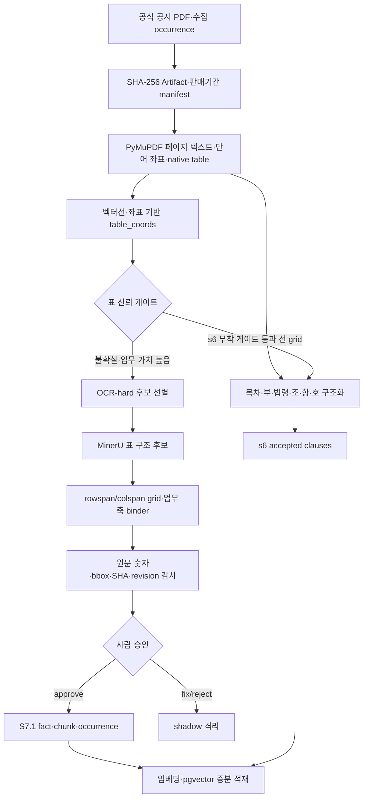

# 수집 데이터 및 데이터 전처리 보고서

- 기준일: 2026-08-04 KST
- 대상: 12개 보험사 실손의료보험 약관
- 운영 기준선: 조항 `s6_pymupdf-1.28.0` + 사람 승인 S7.1 OCR facts
- 핵심 원칙: 원문·좌표를 먼저 보존하고, 불확실한 추출 결과는 추정하지 않으며, 사람 승인 전에는 검색·인용·판정에 사용하지 않는다.

## 0. 한눈에 보는 결과

이 프로젝트의 전처리는 PDF에서 텍스트만 뽑는 작업이 아니다. 사용자의 계약일에 맞는 약관 판본을
고르고, 그 판본에서 조항·별표·표의 근거 위치를 되짚을 수 있게 만드는 데이터 계보 작업이다.

```text
공식 공시 사이트 수집 발생 2,121행
  └─ SHA-256 고유 원문 1,703개
       ├─ 비의료·여행·사업방법서 336개 격리
       └─ 판정 대상 1,367개
            ├─ PyMuPDF 페이지·좌표 추출 1,367개 / 실패 0
            ├─ s6 조항 구조화 204,098개
            └─ 어려운 표만 MinerU 구조 복원 후보화
                 ├─ 생산 candidate 4,562개: 전부 serving·citation 차단
                 └─ 사람 승인 850 facts만 S7.1 증분 릴리스
```

운영 릴리스는 다음 두 층을 합친다.

```text
s6_pymupdf-1.28.0 조항 정본
  + 사람 승인 S7.1 OCR 표 facts 850건
  = r2026-08-04-clause-s7.1-arctic-ko-ocr-approved
```

S7.1은 모든 PDF를 OCR로 다시 읽은 대체판이 아니다. 텍스트·좌표 추출로 충분한 페이지는 s6를
유지하고, 일반 추출이 표의 행·열 관계를 복원하지 못한 일부 페이지만 구조 복원 후보로 보냈다.

## 1. 수집 대상과 원칙

수집 목표는 “인터넷에 있는 보험 PDF를 많이 모으는 것”이 아니라, 사용자의 가입 시점에 적용된
실손의료보험 약관을 원문 조항까지 연결할 수 있는 판본 원장을 만드는 것이다.

| 수집 정책 | 이유 |
|---|---|
| 약관을 수집 | 요약서·사업방법서는 보험금 판정의 조항 근거로 인용할 수 없음 |
| 의료 실손만 판정 대상으로 사용 | 화재·풍수해의 ‘실손’은 실제 손해 보상 방식이지 실손의료보험이 아님 |
| 판매중지 상품과 개정판도 수집 | 과거 가입자의 계약에는 현재 판매 중인 약관이 아니라 당시 판본이 적용됨 |
| 공식 보험사 공시 페이지를 출발점으로 사용 | 제3자 파일 저장소보다 출처·판매기간·개정 이력을 추적하기 쉬움 |
| robots·WAF를 우회하지 않음 | 실제 PDF 경로가 금지되거나 확인이 불가능하면 중단 |
| 원문 PDF를 Git에 커밋하지 않음 | 약관 원문은 저작물이며 재배포 대상이 아님 |

한화손해보험은 `robots.txt`의 허용 목록에 실제 PDF 경로가 없어 제외했다. 차단을 우회해 문서를
늘리는 것보다 수집하지 못한 이유를 남기는 쪽을 택했다.

## 2. 공식 공시 사이트 크롤링

### 2-1. 수집 수량의 단위와 계보

수집 과정에는 서로 다른 네 가지 수량이 있다. 단위를 붙이지 않고 모두 “문서 수”라고 부르면
중복 제거와 격리 결과를 잘못 해석하게 된다.

| 시점·단계 | 단위 | 수량 | 의미 |
|---|---|---:|---|
| 2026-08-01 중간 보고 | 당시 다운로드 기록 | 1,817건·5.16GB | 삼성생명 등이 진행 중이던 역사적 체크포인트. 최종 분모가 아님 |
| 수집 완료 원장 | `SourceOccurrence` | 2,121행 | 같은 PDF가 여러 상품·판매기간에 붙은 발생을 각각 보존 |
| 수집 완료 파일 감사 | 물리 파일 | 2,030개·5.75GB | 중복 파일 정리 전 디스크 기준 스냅샷 |
| 내용 중복 제거 | SHA-256 `Artifact` | 1,703개 | 내용이 같은 PDF는 한 벌만 보존 |
| 비대상 격리 | 고유 SHA | 336개 | 비의료 실손 159·여행실손 158·사업방법서 19 |
| 전처리 입력 | 고유 SHA | 1,367개 | s5 페이지·s6 조항·S7 검증의 공통 분모 |

같은 약관이 여러 상품이나 판매기간에 붙은 것은 오류가 아니다. 파일은 SHA-256 기준 한 벌만 두되,
“어느 상품의 어느 기간에 이 약관이 붙었다”는 발생 기록은 지우지 않았다. 이것이
`Artifact`와 `SourceOccurrence`를 분리한 이유다.

### 2-2. 보험사별 최종 계보

아래 표는 현행 raw manifest를 `수집 발생 / 고유 SHA / 판정 대상 / 격리`로 다시 집계한 값이다.

| 보험사 | 발생 | 고유 원문 | 판정 대상 | 격리 |
|---|---:|---:|---:|---:|
| DB손해보험 | 462 | 258 | 236 | 22 |
| 흥국화재 | 228 | 205 | 194 | 11 |
| 흥국생명 | 18 | 15 | 15 | 0 |
| 현대해상 | 337 | 280 | 228 | 52 |
| KB손해보험 | 120 | 112 | 28 | 84 |
| 롯데손해보험 | 94 | 92 | 92 | 0 |
| 메리츠화재 | 158 | 157 | 9 | 148 |
| 동양생명 | 13 | 13 | 13 | 0 |
| NH농협손해보험 | 12 | 12 | 12 | 0 |
| NH농협생명 | 52 | 52 | 52 | 0 |
| 삼성화재 | 406 | 307 | 288 | 19 |
| 삼성생명 | 221 | 200 | 200 | 0 |
| **합계** | **2,121** | **1,703** | **1,367** | **336** |

기존 문서의 삼성생명 196건은 추출 메타의 미정규화 보험사명 4건을 별도로 센 값이었다. 이 표는
수집 slug 기준으로 4건을 삼성생명에 합쳐 총계가 실제 전처리 분모 1,367과 맞도록 정리했다.

### 2-3. 범용 파서 하나로 해결하지 않은 이유

보험사 공시 사이트는 목록과 다운로드 방식이 서로 달랐다. 정적 HTML만 읽는 범용 크롤러로는
세션, 암호화 토큰, JavaScript 렌더링, 단계별 상품 선택을 동시에 처리할 수 없었다. 그래서
API·HTML 사이트는 개별 어댑터로, UI 의존 사이트는 공통 브라우저 엔진과 사이트 설정으로 나눴다.

| 보험사·유형 | 막힌 지점 | 실제 해결 방식 |
|---|---|---|
| 삼성화재 | `file1/2/3` 중 어떤 슬롯이 약관인지 표시가 없음 | 동일 상품의 세 파일 표지·쪽수를 대조해 약관 슬롯을 확정 |
| DB손해보험 | 코드형 파일명이라 이름만으로 실손 여부 판단 불가 | JSON 카탈로그의 상품·문서 유형과 조인 |
| 현대해상 | 목록·상세가 별도 AJAX 호출 | 두 단계 `POST /ajax.xhi` 응답과 판매기간을 결합 |
| KB손해보험 | 한 상품 상세에 개정판이 다수 존재 | 판매개시일별 파일을 모두 occurrence로 보존 |
| 흥국화재 | `TYPE=filedownX`가 빠지면 1,571바이트 오류 HTML 반환 | 외부 JavaScript의 다운로드 함수 원문을 확인해 요청 형식 복원 |
| NH농협생명 | 세션 없이 상세를 열면 PDF 링크가 빈 값 | CookieJar로 세션을 먼저 만들고 HTML viewer와 실제 PDF를 구분 |
| 동양생명 | 목록은 GET, 페이징은 POST인 혼합 구조 | 브라우저 전이를 관찰해 요청 역할을 분리 |
| NH농협손해보험 | 상품군→구분→상품을 모두 골라야 링크 생성 | UI 3단계를 순서대로 선택하고 파일은 동일 세션에서 다운로드 |
| 메리츠화재 | 직접 요청은 WAF 차단, 폼 다운로드는 일반 응답 이벤트에 안 잡힘 | Playwright `expect_download()`로 실제 다운로드 이벤트 수집 |
| 롯데손해보험 | 중간 단계를 건너뛰면 최종 응답이 0바이트 | 네 단계 호출을 화면 순서대로 수행 |
| 흥국생명 | 메뉴가 렌더 후 나타나고 응답은 EUC-KR·상품명은 이중 인코딩 | 브라우저 렌더링, 문자셋 교정, POST 인코딩을 함께 적용 |
| 삼성생명 | 숨겨진 통합검색창을 잘못 선택해 전 상품을 순회 | 실제 `#keywordSearch`를 찾아 실손 검색 결과만 수집 |

코드상 역할은 다음과 같다.

| 코드 | 역할 |
|---|---|
| `scripts/crawl/sites/*.py` | API·HTML 기반 보험사별 카탈로그와 다운로드 어댑터 |
| `scripts/crawl/browser_collector.py:68` | JavaScript·세션·단계 선택 사이트의 공통 브라우저 엔진과 설정 |
| `scripts/crawl/update_all.py:80` | 현행 삼성화재·DB손해보험 두 API 어댑터의 증분 실행기 |
| `scripts/crawl/reconcile_manifest.py:70` | 디스크 파일과 매니페스트 불일치 복구·감사 |
| `scripts/crawl/dedupe_artifacts.py` | SHA가 같은 물리 파일을 한 벌로 정리하고 occurrence는 유지 |
| `scripts/crawl/verify_coverage.py:204` | 사이트 목록과 수집 원장을 보험사 단위로 재대조 |

현재 저장소에는 12개사를 한 명령으로 완전히 재수집하는 정본 CLI가 없다. 특히
`scripts/crawl/update_all.py`는 두 어댑터만 등록하고, `--recheck`는 인자만 있고 실행 로직이 없다.
따라서 이 파일을 전체 크롤링 재현 명령으로 과장하지 않는다.

### 2-4. 수집 사고와 그 뒤에 추가한 방어

수집 난이도는 사이트별 셀렉터보다 “정상처럼 보이는 실패”를 찾아내는 데 있었다.

| 사고 | 겉으로 보인 상태 | 실측 원인·영향 | 복구와 재발 방지 |
|---|---|---|---|
| 매니페스트 유실 | PDF 파일은 존재 | 디스크 full 뒤 PDF는 쓰이고 append만 실패해 388개 중 377개 기록 없음 | `{sha12}_{원본명}`과 카탈로그를 조인해 377/377 복구. 모르는 URL·날짜는 추정하지 않고 비움 |
| 65,536바이트 잘림 | `%PDF`로 시작해 정상처럼 보임 | HTTP 206 Range 한 구간을 전체 PDF처럼 저장, 165개가 0쪽 | 206 응답을 버리고 200 전체 응답만 채택, 사후 `%PDF`·`%%EOF` 전수 검사 |
| 동시 프로세스 12개 | 다운로드가 계속 진행됨 | 같은 사이트를 중복 수집해 기록 9,574행·실파일 2,260개, 파일 덮어쓰기 발생 | 실행 lock과 PID 기록, 한 occurrence 처리 후 기록하는 계약 도입 |
| 비실손 오분류 | 파일명에 ‘실손’이 없음 | 코드형 파일명 때문에 삼성화재 79·DB 61건을 비실손으로 오탐 | 카탈로그 조인 전에는 삭제하지 않음. 삼성생명의 실제 비실손 443건만 분리 |
| 자연 중복을 오류로 취급 | 같은 SHA가 여러 번 등장 | 같은 약관이 여러 상품·판매기간에 붙음 | Artifact 한 벌 + SourceOccurrence 전부 보존, 당시 1.39GB 절감 |
| URL 기반 커버리지 오탐 | 매 실행마다 새 누락으로 보임 | 일부 사이트 URL의 암호화 토큰이 세션마다 바뀜 | `(정규화 상품명, 판매개시일)`을 비교 키로 사용 |

### 2-5. 수집 품질 검증

| 검증 | 범위 | 결과 | 해석 제한 |
|---|---|---|---|
| 문서 종류 표본 | 12개사×6건=72건의 첫 페이지 | 요약서·사업방법서 오수집 0 | 표본 검증이며 전수 문서 의미 분류는 별도 수행 |
| PDF 무결성 | 당시 1,817건 전수 | `%PDF` 시작·`%%EOF` 꼬리, 잘림 0 | 현행 온라인 저장기는 `%PDF`와 60MB 상한을 검사하고 EOF는 당시 사후 전수 감사였음 |
| 사이트 커버리지 | URL·카탈로그 대조 가능한 9개사 | 누락 0 | 브라우저 수집 3개사는 PDF URL이 없어 화면 결과 건수로 대조 |
| 브라우저 3개사 | 삼성생명·메리츠·NH농협손보 | 화면 223/157/12 대비 수집 221/158/12 | 삼성생명 차이 2건 중 확인된 1건은 DRM 컨테이너라 우회하지 않았고, 나머지 1건은 원인 미확정 |
| 수집 완료 시점 파일 감사 | 매니페스트 발생행 2,121·물리 PDF 2,030개(5.75GB) | PDF 매직바이트 이상 0·`%%EOF` 누락 0·정확히 65,536바이트인 파일 0·매니페스트↔파일 불일치 0 | 2026-08-01 스냅샷이며 발생행과 파일 수는 서로 다른 단위 |

사이트 재조회는 외부 상태가 바뀌고 서버 부하를 일으킨다. 큰 변경 뒤에도 한 번에 전 보험사를
조회하지 않고 `python -m scripts.crawl.verify_coverage --only <slug>`처럼 단일 보험사로 제한한다.

## 3. 좌표 기반 전처리

### 3-1. 전체 파이프라인



실제 본선 진입점은 `scripts/extract/run_all.py`다. 문서 식별 보조기인
`app/outer/outbound/pdf/extractor.py`는 표지·목차 표본을 읽는 용도이며 전량 페이지·조항
전처리기로 사용하지 않는다.

### 3-2. 페이지 정본: 텍스트와 좌표를 함께 보존

`scripts/extract/to_page_json.py:167`은 PDF 한 건을 페이지 JSON으로 변환한다.

1. PyMuPDF `page.get_text()`로 읽기순서 본문을 보존한다.
2. 제어문자·공백을 정리하되 복원하지 못한 PUA 문자를 통계로 남긴다.
3. `page.find_tables()`의 native 표를 보존한다.
4. 단어 bbox와 PDF 벡터선을 사용한 `table_coords` 결과를 별도로 보존한다.
5. 표 추출 실패를 빈 표로 숨기지 않고 `table_extraction_failed`나 실패 사유로 남긴다.
6. 문서 SHA·보험사·상품명·판매기간·URL을 페이지 산출물에 다시 연결한다.

native 표와 좌표 표를 둘 다 남긴 이유는 어느 한쪽도 전 문서에서 완전하지 않기 때문이다.
흥국화재의 대표 KCD 22행 표에서 native `find_tables()`는 2행×3열로 붕괴했다. 이 사례와 같은
조판 3표·66레코드 정답셋 전체의 질병명↔코드 짝 정확도는 통합 전 평평한 페이지 텍스트
기준선 0.455, 벡터선·좌표 복원 1.000이었다. 반대로 벡터선이 없는 표와 다단 본문은 좌표
정렬만으로 구분하기 어렵기 때문에
native 결과를 삭제하지 않았다.

### 3-3. 좌표 표 복원 방식

`scripts/extract/table_coords.py:531`은 단어와 선을 다음 순서로 처리한다.

- 페이지의 2단 패널을 먼저 분리해 서로 다른 본문 열이 한 표로 합쳐지는 것을 막는다.
- 가로·세로 벡터선을 이용해 열 경계와 행 묶음을 복원한다.
- 선이 부족한 경우 단어 정렬·간격·열 밀도로 2열·다열 후보를 만든다.
- `scripts/extract/table_signals.py`의 업무 키워드·금액·비율·문장형 본문 신호로 후보를 판별한다.
- 확실하지 않은 `2열짝짓기`는 자동 채택하지 않고 보류 통계에 남긴다.

좌표 방식의 장점은 빠르고 결정적이며 모든 값에 원문 페이지와 bbox를 남길 수 있다는 것이다.
하지만 병합 셀, 페이지를 넘는 부모 헤더, 3열 이상 무테두리 표, 일반 2단 조판과 표의 구분에는
구조적 한계가 있다. 현재 s5의 원시 `2열짝짓기` 후보 109,421개는 모두 자동 부착이 차단돼 있다.
s6의 `tables_withheld_unverified=109,301`은 fallback 2열 후보 229개를 제외하는 대신 reject된
선 후보 109개를 포함하므로 같은 분모가 아니다. 좌표 표 0건인 보험사도 있어
“전처리 완료=모든 표 복원 완료”라고 주장하지 않는다.

### 3-4. 조항·부록 구조화

`scripts/extract/to_clauses.py:670`은 페이지 정본을 판정·인용 가능한 구조로 바꾼다.

| 처리 | 설명 |
|---|---|
| 목차 판정 | `제N조` 문자열 비율이 아니라 목차 제목·항목·연속 페이지 구조를 사용 |
| 부 경계 | 보통약관·특별약관·별표·부록의 제목형 단독 줄을 구분 |
| 법령 구간 | 관계법령을 약관 조항과 분리해 잘못된 보험 조항 인용을 막음 |
| 조항 경계 | `제N조` 머리말과 참조 꼬리를 구분하고 항 `①`, 호 `1.`·`가.` 계층 복원 |
| locator | 문서 SHA·쪽·section·ordinal·content hash를 보존 |
| 실패 상태 | 구조가 불명확하면 `suspect` 또는 `no_clause_heads`로 표시 |

최종 s6 기준은 1,367문서 전량 생성·실패 0이며, `ok` 1,306·`suspect` 52·
`no_clause_heads` 9다. 조항 발생은 204,098개이고 전체 분모 기준 인용 가능 조항은
195,630개(95.85%)다. 판정 경로는 구조가 불명확한 문서에서 추측하지 않고 기권해야 한다.

### 3-5. 단계별 산출물

| 단계 | 대표 산출물 | 역할 |
|---|---|---|
| 수집 원장 | `data/raw/manifests/*.jsonl` | 보험사·상품·판매기간·URL·SHA occurrence |
| 페이지 정본 | `data/extracted/*/s5_pymupdf-1.28.0/*.json` | 본문·쪽·native 표·좌표 표·정규화 통계 |
| 조항 정본 | `data/structured/*/s6_pymupdf-1.28.0/*.clauses.json` | 조·항·호·부록·locator·parse status |
| 전처리 manifest | `data/manifests/preprocess/manifest_s6.json` | 1,367 입력·산출물·코드·환경 해시 |
| OCR shadow | `data/candidates/s7_selfpay/` | 자동 승인되지 않은 자기부담금 candidate facts |
| 승인 OCR facts | `data/work/s7_1_approved_facts/` | 사람이 승인한 fact·chunk·occurrence |

## 4. OCR 모델 선정 과정

### 4-1. 왜 OCR이 필요했나

OCR 대상 페이지에도 native text와 일부 표 객체는 있었다. 문제는 글자를 전혀 읽지 못한 것이 아니라,
다단 헤더·rowspan·colspan·페이지 경계 때문에 “어떤 금액과 비율이 어느 플랜·진료유형·기관에
속하는가”라는 축 관계가 사라진 것이었다. 따라서 OCR의 역할을 전수 문자 인식이 아니라
고가치 표의 구조를 HTML grid로 다시 제안하는 문서 파서로 한정했다.

모델 후보는 다음 조건으로 먼저 걸렀다.

- 외부 API가 아니라 오프라인 가중치로 재실행할 수 있을 것
- RTX 4070 SUPER 12GB에서 실행 가능할 것
- KCD의 `I/1`, `O/0` 같은 치명 문자 오류를 따로 잴 수 있을 것
- 표의 행·열·병합 셀과 source bbox를 보존할 것
- 평균 점수보다 금액·코드 오결합 0건을 우선할 것

제작사가 공개한 OmniDocBench·KDoc-OCRBench 점수는 평가셋과 조건이 서로 달라 후보 선정에만
사용하고 최종 서열 근거로 사용하지 않았다. 최종 판단은 같은 보험약관 이미지 실측으로 했다.

### 4-2. 동일 보험약관 5종 실측

환경은 x600 RTX 4070 SUPER 12GB였다. KCD 정답 22행 1쪽과 서로 다른 자기부담금 표 6쪽,
총 7쪽을 사용했다.

| 모델 | KCD 코드 완전 | 질병명·코드 같은 행 | KCD 1쪽 시간 | 자기부담금 확장 | 주요 관찰 |
|---|---:|---:|---:|---|---|
| `opendatalab/MinerU2.5-Pro-2605-1.2B` | **22/22** | **21/22** | **30.685초** | 7/7 HTML 표·평균 29.055초/쪽 | bbox·구조 JSON 보존, 비한글 CJK 0, 중복 라인 0% |
| `ATH-MaaS/OvisOCR2` | 22/22 | 21/22 | 74.678초 | 7/7 HTML 표·평균 73.671초/쪽 | 페이지당 CJK 8~66자, 중복 라인 33.33~96.04% |
| `PaddlePaddle/PaddleOCR-VL-1.6` | 0/22 | 0/22 | 81.425초(256토큰) | 확대 보류 | 첫 코드부터 `I00→100`, 긴 실행은 12GB 근접 점유 후 미완료 |
| `zai-org/GLM-OCR` | 9/22 | 3/22 | **14.497초** | 확대 보류 | 빠르지만 한글 오독·중간 절단 |
| `ONTHEIT/BizOnAI-OCR` 4bit | 0/22 | 0/22 | 21.579초 | 확대 보류 | `I00→100`, 출력 절단 |

Paddle NF4 4bit 대조는 계측 VRAM을 약 45.7% 줄였지만 3.4% 느려졌고 핵심 `I00→100`
오류가 그대로였다. 즉 양자화는 가능했지만 이 실험의 정확도 병목을 해결하지 못했다.

### 4-3. MinerU를 선택한 이유

MinerU는 외부 벤치마크 1위라서 선택된 것이 아니다. 동일 보험약관에서 다음 조건을 함께 만족한
가장 실용적인 후보였기 때문이다.

1. KCD 코드 묶음 22/22를 유지했다.
2. 자기부담금 6쪽을 포함한 7쪽 모두에서 HTML 표를 만들었다.
3. 병합 셀과 bbox를 구조화 산출물로 남겼다.
4. Ovis보다 약 2.5배 빨랐고 비한글 CJK·중복 라인이 관찰되지 않았다.
5. 약 2.9GB 수준의 peak VRAM으로 비양자화 경로를 12~16GB 장비에서 실행할 수 있었다.

생산에 사용한 모델과 revision은 다음과 같다.

```text
model     opendatalab/MinerU2.5-Pro-2605-1.2B
revision  bff20d4ae2bf202df9f45284b4d43681555a97ed
mode      비양자화, 결정적 생성 설정
role      표 구조 candidate 생성기 — 자동 정답 생성기 아님
```

비교 표본은 7쪽으로 작고 모델별 출력 토큰 상한도 같지 않았다. 따라서 “한국어 보험 문서에서
항상 최고”라고 일반화하지 않는다. 별도로 계획했던 48문서 shadow 평가는 manifest는 있으나
최종 `score.json`과 완료 리포트가 없어 선정 근거로 사용하지 않았다.

## 5. 선별 OCR 생산과 승인

### 5-1. 전수 OCR 대신 어려운 페이지만 선별

1. 자기부담금 업무 키워드가 있는 4,538쪽을 후보화했다.
2. 이 중 우선순위 3,000쪽을 렌더링했다.
3. 금액·비율, 복수 축, 표 헤더, 기존 업무 fact 누락 신호로 OCR-hard 1,361쪽만 남겼다.
4. 렌더 PNG의 byte SHA-256이 완전히 같은 경우에만 결과를 공유해 1,361 occurrence를
   832개 고유 이미지로 줄였다.
5. 유사 레이아웃이나 같은 보험사라는 이유로 결과를 전파하지 않았다.

이 방식으로 추론 529회를 줄였고, x600 1대와 RunPod 5대의 총 6GPU에서 MinerU 832/832를
완료했다. 가장 늦은 장비 기준 순수 추론 wall time은 128.9분이었다. 원문 PDF와 DB 자격증명은
보내지 않고 SHA 이름의 렌더 이미지와 최소 실행 manifest를 사용했다. 다만 렌더 이미지도 약관
파생물이라는 점을 고려해, 같은 외부 GPU 실험을 반복할 때는 현행 반출 정책을 다시 승인받아야 한다.

### 5-2. OCR 결과를 업무 fact로 바꾸는 과정

| 단계 | 코드 | 검증 내용 |
|---|---|---|
| 어려운 페이지 선별 | `scripts/eval/select_s7_ocr_hard.py` | 업무어·금액/비율·다축 신호와 기존 누락 조건 |
| exact image 중복 제거·배분 | `scripts/eval/allocate_s7_ocr_dedup6.py` | PNG SHA 완전 일치만 alias 허용 |
| 모델 실행 | `scripts/eval/ocr_sota5_runner.py` | 모델·입력 SHA·환경·실행 결과 기록 |
| 결과 병합 | `scripts/eval/merge_s7_ocr_dedup6.py` | 입력 이미지 SHA·모델 revision·alias 계보 검사 |
| 표 grid 복원 | `scripts/eval/selfpay_axis_binder.py:145` | rowspan/colspan 논리 grid 확장 |
| 업무 축 연결 | `scripts/eval/selfpay_axis_binder.py:242` | plan·service·institution·coverage·금액/비율·bbox 연결 |
| candidate 감사 | `scripts/eval/audit_s7_candidates.py:76` | 숫자 원문 대조·bbox·중복 ID·S6 비회귀·격리 상태 |
| S7 결합 | `scripts/extract/build_s7_hybrid.py:156` | 역사적 `is_table` 기준 선 grid→native→OCR candidate 순서, OCR은 candidate-only |
| 사람 승인 물질화 | `scripts/eval/materialize_s7_1_facts.py:76` | `approve` 패턴만 fact·chunk·occurrence로 변환 |

구축된 S7의 선 표 우선순위는 아직 현행 `attachment_verdict(T9)`와 통합되지 않았다. 선 후보
813개 중 builder의 역사적 `is_table` 기준은 777개를 verified로 보지만 현행 s6 부착 게이트는
704개만 통과시켜 73개 차이가 난다. accepted clause 내용 mismatch 0은 확인됐지만, 이것만으로
S7 page mode의 선 표 분류가 현행 안전 게이트와 같다고 주장하지 않는다.

binder는 표 셀의 값을 임의로 채우지 않는다. 페이지 경계, 빈 plan/service, 불완전 bbox,
ragged grid, span mismatch, 비한글 CJK, 알려진 OCR 의심어가 있으면 `review_required`로 내린다.
아무 사유가 없어도 상태는 `shadow_pass`일 뿐 자동 승인이 아니다.

### 5-3. candidate와 사람 승인 결과

| 구분 | 결과 | 운영 처리 |
|---|---:|---|
| OCR 생산 대상 문서 | 601 | 후보 선별 분모 |
| candidate가 생성된 문서 | 573 | 28문서는 candidate 0 |
| candidate facts | 4,562 | 전부 `approval=candidate` |
| `shadow_pass` | 1,390(30.47%) | 사람 승인 전 차단 |
| `review_required` | 3,172(69.53%) | 사유와 함께 검수 큐 |
| 자동 serving/citation | 0/4,562 | 누출 0 확인 |
| 사람 검수 범위 | 29패턴·1,066 facts | 전량 라벨 |
| 승인 | 24패턴·850 facts | S7.1 검색·인용 가능 |
| 수정 필요 | 5패턴·216 facts | DB·serving·citation 제외 |

승인 850 facts는 75개 고유 청크와 850 occurrence가 되어 179문서에 연결됐다. 각 occurrence는
문서 SHA, 원문 쪽, 표 bbox, 렌더 이미지 SHA-256을 보유하며 locator 누락은 0이다.

## 6. 품질 검증과 승격 게이트

| 검증 층 | 검사 | 실측 결과 |
|---|---|---|
| 입력 계보 | 이미지 SHA·모델 revision·archive·alias 대조 | 832/832 입력 일치, 예상 밖 stale 1건 quarantine |
| 숫자 환각 방지 | OCR 금액·비율 토큰이 같은 페이지 native text에 존재하는지 | 금액 4,172/4,172 + 비율 4,124/4,124 = 8,296/8,296 |
| grid·근거 | bbox 4좌표, rowspan/colspan, ragged·span mismatch | invalid bbox 0, 결함 신호는 review 사유로 기록 |
| accepted 비회귀 | S6 accepted clauses와 S7 결합본 비교 | 204,098개 내용 mismatch 0 |
| 결정성 | 같은 입력으로 S7 재빌드 | page+clause 2,734파일 전부 unchanged |
| manifest | S7 1,367문서·tree digest 재검증 | 어긋남 0 |
| 격리 | candidate의 serving/citation·색인 유입 | 승인 전 0건 |
| 사람 승인 | 29패턴 원문 대조 | approve 24·fix 5 |
| 검색 비회귀 | 기존 417질의 top20·리랭크 | 승인 OCR fact 6질의·23 pair 실제 유입, 기존 gold rank 변화 0 |

숫자 토큰 8,296/8,296 일치는 “OCR이 새 숫자를 지어내지 않았다”는 검사다. 그 숫자가 올바른
행·헤더에 연결됐다는 precision을 의미하지 않으므로 최종 축 소속은 사람 승인을 요구했다.

S7.1 적용 전후 기존 검색 평가의 Hit@1과 MRR@10은 동일했다. 이는 새 자기부담금 fact의 독립
정답률을 측정한 결과가 아니라, 승인 fact가 검색에 실제 들어오면서 기존 검색 품질을 훼손하지
않았음을 확인한 비회귀 결과다.

## 7. 전처리 시각화

전처리 결과를 숫자 표만으로 판단하지 않기 위해 문서별 페이지·조항 수, 보험사·세대별 분포,
`parse_status` 편향, 오류 부담 Pareto, 조항 길이, KCD 언급, 조항 참조 모호성을 Plotly 기반
단일 HTML로 만들었다.

<p align="center">
  <a href="01_부록_전처리_시각화.html">전처리 시각화 부록 열기</a>
</p>

부록은 별도 서버 없이 열 수 있다. 다만 상단의 수치 스냅샷과 산출물 태그를 함께 읽어야 하며,
이전 DB 적재 값과 최신 디스크 전처리 값을 같은 분모로 해석하지 않는다.

## 8. 임베딩은 어디까지 전처리인가

임베딩은 넓은 ML 파이프라인에서는 전처리에 포함될 수 있지만, 이 프로젝트의 책임 분리에서는
승인된 텍스트 산출물을 검색 벡터로 바꾸는 **후속 색인 단계**로 보는 것이 더 명확하다.

따라서 이 문서가 책임지는 범위는 다음과 같다.

- 조항·표 사실을 검색 가능한 길이의 `chunk`로 만들기
- 같은 내용을 나타내는 `content_hash`와 문서별 출현인 `occurrence` 분리
- 문서 SHA·쪽·section·bbox·locator를 잃지 않기
- 미승인 candidate를 임베딩 입력에서 제외하기
- 어느 전처리 release가 어느 벡터 release로 갔는지 계보 남기기

모델 후보 21회 비교, 접두어, 길이 잘림, bootstrap 신뢰구간, 배포 모델 판단은
[05C 사용 LLM 모델 §3](05C_사용_LLM_모델.md)과
[임베딩 모델 선정 브리핑](../handoff/13_임베딩모델_선정_브리핑.md)을 단일 정본으로 둔다.

현재 운영 스냅샷은 다음과 같다.

```text
model            dragonkue/snowflake-arctic-embed-l-v2.0-ko
dim              1024
max_seq_length   8192
chunk_budget     448
overlap          80
운영 청크        122,772
```

이 모델은 21회 측정에서 다음 검증에 넣을 1순위로 선택돼 현재 릴리스에 사용됐지만 통계적 최종
우승으로 확정된 것은 아니다. s6 코퍼스 재평가·구어체 질의·별도 holdout·비열등성 허용폭이
남아 있고, `config/accepted_extraction.json`의 모델 revision도 비어 있어 고정이 필요하다.

검색·벡터DB 구현과 적재 경계는 [RAG LLM·벡터DB 구현 보고서](03_RAG_LLM_벡터DB_구현.md)에서
이어 설명한다.

## 9. 재현·감사 명령

### 로컬에서 안전하게 확인 가능한 명령

```powershell
$env:PYTHONIOENCODING = 'utf-8'

# 전처리 대상과 누락 산출물 확인
python -m scripts.extract.run_all --dry-run

# s5↔s6 정합 검사기 자체의 변조 탐지와 실제 기준선 검사
python -m scripts.eval.consistency_check --selftest
python -m scripts.eval.consistency_check

# 동결된 s6 입력·산출물·코드·환경 해시
python -m scripts.extract.build_manifest --schema s6 --verify

# S7 결합본과 OCR candidate 격리·숫자·bbox·S6 비회귀
python -m scripts.extract.build_s7_hybrid --verify
python -m scripts.eval.audit_s7_candidates

# 제출 문서 링크
python -m scripts.verify.check_submission_links
```

### 수집 도구 사용 시 주의

```powershell
# 로컬 매니페스트·중복·분류 dry-run
python -m scripts.crawl.reconcile_manifest --dry-run
python -m scripts.crawl.dedupe_manifest --dry-run
python -m scripts.crawl.dedupe_artifacts --dry-run
python -m scripts.crawl.classify_documents --dry-run

# 외부 사이트 재조회 — 큰 변경 뒤 단일 보험사로만 제한
python -m scripts.crawl.verify_coverage --only <slug>
```

`update_all.py --recheck`는 현행 구현에서 동작 계약이 완성되지 않았으므로 재현 명령으로 사용하지
않는다. 수집 어댑터에는 고정 fixture 기반 contract test도 부족해, 사이트 개편 대응은 향후 보강
대상이다.

## 10. 데이터 공개 범위

| 산출물 | 위치 | 외부 공개 |
|---|---|---|
| 활성 릴리스 포인터 | `config/accepted_extraction.json` | 가능 |
| 확정 문서 원장 | `config/confirmed_documents.jsonl` | 메타데이터 검토 후 가능 |
| 전처리 manifest | `data/manifests/preprocess/manifest_s6.json` | 가능 |
| 승인 OCR facts | `data/work/s7_1_approved_facts/` | 팀 내부 |
| 표 후보 registry | `config/candidate_fact_sources.json` | 경로·해시 메타는 가능 |
| 약관 PDF | `data/raw/insurance_terms/` | 재배포 금지 |
| 약관 본문 파생 JSON | `data/extracted/`, `data/structured/` | 재배포 금지 |

## 11. 남은 한계

- s5 원시 `2열짝짓기` 후보 109,421개는 자동 부착 차단 상태이며, s6 보류 통계 109,301과 분모가 다르다.
- S7 builder의 역사적 선 표 기준과 현행 T9 부착 게이트 사이에 73개 분류 차이가 남아 있다.
- 좌표 표가 0건인 보험사가 있고, 현재 표 정답셋 120쪽도 전체 보험사·조판을 대표하지 않는다.
- MinerU 5종 비교는 7쪽 소표본이고 모델별 토큰 상한이 달라 전 도메인 우위를 주장할 수 없다.
- 48문서 shadow 계획은 최종 score와 종료 리포트가 없어 완료 실험으로 쓰지 않는다.
- 페이지를 넘는 표의 부모 셀 자동 병합은 지원하지 않으며 이런 후보는 `review_required`로 남는다.
- 사람 검수는 4,562 candidate 전량이 아니라 29패턴·1,066 facts 범위이며, 850 facts만 승인됐다.
- 승인 OCR facts 전용 독립 holdout이 없어 새 fact의 precision/recall은 아직 확정하지 못했다.
- 장해분류표 지급률 8,586 facts와 지연이자표 36 facts는 candidate-only이며 사람 승인 전 판정 근거가 아니다.
- 기계 대조 확정 문서 850건은 사람 최종 서명과 다르다. 엄격 `human_signoff` 모드에서는 승인 문서가 0건이다.
- 임베딩 revision 고정, s6 코퍼스·구어체·holdout 재평가가 남아 있다.

## 참조

- [실손보험 약관 수집 결과](../reports/2026-08-01_실손약관_수집_결과보고.md)
- [사이트 커버리지 대조 결과](../reports/2026-08-01_커버리지_대조_결과.md)
- [OCR SOTA 5종 벤치마크 계획](../plans/2026-08-03_1850_오프라인_OCR_SOTA5_벤치마크_계획.md)
- [오프라인 OCR SOTA 5종 x600 실측](../reports/2026-08-03_2010_오프라인_OCR_SOTA5_x600_실측.md)
- [S7 6GPU OCR candidate 완료 보고](../reports/2026-08-04_0219_S7_6GPU_OCR_candidate_데이터셋_완료보고.md)
- [S7.1 사람 승인 OCR 승격 결과](../reports/2026-08-04_S7.1_OCR승격_최종결과.md)
- [데이터 현황 계약](../handoff/01_데이터_현황.md)
- [모델 평가 계약](../handoff/10_계약_모델_평가.md)
- [임베딩 모델 선정 브리핑](../handoff/13_임베딩모델_선정_브리핑.md)
