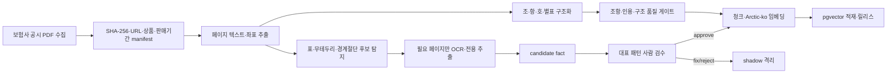

# 수집 데이터 및 데이터 전처리 보고서

## 1. 목적과 데이터 계보

사용자가 입력한 보험사·상품·계약일·KCD 질병기호를 정확한 약관 판본의 조항과 연결하기 위해 보험사 공시 약관을 수집하고 구조화했다. 운영 정본은 다음 두 층으로 구성한다.

```text
s6_pymupdf-1.28.0 조항 정본
  + 사람 승인 S7.1 OCR 표 facts 850건
  = r2026-08-04-clause-s7.1-arctic-ko-ocr-approved
```

S7.1은 모든 PDF를 OCR로 다시 읽은 대체판이 아니다. 텍스트·좌표 추출로 충분한 페이지는 s6를 유지하고, 일반 추출만으로 축 관계가 손실되는 표 중 사람이 승인한 사실만 증분했다.

## 2. 데이터 수집 현황

| 항목 | 실측 |
|---|---:|
| 수집 원문 | 1,703문서 |
| 의료 실손 판정 대상 | 1,367문서 |
| 격리 | 336문서 |
| 인식 보험사 | 12개사 |
| s6 전처리 실패 | 0문서 |
| s6 조항 | 204,098개 |
| 인용 가능 조항 | 195,630개, 95.85% |
| 기계 대조 확정 문서 | 850개 |

격리 336건은 삭제하지 않고 원본과 사유를 보존했다.

| 격리 사유 | 건수 | 이유 |
|---|---:|---|
| 비의료 실손 | 159 | 화재·풍수해 등 실제 손해 보상 문서로 의료 실손이 아님 |
| 여행실손 | 158 | 일반 실손 세대 판정 코호트와 다름 |
| 사업방법서 | 19 | 약관이 아닌 내부 업무 기준 |

보험사별 대상 문서는 삼성화재 288, DB손해보험 236, 현대해상 228, 삼성생명 196, 흥국화재 194, 롯데손해보험 92, NH농협생명 52, KB손해보험 28, 흥국생명 15, 동양생명 13, NH농협손해보험 12, 메리츠화재 9건이다.

## 2-1. 공시 사이트 크롤링 방법

약관 PDF를 임의의 검색 결과나 제3자 파일 저장소에서 수집하지 않고, 각 보험사의 공식 상품공시 페이지를 출발점으로 삼았다. 보험사마다 목록 화면의 구현 방식과 PDF 다운로드 방식이 달라서, 하나의 범용 HTML 파서로 처리하지 않고 사이트별 어댑터를 두었다.

| 사이트 유형 | 적용 방식 | 처리 내용 |
|---|---|---|
| 서버 API·HTML 목록이 노출되는 사이트 | `urllib` 기반 직접 수집 | 상품명·판매기간·약관 파일 URL을 목록 API/HTML에서 읽고 PDF를 다운로드 |
| JavaScript로 목록을 만드는 사이트 | Playwright 브라우저 수집 | 실제 화면을 렌더링하고 검색·분류·페이지 이동을 수행한 뒤 목록과 다운로드 이벤트를 수집 |
| 요청 본문이나 다운로드 토큰이 세션에 묶인 사이트 | 브라우저 탐색 + 세션 다운로드 | 브라우저에서 상품·토큰을 확보하고 동일 세션으로 PDF를 받아 재현성을 유지 |
| 계단식 상품 선택 사이트 | 단계별 UI 선택 | 상품군 → 상품구분 → 개별 상품 순서로 선택한 뒤 약관 링크가 생성될 때까지 대기 |

사이트별 수집 어댑터는 `scripts/crawl/sites/`에 분리했다. 예를 들어 삼성생명은 검색어 `실손`과 페이지 번호 버튼을 이용하고, NH농협손해보험은 상품군·상품구분·상품을 순차 선택한다. 메리츠화재처럼 SPA 내부에 다운로드 토큰이 있는 경우에는 화면의 다운로드 함수를 분석해 약관 슬롯(`file1`)을 식별하고 실제 브라우저 클릭으로 파일을 받는다. 이처럼 사이트마다 다른 동작을 코드에 섞지 않고 어댑터 설정과 공통 수집기에 분리했다.

수집 시에는 다음 방어 규칙을 적용했다.

1. `robots.txt`와 공식 공시 페이지를 확인하고, 행 사이에 지연을 둔다.
2. PDF 파일은 최대 크기와 응답 형식을 확인해 HTML 오류 페이지가 PDF로 저장되지 않도록 한다.
3. 파일마다 원본 URL, 보험사, 상품명, 판매기간, 수집 시각, SHA-256을 `fetch_manifest.jsonl`에 기록한다.
4. 이미 수집한 URL은 증분 실행에서 건너뛰고, `--recheck` 실행 시 같은 URL의 내용 변경을 SHA-256으로 감지한다.
5. 파일명이나 상품명만으로 중복을 제거하지 않고 URL·판매기간·파일 해시를 함께 사용해 같은 상품의 개정판을 보존한다.
6. 목록이 0건이거나 페이지가 실제로 바뀌지 않으면 성공으로 처리하지 않고 오류를 발생시킨다. 사이트 개편으로 “못 찾은 것”을 “대상이 없음”으로 오인하지 않기 위해서다.

주요 실행 진입점은 `scripts/crawl/update_all.py`이며, 신규 문서 확인은 `--dry-run`, 실제 증분 수집은 기본 실행, 기존 URL 내용 재확인은 `--recheck` 옵션으로 수행한다. 수집 결과는 원본 PDF를 수정하지 않고 `data/raw/insurance_terms/`에 보존한 뒤, 이후 전처리 단계에서 별도 산출물로 변환한다.

## 3. 상품·세대 축

| 상품 라인 | 문서 | 처리 원칙 |
|---|---:|---|
| 일반 실손 | 1,004 | 1~5세대 판정 |
| 유병력자 | 173 | 일반 세대와 분리 |
| 노후실손 | 153 | 일반 세대와 분리 |
| 불명 | 37 | 자동 판정 기권 |

일반 실손은 1세대 3, 2세대 152, 3세대 316, 4세대 446, 5세대 81문서다. 세대 경계는 `config/generation_profiles.json`을 단일 출처로 사용하며 코드에 날짜를 하드코딩하지 않는다.

## 4. 전처리 파이프라인



### 단계별 구현

1. `scripts/extract/build_manifest.py`: 원문과 메타데이터 원장 생성.
2. `scripts/extract/to_page_json.py`: 페이지 텍스트·좌표·표 후보 추출.
3. `scripts/extract/to_clauses.py`: 목차를 배제하고 조·항·호·별표를 구조화.
4. `scripts/eval/struct_audit.py`, `consistency_check.py`: 조 경계와 계보 정합성 검사.
5. `scripts/eval/ocr_sota5_runner.py`, `build_s7_hybrid.py`: OCR이 필요한 후보만 처리.
6. `scripts/eval/materialize_s7_1_facts.py`: 승인 facts를 검색 청크와 occurrence로 변환.
7. `scripts/index/s7_arctic_embed.py`, `load_s7_1_approved_facts.py`: 임베딩과 증분 적재.

### 전처리에서 실제로 수행한 정규화와 구조화

수집된 PDF를 곧바로 문장 단위로 잘라 색인하지 않았다. 먼저 페이지 단위 텍스트와 좌표를 보존한 JSON을 만들고, 그 결과를 기준으로 약관의 구조와 인용 위치를 복원했다.

| 단계 | 처리 내용 | 대표 산출물 |
|---|---|---|
| 원문 보존 | PDF 파일과 페이지 번호·텍스트·좌표를 보존하고 파일 해시로 계보 연결 | `data/raw/`, `data/extracted/` |
| 텍스트 정리 | 줄바꿈·공백·페이지 머리말 등 추출 노이즈를 정리하되 원문 위치 정보는 유지 | page JSON |
| 목차 판정 | 목차의 `제N조`를 본문 조항으로 잘못 인식하지 않도록 문맥·페이지 구조를 함께 검사 | `s6` 구조화 결과 |
| 조항 구조화 | `제N조` → 항 `①` → 호 `1.`/`가.` 계층을 복원하고 조항별 locator를 부여 | `data/structured/` |
| 부록·법령 분리 | 약관 본문, 별표·부록, 법령 인용을 구분해 검색·판정 대상과 참조 대상을 분리 | `annexes`, statute 구간 |
| 표 보강 | 표 경계와 행·열 축이 일반 추출에서 손실된 후보만 OCR로 재추출 | `data/work/s7*` |
| 품질 게이트 | 조항 누락·과대 조항·번호 불명확·인용 locator 누락을 `suspect` 또는 `needs_expert`로 격리 | parse status, audit report |
| 검색용 변환 | 승인된 facts를 occurrence·content·chunk로 변환하고 임베딩 버전을 고정 | `data/work/s7_1_approved_facts/`, pgvector |

전처리의 핵심 원칙은 “추출이 잘 안 된 부분을 빈 문자열이나 추정값으로 채우지 않는다”는 것이다. 일반 추출로 충분한 문서는 PyMuPDF 결과를 사용하고, 표 축이 무너진 일부 페이지만 OCR 후보로 올렸다. OCR 결과도 자동으로 운영 색인에 넣지 않고 대표 패턴을 사람이 대조한 뒤 `approve`된 facts만 S7.1 릴리스에 포함했다. 승인되지 않은 후보는 별도 shadow 영역에 두어 검색·인용·보험금 판정에 사용되지 않도록 했다.

### 전처리 시각화 자료

전처리 결과를 숫자 표만으로 판단하지 않기 위해 문서별 페이지 수와 조항 수, 보험사·세대별 분포, `parse_status` 편향, 오류 부담 Pareto, 조항 길이 분포, 약관의 KCD 범위 언급, 조항 간 참조 모호성을 Plotly 기반 단일 HTML로 시각화했다.

<p align="center">
  <a href="01_부록_전처리_시각화.html">전처리 시각화 부록 열기</a>
</p>

시각화는 다음 질문에 답하도록 구성했다.

- 특정 보험사나 세대에 `suspect` 문서가 편중되어 파서 편향이 생겼는가?
- 페이지 수에 비해 조항 수가 지나치게 적거나, 하나의 조항이 비정상적으로 긴 문서는 무엇인가?
- 인용 모호 조항과 번호를 읽지 못한 항이 어느 문서에 집중되는가?
- KCD 범위 언급과 법령 조항 참조가 어떤 유형으로 분포하는가?
- 전처리 산출 단위와 DB 적재 단위가 혼동되고 있지는 않은가?

부록 HTML은 Plotly 라이브러리를 파일 안에 포함한 독립 실행 파일이다. 따라서 별도의 Python 환경이나 서버 없이 브라우저에서 열 수 있다. 단, 시각화의 상단에 표시된 수치 스냅샷을 기준으로 읽어야 한다. 현재 부록은 `s6` 재추출 결과를 중심으로 하며, 일부 DB 비교 표는 이전 적재 판의 값이므로 전처리 산출과 DB 적재를 동일한 분모로 해석하지 않는다.

## 5. 품질 게이트

| 게이트 | 통과 조건 | 실패 처리 |
|---|---|---|
| 문서 식별 | SHA·상품명·경쟁 상품명이 일관됨 | 확정 원장 제외 |
| 조항 구조 | 조 헤더, 순서, 본문 경계가 검증됨 | `suspect`/`no_clause_heads` |
| 인용 가능성 | 문서·쪽·조항 locator 복원 가능 | citation 차단 |
| 표 사실 | 헤더·행·열 축과 값의 소속을 판단 가능 | candidate-only |
| 금액·비율 | 단위·범위·축 충돌 없음 | partial/unparsed |
| 사람 승인 | 대표 원문과 추출 결과가 일치 | fix/reject 격리 |
| 릴리스 | manifest, 행 수, 해시, 회귀검사 통과 | readiness 실패 |

s6의 `parse_status`는 `ok` 1,306(95.5%), `suspect` 52, `no_clause_heads` 9다. 판정은 구조가 불명확한 문서에서 추측하지 않고 `needs_expert`와 `abstained=true`를 반환한다.

## 6. S7.1 OCR 보강 결과

| 구분 | 패턴 | facts | 운영 처리 |
|---|---:|---:|---|
| 사람 승인 | 24 | 850 | 75개 고유 청크·850 occurrence로 적재 |
| 수정 필요 | 5 | 216 | serving·citation 차단 |
| 합계 | 29 | 1,066 | 전량 판정 완료 |

승인 facts는 179문서에 걸쳐 있으며 각 occurrence가 문서 SHA, 원문 쪽, 표 bbox와 렌더 이미지 SHA-256을 보유한다. locator 누락은 0건이다.

운영 인덱스 적재 후 occurrence는 210,733개, Arctic-ko 청크는 122,772개이며 64자 SHA 위반은 0건이다. 승인 벡터 단건 검색에서 rank 1, 거리 0을 확인했다.

## 7. 미승인 shadow 데이터

| 후보 | 행/표 | facts | 상태 |
|---|---:|---:|---|
| 장해분류표 지급률 B8 | 1,297표 | 8,586 | 26패턴 사람 승인 대기 |
| 지연이자 다열표 F4 | 9쪽 | 36 | 사람 승인 대기 |
| 합계 | 1,306행 | 8,622 | DB·serving·citation 0건 |

`config/candidate_fact_sources.json`이 후보 파일의 경로, SHA-256, 행 수와 차단 상태를 검증한다. 파일이 손상되거나 후보가 승인 없이 serving 가능 상태로 바뀌면 readiness가 실패한다.

## 8. 데이터 산출물과 공개 범위

| 산출물 | 위치 | 외부 공개 |
|---|---|---|
| 활성 릴리스 | `config/accepted_extraction.json` | 가능 |
| 확정 문서 원장 | `config/confirmed_documents.jsonl` | 메타데이터 검토 후 가능 |
| 전처리 manifest | `data/manifests/preprocess/manifest_s6.json` | 가능 |
| 승인 OCR facts | `data/work/s7_1_approved_facts/` | 팀 내부 |
| 표 후보 registry | `config/candidate_fact_sources.json` | 가능 |
| 약관 PDF | `data/raw/insurance_terms/` | 재배포 금지 |
| 약관 본문 파생 JSON | `data/structured/` | 재배포 금지 |

## 9. 한계와 후속 검증

- 신규 OCR 자기부담금 facts 전용 독립 holdout이 없어 현재 평가는 유입과 기존 검색 비회귀를 확인한 것이다.
- 사람 검수하지 않은 B8/F4 후보는 운영 판정 근거가 아니다.
- 기계 대조 확정 850건은 사람 최종 서명과 다르다. 엄격 `human_signoff` 모드에서는 승인 문서가 0건이 된다.
- 세대 설정의 원 출처 재확인과 보험사별 조항 span precision/recall 확대가 필요하다.
- 원본 PDF와 본문 파생물은 제출 저장소에 포함하지 않고 별도 내부 저장소로 인계한다.

상세 근거는 `docs/handoff/01_데이터_현황.md`와 `docs/reports/2026-08-04_S7.1_OCR승격_최종결과.md`를 따른다.
