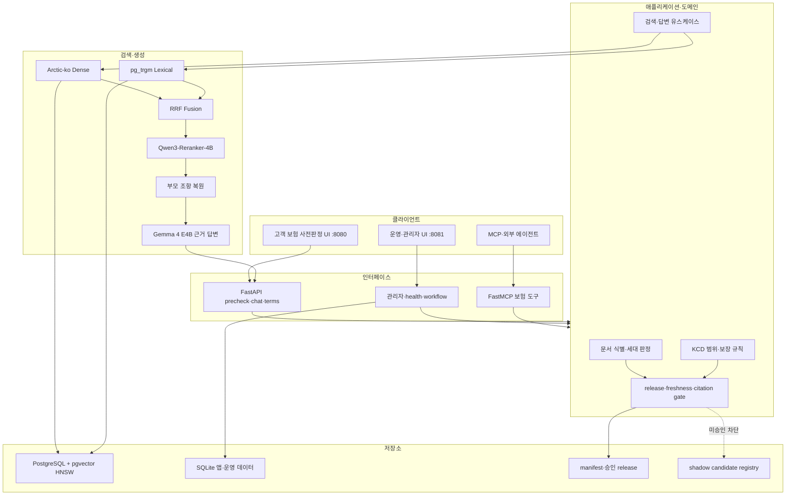
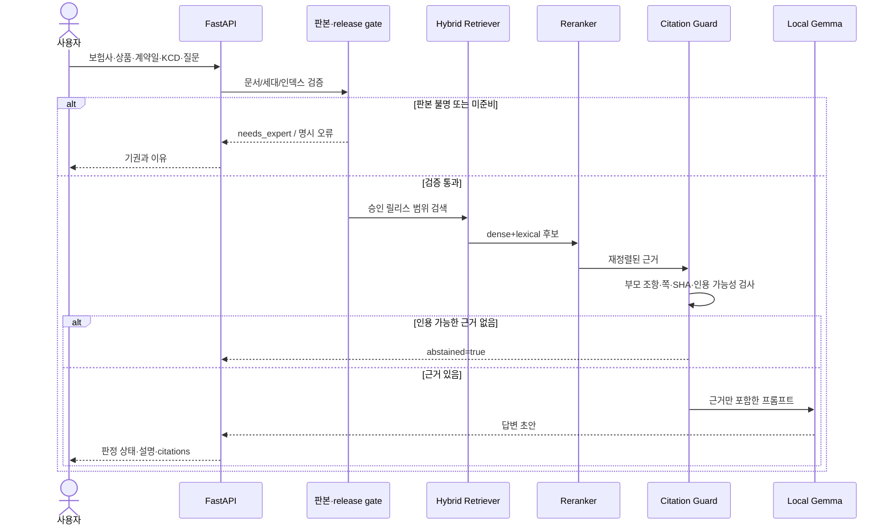
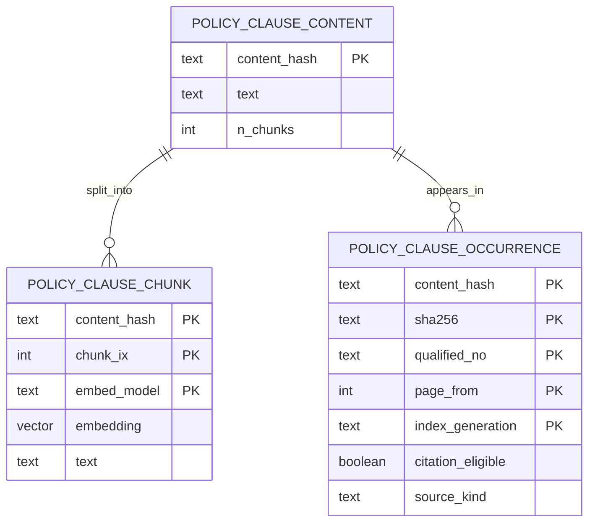
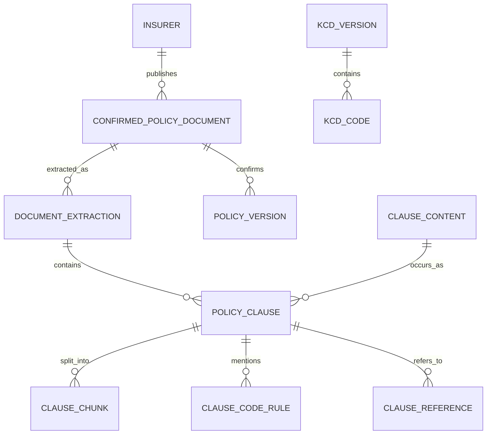

# 시스템 아키텍처 설계 보고서

## 1. 설계 목표

올바른 보험비서는 KCD 코드와 가입 시점의 실손보험 약관을 연결해 보장·면책 근거를 사전 안내한다. 핵심 원칙은 다음과 같다.

- 근거가 없으면 생성하지 않고 기권한다.
- 문서 판본·검색 인덱스·인용 locator가 검증되지 않으면 명시적으로 실패한다.
- 애플리케이션 규칙을 FastAPI, PostgreSQL, LLM 구현과 분리한다.
- 미승인 OCR 후보는 보존하되 검색·인용에서 차단한다.
- 고객 화면과 관리자 도구를 별도 프로세스와 포트로 분리한다.

## 2. 전체 구조

## 3. 계층과 책임

| 계층 | 책임 | 대표 코드 |
|---|---|---|
| Interface | HTTP·MCP 요청 검증과 응답 타입 | `app/routers/`, `app/mcp/server.py` |
| Application | 근거 검색, 기권, 판정 흐름 | `app/application/`, `app/core/usecases/` |
| Domain | 세대, KCD 범위, 인용·확정 규칙 | `app/core/domain/` |
| Adapter | pgvector, lexical, LLM, reranker 구현 | `app/adapters/` |
| Infrastructure | PostgreSQL·SQLite·FAISS·모델 서버 | `scripts/`, `app/db/` |
| Presentation | 고객·관리자 HTML/JS | `app/static/` |

Application 계층은 구체 검색 엔진 대신 포트를 사용한다. 따라서 FAISS, pgvector, Hybrid, GraphRAG를 같은 유스케이스 뒤에서 교체하고 비교할 수 있다.

## 4. RAG 요청 시퀀스

## 5. 데이터베이스 구조

### 운영 검색 3계층

- `content`: 중복 없는 부모 조항 원문.
- `chunk`: 검색용 조각과 모델별 벡터. 모델이 다른 벡터 공간이 섞이지 않게 `embed_model`을 키에 포함한다.
- `occurrence`: 어느 문서·쪽·조항에 나타났는지와 인용 게이트 필드.

### 도메인 목표 스키마

상세 ERD는 `docs/handoff/02_ERD_및_스키마.md`에 있다. 핵심은 원본 확정과 추출 실행을 분리하고, 내용 정체성과 문서 수록 위치를 분리하는 것이다.

인용 ID는 표시용 조 번호가 아니라 `document_extraction_id + ordinal`에서 만든다. 같은 문서에서 조 번호가 반복되므로 `qualified_no`만으로 유일성을 보장할 수 없기 때문이다.

## 6. 모델 아키텍처

| 단계 | 모델 | 역할 |
|---|---|---|
| 생성 | Gemma 4 E4B Instruct Q4_0 | 검색 근거를 자연어로 설명 |
| Dense retrieval | Arctic-ko 1024차원 | 한국어 보험 약관 후보 검색 |
| Reranking | Qwen3-Reranker-4B | top20 query-passage 관련도 재정렬 |
| OCR | 선별 OCR/VLM 파이프라인 | 표 후보에서 구조 facts 생성; 답변 LLM 아님 |

리랭커는 S7.1 오프라인 release를 만들었지만 `.env.example`의 `RAG_RERANK_ENABLED=false`가 기본이다. GPU 기반 실시간 serving을 준비한 뒤 플래그를 켜야 한다.

## 7. 배포·보안 경계

- 고객 앱 `:8080`: 보험 판정과 고객 기능만 탑재. 관리자 경로는 404.
- 관리자 앱 `:8081`: 인덱스 상태·로그·지식갭·검수·보고서. 인증과 ADMIN 권한 필요.
- 역할은 JWT에 넣지 않고 매 요청 DB에서 조회해 강등을 즉시 반영한다.
- 관리자 승격·강등은 CLI 전용이며 마지막 관리자 강등을 거부한다.
- 원문 질문이 필요한 지식갭은 PII 마스킹 후 제한 보관한다.
- 데이터·모델·인덱스가 미준비면 자동 생성이나 대체 결과 없이 readiness를 실패시킨다.

## 8. 관측성과 장애 처리

- 모든 요청에 `X-Trace-ID`를 부여하고 이벤트를 상관 분석한다.
- `ConfigError`, `InfraError`, `LLMOutputError`, `ValidationErr`로 실패 유형을 분리한다.
- `/api/health/ready`가 DB, 활성 릴리스, 벡터 인덱스, candidate registry를 검증한다.
- 근거를 못 찾은 정상 기권은 HTTP 장애와 구분한다.
- 승인되지 않은 후보 파일이 손상되거나 serving 가능 상태로 바뀌면 fail-closed한다.

## 9. 알려진 제약

- 로컬 Gemma 프로필은 모델 revision을 선언했지만 GGUF artifact SHA, peak memory, live verification이 비어 있다.
- 로컬 Gemma의 tool call은 검증되지 않아 도구형 에이전트에는 외부 모델 또는 별도 검증 프로필이 필요하다.
- Qwen3 실시간 리랭킹은 GPU serving이 기본 구성에 포함되지 않는다.
- 신규 OCR facts 전용 정답셋과 동시 사용자 부하 테스트는 후속 과제다.
