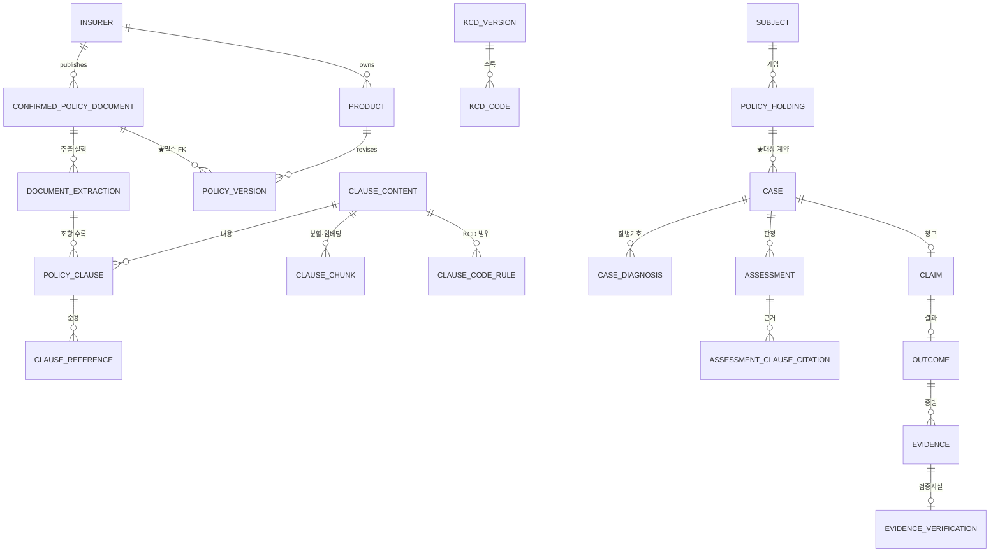

# 05A. DB 스키마

> [05_프로젝트_발표_보고서.md](05_프로젝트_발표_보고서.md) §5 의 부록. **발표 보고서 제출 요구 항목 「DB 스키마」의 정본이다.**
> 기준일 2026-08-04 · 활성 릴리스 `r2026-08-04-clause-s7.1-arctic-ko-ocr-approved`

---

## 0. 먼저 — 이 문서에는 **두 종류의 스키마**가 있다

섞어 읽으면 "27개 테이블이 돌고 있다"로 오해된다. 그렇지 않다.

| | 무엇 | 지금 상태 | 어디 |
|---|---|---|---|
| **A. 운영 검색 스키마** | PostgreSQL + pgvector **3테이블** | ★**실제로 돌고 있다.** 조각 122,772 · 발생 210,733 | §2 |
| **B. 서비스 도메인 스키마** | `core` 12 · `app` 10+뷰1 · `ops` 5 = **27테이블 + 뷰 1** | ★**설계 확정 · 적재 미착수**(0행) | §3~§6 |
| **C. 애플리케이션 SQLite** | 사용자·지식갭·운영 이벤트 | 돌고 있음. ★**커머스 잔재 테이블이 남아 있다** | §7 |

**A 와 B 는 대체 관계가 아니다.** A 는 "이 문장이 어느 조항인가"를 빠르게 찾는 검색층이고,
B 는 "이 사람의 이 계약에 어느 판본이 적용되고 무엇을 근거로 판정했나"를 남기는 기록층이다.
MVP 4주 안에서 A 를 먼저 세웠고, B 는 **행이 0개인 지금 계약을 확정해 두는 것**이 목표였다.

> ★왜 0행인데 스키마를 확정하나 — 지급결과·증빙은 **사람이 검증한 사실**이라 나중에 스키마를
> 바꾸면 이미 받은 동의·보존기간·감사기록이 소급으로 어긋난다. 행이 0개인 지금이 가장 싸다.

---

## 1. 설계의 뼈대 넷

이 네 가지가 나머지 결정을 전부 지배한다.

### ① 확정(confirm)과 추출(extract)을 나눈다

```
confirmed_policy_document   "이 PDF가 무슨 약관인지 사람이 확정했다"   ← 사람의 결정
document_extraction         "그 PDF를 이 추출기·이 스키마로 돌렸다"   ← 기계의 실행
```

한 문서를 s4·s5·s6 로 여러 번 돌린다. 합쳐 두면 **재전처리할 때마다 "누가 확정했나"가 지워진다.**

### ② 내용(content)과 수록(occurrence)을 나눈다

같은 조항이 여러 문서에 그대로 실린다. **실측(s6 전량 1,367문서)**:

| | 값 |
|---|---:|
| 조항 등장(occurrence) | **204,098** |
| 서로 다른 내용(content) | **68,431** |
| 중복률 | **66.5%** |
| 한 조항의 최대 수록 문서 수 | **170** |
| 두 문서 이상에 걸친 고유 해시 | 25,805 / 68,431 = **37.7%** |

내용마다 한 번만 임베딩하고, 인용할 때는 **어느 문서 몇 쪽인지**를 수록에서 꺼낸다.
합쳐 뒀다면 같은 문장을 170번 임베딩했을 것이다.

### ③ ★식별키는 `ordinal` 이다. `qualified_no` 가 아니다

`제4조` 는 한 문서 안에서도 반복된다(보통약관·특별약관·부록).
`(sha, qualified_no)` 로 인용을 식별하면 **41.35% 가 모호**하다.

| 식별키 | 모호율 |
|---|---:|
| `(sha256, qualified_no)` | **41.35%** |
| `{sha12}/{qualified_no}#{content_hash[:8]}` ← 현재 서빙 키 | **3.20%** |
| `(sha256, qualified_no, page_from, char_offset)` | **0%** |

→ 설계 스키마는 `UNIQUE(document_extraction_id, ordinal)` 을 쓴다. 표시용 조 번호와 식별키를 분리한다.

### ④ 외부에서 온 것은 급을 나눈다

판정 근거로 인용할 수 있는 것은 **약관 조항 하나뿐**이다.
상호작용 로그·FAQ·다른 사용자의 답변은 **문장으로 금지하는 게 아니라 FK 가 없어서 못 들어간다**(§6-1).

---

## 2. A. 운영 검색 스키마 — **지금 돌고 있는 것**

`app/adapters/pgvector_clause_index.py:400-547` `ensure_schema()` 가 만드는 그대로다.

```sql
CREATE EXTENSION IF NOT EXISTS vector;

CREATE TABLE policy_clause_content (          -- 중복 없는 부모 조항 원문
    content_hash text    PRIMARY KEY,
    text         text    NOT NULL,
    n_chunks     integer NOT NULL
);

CREATE TABLE policy_clause_chunk (            -- 검색 조각 + 모델별 벡터
    content_hash text    NOT NULL,
    chunk_ix     integer NOT NULL,
    n_chunks     integer NOT NULL DEFAULT 0,
    text         text    NOT NULL,
    embedding    vector(1024) NOT NULL,       -- Arctic-ko 1024차원
    embed_model  text    NOT NULL,
    PRIMARY KEY (content_hash, chunk_ix, embed_model)      -- ★§2-1
);
CREATE INDEX policy_clause_chunk_hnsw
    ON policy_clause_chunk USING hnsw (embedding vector_l2_ops);

CREATE TABLE policy_clause_occurrence (       -- 어느 문서 · 몇 쪽 · 인용 가능한가
    content_hash      text    NOT NULL,
    sha256            text    NOT NULL,
    insurer           text    NOT NULL DEFAULT '',
    qualified_no      text    NOT NULL DEFAULT '',
    section           text    NOT NULL DEFAULT '',
    title             text    NOT NULL DEFAULT '',
    page_from         integer NOT NULL DEFAULT 0,
    page_to           integer NOT NULL DEFAULT 0,
    citation_eligible boolean,                -- 인용 게이트
    chunk_type        text,
    is_statute        boolean,
    parse_status      text,
    index_generation  text    NOT NULL DEFAULT 's5-mixed',  -- ★§2-2
    source_kind       text    NOT NULL DEFAULT 'clause',    -- clause / annex / s7_fact
    PRIMARY KEY (content_hash, sha256, qualified_no, page_from, index_generation)
);
CREATE INDEX policy_clause_occurrence_gen ON policy_clause_occurrence (index_generation);
CREATE INDEX policy_clause_occurrence_sha ON policy_clause_occurrence (sha256);
```

### 2-1. ★`embed_model` 을 **기본키에** 넣은 이유 — 안 넣으면 조용히 샌다

적재는 `ON CONFLICT DO NOTHING` 이다. `embed_model` 이 PK 에 없으면
`(content_hash, chunk_ix)` 가 같은 **옛 모델 벡터가 자리를 지키고 새 벡터가 버려진다.**
오류는 안 난다. 적재 로그에는 "이미 있음"으로 찍힌다.

같은 이유로 옛 `ko-sroberta@128` 46,385조각은 **지우지 않았다** — `embed_model` 로 갈라져 섞이지 않는다.

### 2-2. ★`index_generation` 도 기본키에 넣는다

조항 스키마가 오르면 `content_hash` 가 바뀐다(s6 에서 부록을 본문에서 뺐다).
구·신이 한 테이블에 남으면 **오염된 옛 근거가 계속 검색된다.** 그렇다고 지우면 6시간짜리 임베딩을 버린다.
→ **지우지 않고 갈라 놓고, 검색은 현재 세대만 본다.**

기본값을 `s5` 가 아니라 **`s5-mixed`** 로 둔 것도 의도다. s5 적재 중간에 s6 발생행이 섞인 적이 있어
그 안이 순수한 s5 라고 **말할 수 없다.** 모르면 모른다고 적는다.

### 2-3. 실측 적재량 — ★**DB 를 직접 조회한 값** (2026-08-04 14:17)

```sql
-- 재현: psycopg 로 PGVECTOR_DSN 에 붙어 그대로 실행하면 같은 값이 나온다
SELECT index_generation, count(*) FROM policy_clause_occurrence GROUP BY 1;
SELECT source_kind,      count(*) FROM policy_clause_occurrence
  WHERE index_generation='s6' GROUP BY 1;
SELECT embed_model,      count(*) FROM policy_clause_chunk GROUP BY 1;
```

| 테이블 | 행 |
|---|---:|
| `policy_clause_occurrence` **전체** | **368,919** |
| ├ `index_generation = 's6'` ← ★현재 검색 세대 | **210,733** |
| └ `index_generation = 's5-mixed'` ← 이전 세대 | 158,186 |
| `policy_clause_content` | **64,607** |
| `policy_clause_chunk` | **122,772** |

**`s6` 발생 210,733의 내역**

| 구분 | 값 |
|---|---:|
| `source_kind = clause` | 200,881 |
| `source_kind = annex` | 9,002 |
| `source_kind = approved_ocr_table_fact` | **850** ← S7.1 승인 facts |
| **벡터가 있는 발생** | **190,156** |
| 벡터 없는 발생 | 20,577 |
| `citation_eligible = true` | **189,890** |

**임베딩 모델별 청크**

| `embed_model` | 청크 |
|---|---:|
| `dragonkue/snowflake-arctic-embed-l-v2.0-ko\|-\|d1024\|L8192\|c448\|o80` | **122,772** |

> ★★**두 가지를 정정한다** (2026-08-04 실측으로 확인).
>
> 1. **옛 `ko-sroberta@128` 조각 46,385개는 이 테이블에 없다.** `CLAUDE.md` 는
>    *"`embed_model` 로 갈려 섞이지 않으므로 지우지 않았다"* 고 적었는데,
>    지금 `policy_clause_chunk` 의 `embed_model` 은 **Arctic-ko 하나뿐**이다.
>    이 문서의 이전 판도 그 문장을 그대로 옮겨 적었다 — **옮겨 적기 전에 세지 않았다.**
>    언제 어떻게 사라졌는지는 **확인하지 못했다.**
> 2. **벡터가 있는 발생은 189,306 이 아니라 190,156** 이다.
>    189,306 은 S7.1 승인 fact 850 을 적재하기 **전** 값이고, `189,306 + 850 = 190,156` 이다.
>    리포트의 숫자가 틀린 게 아니라 **시점이 다르다.**

> ★벡터 없는 20,577행과 `s5-mixed` 158,186행은 게이트 값이 전부 `NULL` 이라 검색에서 막혀 있다.
> **게이트 값이 채워진 다른 세대 행은 0건**(실측) — 누수는 없다.
> 다만 "적재됐다"와 "검색된다"는 다른 말이라 나눠 적는다.

> ★`s6` 발생의 고유 `content_hash` 는 **72,723** 인데 `policy_clause_content` 는 **64,607** 행이다.
> 차이 8,116 은 `clause` 4,044 + `annex` 4,162 다 — **본문이 없는 발생**이 그만큼 있다.
> 원인은 **확인하지 못했다.** 이 행들은 부모 조항 복원이 안 되므로 인용에 쓸 수 없다.

### 2-4. 검색 지연 — HNSW 를 못 쓰던 SQL 을 고쳤다

`DISTINCT ON(content_hash)` 를 전체 조각에 **먼저** 걸어 HNSW 거리순 LIMIT 이 사실상 무력했다.
근접 후보 풀을 먼저 고르고 그 뒤에 중복을 제거하도록 바꿨다.

| warm top20 | 변경 전 | 변경 후 |
|---|---:|---:|
| p50 | 5,420ms | **323ms** |
| p95 | 6,787ms | **364ms** |
| 평균 | 5,673ms | 330ms |

고정 질의 top20 의 내용 해시·chunk index·거리·순위는 전후 **20/20 동일**했다(같은 답을 16.8배 빨리).

---

## 3. B. 서비스 도메인 스키마 — 27테이블 + 뷰 1



| 스키마 | 테이블 | 목록 |
|---|---:|---|
| `core` | 12 | `insurer` · **`confirmed_policy_document`** · **`document_extraction`** · `product` · `policy_version` · **`clause_content`** · `policy_clause` · `clause_chunk` · **`clause_code_rule`** · **`clause_reference`** · `kcd_version` · `kcd_code` |
| `app` | 10 + 뷰1 | `subject` · `policy_holding` · `case` · `case_diagnosis` · `assessment` · `assessment_clause_citation` · `claim` · `outcome` · `evidence` · **`evidence_verification`** + `cohort_stats`(VIEW) |
| `ops` | 5 | `agent_client` · `interaction_log` · `consent` · `admin_user` · `audit_log` |

### 3-1. 적재하면 몇 행인가 — 실측 (v4 전량 1,367문서 기준)

| 테이블 | 예상 행 | 근거·주의 |
|---|---:|---|
| `insurer` | **13** | ★12개사인데 13으로 세진다 — §4-1 |
| `confirmed_policy_document` | 1,703 | 고유 sha256. 매니페스트 2,121행 중 **418행이 중복** |
| `document_extraction` | 1,367 | 판정 대상(격리 336 제외) |
| `product` | ~1,179 | (보험사, 상품명) distinct |
| `policy_version` | ≥1,703 | **1파일:N버전이 있다** — §4-3 |
| `policy_clause` | **129,086** | `page_fallback` 439는 별도 |
| `clause_content` | **46,022** | 중복률 64.3% |
| `clause_chunk` | **122,512** | 800자 청크. ★occurrence 단위였다면 343,630 (2.8배) |
| `clause_code_rule` | **74,503** | canonical 단위 |
| `clause_reference` | **185,061** | 조 머리 제외 |
| `kcd_version` / `kcd_code` | **0** | ★**적재원이 저장소에 없다** — §7-2 |
| `app.*` / `ops.*` | **0** | 지급결과 수집 경로가 아직 없다 |

> ★위 행수는 **v4(s4) 산출물 기준**이다. §1-② 의 s6 수치(등장 204,098 / 고유 68,431)와 분모가 다르다.
> 스키마 판이 바뀌면 분모가 바뀐다 — 인용할 때 어느 판인지 함께 적는다.

---

## 4. `core` — 판정의 근거가 되는 것

### 4-1. `core.insurer` — 12행인데 매니페스트는 13으로 센다

```sql
id uuid PK · slug text UNIQUE · legal_name · display_name
· kind enum(general|life) · active bool
```

매니페스트 2,121행의 `insurer` 값 실측:

```
462 DB손해보험   406 삼성화재   337 현대해상   228 흥국화재   217 삼성생명
158 메리츠화재   120 KB손해보험  94 롯데손해보험  52 NH농협생명
 18 흥국생명     13 동양생명    12 NH농협손해보험
  4 samsunglife   ← ★slug 가 표시명과 섞여 별개 회사로 세어진다
```

**이 4행이 `insurer` 테이블이 필요한 이유의 전부다.** 문자열로 두면 조인이 조용히 갈라진다.
적재 전 `samsunglife → 삼성생명` 정규화가 선행돼야 한다.

★`kind` 로 삼성화재(손보)와 삼성생명(생보)이 같은 코드로 뭉치지 않게 한다.

### 4-2. ★`core.confirmed_policy_document` — 확정된 문서만 들어온다

| 컬럼 | 타입 | 비고 |
|---|---|---|
| `id` | uuid PK | |
| **`sha256`** | text UNIQUE NOT NULL | 같은 파일이 두 번 들어오지 않는다 |
| **`source_url`** | text NOT NULL | ★근거 보존 |
| **`fetched_at`** | timestamptz NOT NULL | |
| `http_status` / `bytes` / `pages` | int | 수집 당시 사실 |
| `insurer_id` | uuid FK → `insurer` | |
| **`identified_by`** | uuid NOT NULL FK → `ops.admin_user` | ★**확정에는 반드시 사람 이름이 붙는다** |
| **`identified_at`** | timestamptz NOT NULL | |
| `identification_note` | text | 무엇을 근거로 확정했나 |
| `license` / `redistributable` | text / bool | 기본 `false` |

★**`status` 컬럼이 없다.** 행이 존재하는 것이 곧 "확정됨"이다. enum 은 `UPDATE` 로 뚫린다.

**현재 확정 실적: 1,367건 중 850건(62.2%)** — `config/confirmed_documents.jsonl`.
남은 것: 모호 221(같은 문서에 다른 본약관도 있어 사람이 골라야 함) · 이름 미확인 286 · 비실손 혼입 4 · 판매시점 미상 6.

### 4-3. ★`core.document_extraction` — 추출 실행 하나

| 컬럼 | 타입 | 비고 |
|---|---|---|
| `id` | uuid PK | |
| `confirmed_document_id` | uuid NOT NULL FK | |
| **`extractor`** | text NOT NULL | `pymupdf/1.28.0` |
| **`schema_version`** | int NOT NULL | UNIQUE(`confirmed_document_id`, `schema_version`, `extractor`) |
| **`parse_status`** | enum NOT NULL | `ok`/`suspect`/`failed` — ★**기본값 없음. 누락은 fail-closed** |
| `failure_reason` | text | `no_clause_heads` 등. **상태가 아니라 이유다** |
| **`approval`** | enum NOT NULL | `candidate`/`accepted`/`rejected` — 문서당 `accepted` 는 1건 |
| `numbering` | enum | `article`/`numbered`/`none`/`ambiguous` |
| `parse_warnings` | jsonb | `[{code, detail}]` |
| `toc_pages` | int[] | |
| `unmapped_glyph_count`·`control_removed_count`·`pua_removed_count` | int NOT NULL DEFAULT 0 | ★**세어서 보고할 수 있어야** 하므로 컬럼 |
| `unmapped_glyphs` | jsonb | `{"U+F02BA": 1207, …}` |
| `extracted_at` | timestamptz | |

실측 분포 (1,367 extraction · s4 기준):

```
parse_status    ok 1,240 · suspect 108 · failed(no_clause_heads) 19
numbering       article 1,073 · numbered 275 · none 19
unmapped_glyphs 187문서 · 23종 · 5,749회
```

> ★`unmapped_glyphs` 는 항 번호 `①②③` 가 보조 PUA 로 깨진 문서를 가리킨다.
> **187문서에서 「제N항」을 특정할 수 없다.** 이걸 컬럼으로 남기지 않으면 인용 정밀도의 한계를 알 수 없다.

### 4-4. ★`core.policy_version` — 이 모델의 중심

가입일·사고일로 **어느 판본이 적용되는지** 정하는 것이 판정의 출발점이다.

| 컬럼 | 비고 |
|---|---|
| `id` uuid PK | |
| **`confirmed_document_id`** uuid **NOT NULL** FK | ★확정 문서 없이는 행을 만들 수 없다. **UNIQUE 를 걸지 않는다** |
| `product_id` uuid FK | UNIQUE(`product_id`, `version_label`) |
| `variant` | `standard`/`contract_conversion`/`conversion_resume`/`child_conversion` — ⚠ **출처 없음** |
| **`valid_from` / `valid_to`** | ★적용 구간. 사고일·가입일을 여기 맞춘다 |
| `sales_from` / `sales_to` | 판매 기간 |
| **`date_confidence`** enum NOT NULL | `exact`/`month`/`unknown` |
| **`generation`** smallint **NULL 허용** | 1~5세대 |
| `generation_source` / `generation_confidence` | `sale_start`/`product_code`/`manual`/`""` |

★**`generation` 을 NULL 허용으로 두는 것이 이 표에서 가장 중요하다.**
모르는 세대를 숫자로 채우면 그 오류가 판정까지 간다.
판정에서 참조할 수 있는 것은 `date_confidence <> 'unknown'` 인 버전뿐이다.

**★`confirmed_document_id` 에 UNIQUE 를 걸면 안 되는 실측 근거**

```
1 파일 : N 상품        156건  (최대 4상품)
1 파일 : N 판매구간    102건
```

한 PDF 가 `[계약전환용]`·`[전환·재개용]`·`[자녀보험전환용]` 처럼 복수 변형을 담거나
같은 약관이 여러 상품에 붙는다. UNIQUE 를 걸면 **156건이 적재 자체가 안 된다.**

> ⚠ **`variant` 는 채울 출처가 없다.** 매니페스트에는 `doc_type`·`identification`·`filename_kind_hint`
> 뿐이고 `variant` 가 없다. 표지 문자열에서 파생해야 하는데 **그 규칙이 아직 없다.**
> NULL 허용으로 두고 파생 규칙이 생기면 `variant_source` 와 함께 채운다. 지금 채우면 지어내는 것이다.

### 4-5. `core.clause_content` / `core.policy_clause`

```sql
-- 내용은 한 번만
clause_content:
  content_hash char(64) PK   -- sha256(hash_version ‖ norm(title) ‖ norm(content))
                             -- ★section·조 번호 제외 → 같은 내용이면 같은 해시
  hash_version, title, body, char_length

-- 수록. ★인용이 가리키는 곳
policy_clause:
  id uuid PK                                    -- ★인용은 이 ID를 가리킨다
  document_extraction_id uuid NOT NULL FK
  policy_version_id uuid FK                     -- 비정규화. 검색에서 버전 게이트가 걸리게
  ordinal int NOT NULL                          -- UNIQUE(document_extraction_id, ordinal)
  content_hash char(64) FK → clause_content
  qualified_no · section · clause_no            -- 표시·검색 전용. 유일하지 않다
  kind enum NOT NULL                            -- coverage/exclusion/definition/limit/unclassified
  citeable bool NOT NULL                        -- page_fallback 은 false
  locator jsonb                                 -- {page_from, page_to, char_offset}
  paragraph_count · table_count · tables_on_pages jsonb
```

★**`kind` 를 현재 산출물이 채우지 못한다.** 조항 분류 필드가 없다.
`unclassified` 로 넣고 **버전 있는 후처리**로 채운다. 없는 분류를 지어내지 않는다.

### 4-6. `core.clause_code_rule` — 약관이 KCD 코드를 **직접 쓴다**

이게 이 프로젝트의 핵심 조인이다. 약관 본문에 `F04∼F99`, `N39.3` 같은 코드가 그대로 적혀 있다.

| 입력 KCD | 판정 | 왜 |
|---|---|---|
| `F32` 우울증 | 조건부 | `F04∼F99` 면책이나 `F30∼F39` 예외에 든다 |
| `E66` 비만 | 면책 | 단일 코드로 명시 |
| `N39.3` 요실금 | 면책 | 세분류 지정 |
| `N39.0` | 목록 없음 | **N39.3 만 면책이다.** 세분류가 다르면 안 든다 |
| `S72` 대퇴골 골절 | 목록 없음 | ★**보장된다는 뜻이 아니다** — 보장은 '보상하는 사항'이 정한다 |

★마지막 줄이 이 서비스의 제1원칙이다. **면책 목록에 없다 ≠ 보장된다.**

---

## 5. `app` — 사람의 사례와 판정 기록 (0행 · 계약 확정)

| 테이블 | 핵심 컬럼 | 왜 이렇게 |
|---|---|---|
| `subject` | `age_band · sex · retention_until · deleted_at` | ★**생년월일을 저장하지 않는다.** `(생년월일+질병코드+보험사)` 면 개인이 특정된다 |
| `policy_holding` | `subject_id · product_id · policy_version_id · enrolled_on` | 적용 약관 확정의 **결과**가 여기 저장된다 |
| `case` | `subject_id NULLABLE`(1회 익명) · **`policy_holding_id`** · `incident_on` · `channel` | ★계약을 **직접** 가리킨다 — §5-1 |
| `case_diagnosis` | `kcd_code_id FK · ocr_confidence · user_corrected · corrected_at` | OCR 값과 **사용자 승인 값을 구분** |
| `assessment` | `policy_version_id · verdict(4단) · missing_documents jsonb · rule_engine_version · abstained · abstain_reason` | 기권이 **정상 결과**라서 컬럼으로 있다 |
| `claim`/`outcome` | `claimed_on·claimed_amount` / `decision(approved/partial/denied)·paid_amount` | |
| `evidence` | `outcome_id · doc_type · sha256 · stored_ref · consistency_checked_at · consistency_result jsonb` | |
| **`evidence_verification`** | `evidence_id UNIQUE · result · verification_method NOT NULL · verified_by · verified_at` | **append-only** |

### 5-1. `case.policy_holding_id` 를 직접 두는 이유

이전 판은 `case → subject → policy_holding` 으로 조인했다.
한 subject 가 계약을 여럿 가지면 **한 outcome 이 여러 상품 그룹에 들어갔다.**

### 5-2. ★`consistent` 는 컬럼이고 `verified` 는 행이다

정합성 검사는 **재검사되는 계산 결과**지만, 검증은 **사람이 책임진 불변 사실**이다.
그래서 `evidence.consistency_result` 는 컬럼이고 `evidence_verification` 은 별도 테이블(append-only)이다.

---

## 6. ★가장 중요한 제약 두 개

### 6-1. `app.assessment_clause_citation` — 근거가 될 수 없는 것은 **FK 가 없다**

```sql
CREATE TABLE app.assessment_clause_citation (
  assessment_id     uuid REFERENCES app.assessment(id),
  policy_clause_id  uuid,
  citeable          bool NOT NULL DEFAULT true CHECK (citeable),
  -- ★복합 FK: citeable=false 인 조항은 참조 자체가 불가능하다
  FOREIGN KEY (policy_clause_id, citeable)
      REFERENCES core.policy_clause (id, citeable),
  role       text  NOT NULL CHECK (role IN ('ground','exclusion')),
  -- 감사 재현용 스냅샷
  content_hash char(64) NOT NULL,
  quote        text     NOT NULL,
  locator      jsonb    NOT NULL,
  PRIMARY KEY (assessment_id, policy_clause_id)
);
```

**판정 근거로 인용할 수 있는 것은 `core.policy_clause` 하나뿐이다.**
상호작용 로그·FAQ·다른 사용자의 답변은 FK 가 없어서 **못 넣는다.**
`page_fallback` 조항도 복합 FK 로 차단된다 — 규칙을 문장이 아니라 **구조**로 만들었다.

> 승격 경로: 지식갭 → 사람 검수 → 문서화 → `core` 등재 → **그때부터 인용 가능**.

### 6-2. `app.cohort_stats` (VIEW) — 검증된 것만 집계에 들어간다

```sql
CREATE VIEW app.cohort_stats AS
SELECT d.kcd_code_id, ph.product_id,
       ph.policy_version_id,                                        -- ★그룹키에 버전
       pv.generation,
       count(DISTINCT o.id)                                       AS n,
       count(DISTINCT o.id) FILTER (WHERE o.decision='approved')  AS approved_n,
       count(DISTINCT o.id) FILTER (WHERE o.decision='denied')    AS denied_n,
       'verified_real'::text                                      AS data_source
FROM app.outcome o
JOIN app.claim          c  ON c.id  = o.claim_id
JOIN app."case"         ca ON ca.id = c.case_id
JOIN app.case_diagnosis d  ON d.case_id = ca.id
JOIN app.policy_holding ph ON ph.id = ca.policy_holding_id          -- ★직접 조인
JOIN core.policy_version pv ON pv.id = ph.policy_version_id
WHERE EXISTS (                                    -- ★★검증 게이트
  SELECT 1 FROM app.evidence e
  JOIN app.evidence_verification v ON v.evidence_id = e.id
  WHERE e.outcome_id = o.id AND v.result = 'verified'
)
GROUP BY 1,2,3,4;
```

- **`policy_version_id` 가 그룹키에 있어야** "약관 버전 roll-up 금지"가 지켜진다.
  이전 판은 `product_id, generation` 으로만 묶어 스스로 그 금지를 위반했다.
- `WHERE EXISTS` 절이 **정합성만 통과한 증빙(`consistent`)을 집계에서 뺀다.**
  그 검사가 확인한 것은 문서 내부 정합성일 뿐, 보험사가 실제로 그렇게 결정했는지가 아니다.
- 합성 데이터는 `data_source='synthetic'` 인 **별도 뷰**다. **두 뷰를 UNION 하지 않는다.**

API 가 덧붙이는 것: `min_sample_met` · `approval_ci`(Wilson 95%) · `warnings[]` · `as_of`.
→ 표본이 적으면 **비율 자체를 내지 않고**, 게이트를 넘겨도 **점추정 대신 구간**으로 말한다
(`app/core/domain/insurance.py:181` `rate_interval()`).

---

## 7. C. 애플리케이션 SQLite — 그리고 정직하게 남길 것

### 7-1. ★커머스 잔재가 남아 있다

이 저장소는 쇼핑몰 실습(`_unified_mall`)에서 출발해 보험 도메인으로 옮기는 중이다.
`app/db/models.py` 에는 **아직 커머스 시절 테이블이 있다.**

| 테이블 | 보험 서비스에서 | 상태 |
|---|---|---|
| `users` · `face_credentials` | 관리자 인증에 쓰인다 | 사용 중 |
| `knowledge_gaps` | 근거를 못 댄 질문 기록 | 사용 중 |
| `run_events` | 운영 이벤트 | 사용 중 |
| `products` · `inventory` · `orders` · `order_items` · `order_idempotency` · `payments` | **쓰지 않는다** | ★**커머스 잔재 · 미정리** |

**감추지 않고 적는다.** 4주 MVP 에서 도메인 전환 중이고, 이 6개는 제거 대상이다.
화면 쪽 잔재 5개(`admin`·`mypage`·`rag`·`facebench`·`common.js`)도 같은 상태다.

### 7-2. 아직 채울 수 없는 것

| | 무엇이 없나 | 결과 |
|---|---|---|
| `kcd_version` / `kcd_code` | ★**적재원이 저장소에 없다** — KCD 표준 코드 마스터를 아직 확보하지 못했다 | 0행. 지금은 약관에서 뽑은 `clause_code_rule` 로만 대조한다 |
| `policy_version.variant` | 표지 문자열 파생 규칙 없음 | NULL |
| `policy_clause.kind` | 조항 분류 필드가 산출물에 없음 | `unclassified` |
| `app.*` / `ops.*` 전부 | 실제 지급결과 수집 경로 없음 | 0행 |

---

## 8. 만드는 순서 (적재 계획)

```
P0  core.insurer → confirmed_policy_document → document_extraction
    → product → policy_version → clause_content → policy_clause
    ★여기까지가 "판정에 근거를 댈 수 있다"의 최소 집합
P1  clause_chunk(임베딩) · clause_code_rule · clause_reference
P2  app.* (사례·판정·청구·증빙) · ops.* (에이전트·동의·감사)
P3  kcd_version / kcd_code — 적재원 확보 후
```

★**P0 을 마치기 전에 `app.*` 을 만들지 않는다.** 근거를 못 대는 상태에서 판정 기록을 쌓으면
그 기록이 나중에 전부 재검증 대상이 된다.

---

## 9. 이 문서의 숫자를 어떻게 셌나 (재현)

```bash
export PYTHONIOENCODING=utf-8

# 조항·중복·인용가능 비율 (s5 ↔ s6 정합 포함)
python -m scripts.eval.consistency_check

# 표 — 고유/부착을 나눠 낸다
python -m scripts.eval.table_counts --clause-tag s6_pymupdf-1.28.0

# 확정 문서 원장
wc -l < config/confirmed_documents.jsonl        # 850

# 인덱스 A 적재 상태
curl http://127.0.0.1:8080/api/health/ready
```

## 참조

- 설계 정본: [`docs/handoff/02_ERD_및_스키마.md`](../handoff/02_ERD_및_스키마.md)
- 전 컬럼 사전(브라우저): [`docs/handoff/erd_tables.html`](../handoff/erd_tables.html)
- 적재 의뢰서: [`docs/handoff/16_DB_스키마_적재_의뢰.md`](../handoff/16_DB_스키마_적재_의뢰.md)
- 운영 DDL 원문: `app/adapters/pgvector_clause_index.py:400-547`
- 인덱스 적재 실측: [`docs/reports/2026-08-04_0100_인덱스A_적재와_두경로_정합_리포트.md`](../reports/2026-08-04_0100_인덱스A_적재와_두경로_정합_리포트.md)
- S7.1 증분 적재·지연 개선: [`docs/reports/2026-08-04_S7.1_OCR승격_최종결과.md`](../reports/2026-08-04_S7.1_OCR승격_최종결과.md)
