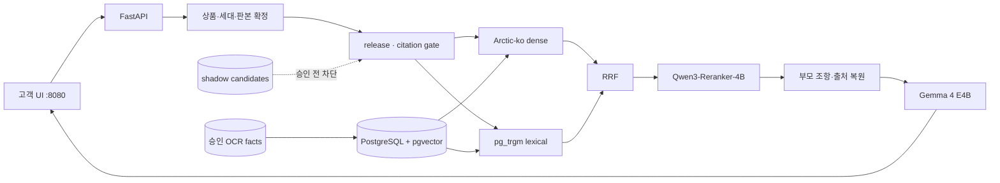
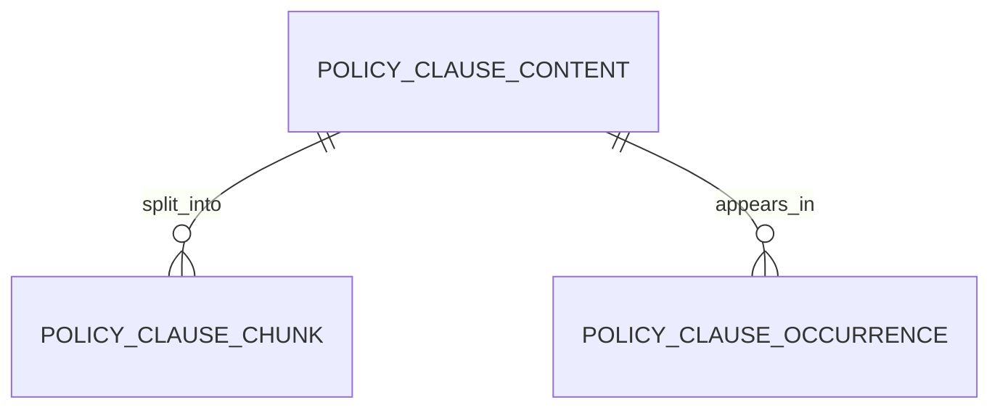

# 프로젝트 발표 보고서

**올바른 보험비서** — KCD 질병기호 × 실손보험 약관 사전판정
팀 **비서단** (송채영 · 김지혜 · 서유현 · 정재희 · 최연우) · 4주
기준일 2026-08-04 · 활성 릴리스 `r2026-08-04-clause-s7.1-arctic-ko-ocr-approved`

---

## 이 보고서의 구성 — 제출 요구 4항목이 어디 있나

| 요구 항목 | 이 문서 | **정본 부록** |
|---|---|---|
| **DB 스키마** | §5 요약 | ★[**05A_DB_스키마.md**](05A_DB_스키마.md) |
| **UI 와이어프레임 & 스토리보드** | §6 요약 | ★[**05B_UI_와이어프레임_스토리보드.md**](05B_UI_와이어프레임_스토리보드.md) |
| **사용 LLM 모델** | §7 요약 | ★[**05C_사용_LLM_모델.md**](05C_사용_LLM_모델.md) |
| **파인튜닝 모델 설계** | §8 요약 | ★[**05D_파인튜닝_모델_설계.md**](05D_파인튜닝_모델_설계.md) |

이 문서만 읽어도 전체가 파악되게 썼다. 근거·컬럼·측정치·하이퍼파라미터는 부록에 있다.

---

## 1. 무엇을 만들었나

사용자의 **KCD 질병기호**와 **가입 당시 실손보험 약관 판본**을 연결해
보장·면책 가능성을 **약관 조항 근거와 함께** 사전 안내하는 RAG 서비스.

### 해결하려는 문제

- 같은 질병도 **보험사·상품·계약 시점**에 따라 적용 약관이 다르다.
- 보장·면책 정보가 본문뿐 아니라 **표·별표·각주**에 흩어져 있다.
- PDF 표의 행·열 관계가 깨지면 금액은 읽어도 **어느 조건의 값인지** 틀릴 수 있다.
- 일반 챗봇은 그럴듯한 설명은 만들지만 **어느 약관 몇 쪽을 근거로 했는지** 보장하기 어렵다.

### ★제1원칙 — 모르면 모른다고 한다

> **"보장됩니다"라고 잘못 말하면 사람이 손해를 본다.**
> 청구했다가 거절당하거나, 받을 걸 포기한다.
> 그래서 이 프로젝트는 **정확도보다 정직성이 앞선다.**

```
정확한 약관 판본 선택
  + KCD 코드 기반 조항 검색
  + 승인된 표 사실 보강
  + 근거 조항·쪽·문서 SHA 인용
  + ★모르면 기권
  = 검증 가능한 보험 사전판정
```

이진 판정(된다/안된다)을 만들지 않는다. 판정은 **4단**이고 기권은 **정상 결과(HTTP 200)** 다.

---

## 2. 핵심 사용자 시나리오

1. 사용자가 **보험사 · 계약일 · KCD 코드**를 입력한다 (★상품명은 받지 않는다)
2. 시스템이 상품 라인과 세대, 적용 가능한 **약관 판본**을 찾는다
3. ★후보가 여럿이면 **임의로 고르지 않고 사용자에게 되묻는다**
4. 승인된 릴리스 안에서 보장·면책 조항과 표 facts 를 검색한다
5. 판정 상태 · 설명 · **근거 조항과 쪽**을 반환한다
6. 근거가 부족하면 **기권**하고 지식갭을 기록한다

---

## 3. 데이터 성과

| 항목 | 결과 |
|---|---:|
| 수집 약관 (고유 sha256) | 1,703문서 |
| 의료 실손 판정 대상 | **1,367문서** (격리 336 제외) |
| 보험사 | 12개사 |
| s6 조항 등장 | **204,098** (고유 68,431 · 중복 66.5%) |
| 조항 단위 인용 게이트 | **96.10%** |
| ★**확정 문서** | **850건** (1,367의 62.2%) |
| ★**사람 승인 OCR 표 facts** | **850건** (24패턴) |
| 승인 facts → 청크 · 문서 | 75청크 · 179문서 |
| 미승인 shadow facts | 8,622건 (DB occurrence **0**) |

> ★★**「850」이 두 번 나오는데 서로 다른 수다.** 우연히 같다.
>
> | | 무엇 | 어디 |
> |---|---|---|
> | **확정 문서 850** | 이 PDF 가 무슨 약관인지 **확정한 문서 수** | `config/confirmed_documents.jsonl` (850행) |
> | **승인 facts 850** | 사람이 원문 검수해 승인한 **OCR 표 사실 수** | S7.1 `approved_facts.jsonl` |
>
> 발표에서 섞어 말하면 청중이 같은 것으로 듣는다. **단위를 붙여 말한다.**

전처리는 범용 표 격자를 무조건 복원하지 않는다.
일반 추출이 되는 표는 통과시키고, **자기부담금처럼 다축 의미가 필요한 후보만**
OCR·유형별 추출·**사람 승인**에 보낸다.

---

## 4. 시스템 아키텍처



- 클린 아키텍처 2계층. 도메인 유스케이스는 **구체 DB·LLM 이 아니라 포트에** 의존한다
  (`tests/test_arch.py` 가 강제). pgvector·FAISS·Hybrid 를 어댑터로 교체·비교할 수 있다.
- 고객 앱(:8080)과 운영 앱(:8081)은 **다른 프로세스**다. 고객 앱에는 관리자 라우터가 **아예 없다**(404).
- 자세한 것 → [02_시스템_아키텍처.md](02_시스템_아키텍처.md)

---

## 5. DB 스키마 — 요약 (정본: [05A](05A_DB_스키마.md))

### 두 종류가 있다

| | 무엇 | 지금 |
|---|---|---|
| **A. 운영 검색** | PostgreSQL + pgvector **3테이블** | ★**실제로 돌고 있다** — 조각 122,772 · 발생 210,733 |
| **B. 서비스 도메인** | `core` 12 · `app` 10+뷰1 · `ops` 5 = **27테이블** | ★설계 확정 · 적재 미착수(0행) |



### 설계의 뼈대 넷

1. **확정과 추출을 나눈다** — 「사람이 무슨 약관인지 확정했다」와 「기계가 이 추출기로 돌렸다」는 다르다
2. **내용과 수록을 나눈다** — 같은 조항이 **최대 170개 문서**에 실린다(중복 66.5%).
   내용마다 한 번만 임베딩하고, 인용할 때 어느 문서 몇 쪽인지를 꺼낸다
3. **★식별키는 `ordinal`** — `(sha, 조번호)` 는 **41.35% 모호**하다. 표시 번호와 식별키를 분리한다
4. **외부에서 온 것은 급을 나눈다** — 판정 근거로 인용 가능한 것은 **약관 조항 하나뿐**

### 규칙을 문장이 아니라 **구조**로 만든 두 곳

```sql
-- ① 인용할 수 없는 조항은 참조 자체가 불가능하다 (복합 FK)
FOREIGN KEY (policy_clause_id, citeable) REFERENCES core.policy_clause (id, citeable)
-- ② 검증되지 않은 증빙은 집계에 들어오지 못한다 (뷰의 WHERE EXISTS)
WHERE EXISTS (SELECT 1 FROM app.evidence_verification v WHERE … v.result='verified')
```

★그리고 운영 테이블에서 **`embed_model` 과 `index_generation` 을 기본키에 넣었다.**
안 넣으면 `ON CONFLICT DO NOTHING` 때문에 **새 벡터가 조용히 버려진다** — 오류도 안 난다.

→ 전 컬럼·제약·실측 행수·DDL 원문은 [**05A**](05A_DB_스키마.md)

---

## 6. UI 와이어프레임과 스토리보드 — 요약 (정본: [05B](05B_UI_와이어프레임_스토리보드.md))

### 두 층을 섞지 않는다

- **와이어프레임** = 설계 의도 (*"왜 여기에 이 경고가 있어야 하는가"*)
- **스토리보드** = 실캡처 (*"정말 그렇게 만들었다"*)

### 화면이 지키는 것

| 설계 | 이유 |
|---|---|
| ★**상품명 입력칸이 없다** | 화면이 상품을 지어내지 않는다. 여럿이면 **되묻는다** |
| ★**동의 체크가 필수** | KCD 코드 오류 책임 경계를 **판정 전에** 긋는다 |
| ★**확정률 경고가 판정보다 위에** | 판정을 먼저 읽으면 경고를 안 읽는다 |
| **「어느 약관으로 봤나」가 필수 블록** | 답이 맞는지는 **어느 판본을 봤는지**로 결정된다 |
| 코호트를 **실제/합성 두 칸으로** | 합치면 합성이 실제로 읽힌다 |

### 스토리보드 6컷 (실캡처) — 입력 고정: 삼성화재 · `20190501` · `K02.1`

| 컷 | 화면 | 증명하는 것 |
|---:|---|---|
| 1 | 보험정보 입력 | 상품명을 비워 둔다 |
| 2 | 동의 후 등록 활성 | 책임 경계를 먼저 긋는다 |
| **3** | ★**기권 + 후보 3건** | ★**무폴백 설계의 증거** |
| 4 | 판정 + 근거 5건 | 조·부·쪽·SHA 가 실제로 붙는다 |
| 5 | 용어 설명 | 약관 원문 인용 · "보장은 판정하지 않는다" 경고 |
| 6 | 관리자 로그인 게이트 | 고객/운영 물리 분리 |

★**발표에서 컷 3(기권)을 반드시 포함한다.** 정상 성공만 보여주면 이 프로젝트의 설계가 안 보인다.

> **제출 정본**: [`docs/delivery/storyboard.html`](../delivery/storyboard.html) (브라우저로 열기)
> ★~~`docs/screen_walkthrough.html`~~ 은 **커머스 시절 화면 18장**이라 제출물에서 링크하지 않는다.

→ 와이어프레임 전체·상태표·에이전트 JSON 트랙은 [**05B**](05B_UI_와이어프레임_스토리보드.md)

---

## 7. 사용 LLM 모델 — 요약 (정본: [05C](05C_사용_LLM_모델.md))

| 슬롯 | 모델 | 상태 |
|---|---|---|
| 답변 생성 | `google/gemma-4-E4B-it-qat-q4_0-gguf` (Q4_0 · llama.cpp · 로컬 :8002) | 기본 활성 · ★artifact SHA·라이브 승인 **미완료** |
| 임베딩 | `dragonkue/snowflake-arctic-embed-l-v2.0-ko` (1024d · 8192) | 운영 인덱스 적용 중 |
| 리랭커 | `Qwen/Qwen3-Reranker-4B` | 오프라인 release 완료 · ★실시간 기본 **OFF** |
| 저지연 폴백 | `BAAI/bge-reranker-v2-m3` | 같은 평가셋에서 측정 |
| 선택형 외부 | `gpt-4o-mini` · `gemini-2.5-flash` | 키가 있을 때만 |

### 어떻게 골랐나 — 남의 벤치마크를 쓰지 않았다

- **임베딩 21회 측정**(fp16 17 + 4bit 4). 질의를 **지어내지 않고** 우리 코퍼스 문장에서 뽑았다.
  결정적이었던 것은 순위표가 아니라 **잘림**이다 — 옛 설정 `ko-sroberta@128` 은 조항의 **83.7%가 잘렸고**,
  정작 검색해야 할 면책 문구는 조항 **뒤쪽**에 있다.

  ```
  뒷부분 검색 MRR   ko-sroberta@128  0.133  →  Arctic-ko@8192  0.317  (2.4배)
  면책 표현 MRR     ko-sroberta@128  0.077  →  Arctic-ko@8192  0.341  (4.4배)
  ```

- **리랭커 5종 실측**. dense 기준선 64.65% → Qwen3-4B **84.71%**.
  ★결정적이었던 지표는 **대체표현 Hit@1** 이다(17.35% → **73.47%**) —
  사용자는 약관 문구 그대로 묻지 않는다.

### ★책상 위 권고가 실측에 뒤집힌 기록

2026-08-02 SOTA 조사는 12GB 예산에 맞춰 **`Qwen3-Reranker-0.6B`** 를 권고했다
(*"4B 급은 근거 없이 올리지 않는다"* — 옳은 절차였다).
그런데 실측에서 0.6B 는 Hit@1 **71.02%**·대체표현 **33.67%** 로 크게 밀렸고 **처리량마저 느렸다.**
→ 결론을 바꿨다. 다만 4B 는 12GB 상주 예산에 안 들어가 **오프라인 release 로만** 쓴다.

### ★생성 LLM 이 하지 않는 일

**보장 여부를 결정하지 않는다.** 판정은 규칙엔진과 인용 게이트가 하고,
LLM 은 확정된 근거를 **읽기 쉽게 옮겨 적는다.** 근거 0건이면 **LLM 을 호출조차 하지 않는다.**

→ 측정표·revision·12GB VRAM 예산·추론 파라미터는 [**05C**](05C_사용_LLM_모델.md)

---

## 8. 파인튜닝 모델 설계 — ★**미실행 · 설계안** (정본: [05D](05D_파인튜닝_모델_설계.md))

### 우리는 파인튜닝을 하지 않았다

품질 향상은 전부 다른 데서 왔다 — 데이터 정제 · 임베딩 교체 · 리랭커 도입 · 사람 승인 OCR facts.
**발표에서 "파인튜닝 완료"라고 말하지 않는다.**

### ★파인튜닝이 고칠 수 **없는** 것 — 이게 설계의 출발점

| 실패 | 왜 학습으로 안 되나 |
|---|---|
| 검색이 조항을 못 찾음 | 후보에 없는 것을 만들어 내면 그게 환각이다 |
| 잘못된 판본을 고름 | 판본 확정은 조회 문제다 |
| 표의 행·열이 깨짐 | 학습으로 복원하면 **그럴듯하게 틀린 값**이 생긴다 |
| 약관 자체에 없음 | 기권이 정답이다 |

### 착수 조건 넷 — 현재 **전부 미충족**

| 조건 | 지금 |
|---|---|
| 승인 `질의–근거–답변` ≥ 3,000건 | **0건** |
| 문서 SHA·상품계열 단위 holdout | 생성용 평가셋 없음 |
| 모든 주장에 citation + 이중 검수 | 프로세스 미정의 |
| 근거성·기권·인용 정확도 **동시** 개선 증명 | baseline 미측정 |

### 조건이 갖춰지면 이렇게 한다

```yaml
방식      QLoRA — 베이스 가중치 미변경, adapter 만 산출 (롤백이 한 줄)
양자화    4-bit NF4 · double quant · compute bf16
LoRA      r=16 · alpha=32 · dropout=0.05 · target [q,k,v,o]_proj
스케줄    seq 2048 · micro-batch 1 · grad-accum 16 · lr 2e-4
          cosine · warmup 3% · 2 epochs · seed 42 · gradient checkpointing
데이터    승인 조항 QA 1,800 + 승인 OCR QA 600 + ★기권 사례 600 = 3,000
분할      ★(document_sha256, product_line) 단위 — 랜덤 분할 금지
          같은 조항이 최대 170문서에 실려 행 단위 분할은 train↔test 누수를 만든다
평가      citation precision · groundedness · abstention P/R · schema validity
          ★넷 중 하나라도 회귀하면 채택하지 않는다
VRAM      약 5~7 GiB 추정 (12GB 안) — ★실측 아님. pilot 필요
```

★**학습 데이터에 약관 원문이 들어간다** → 외부 GPU(RunPod 등)로 보낼 수 없다.
학습은 **로컬 12GB 안에서 끝나야 한다.** 이것도 QLoRA 를 고른 이유다.

→ 데이터 규격·제외 목록·분할 검사·평가 프로토콜·롤백은 [**05D**](05D_파인튜닝_모델_설계.md)

---

## 9. 테스트 성과

| 지표 | 결과 | 범위 |
|---|---:|---|
| **기본 CI** | **685 passed · 1 skipped · 0 failed** | 2026-08-04 실행 · [04](04_테스트_계획_및_결과.md) |
| retrievable Hit@1 | 84.71% | 314문항 · Qwen3-4B 리랭크 후 |
| retrievable MRR@10 | 0.9101 | 같음 |
| 전체 Hit@1 | 63.79% | 417문항 · 종단 |
| 기존 gold rank 회귀 | **0건** | S7 → S7.1 |
| 승인 OCR occurrence | 850/850 적재 | |
| 미승인 후보 occurrence | **0** | 차단 확인 |
| pgvector top20 p50 / p95 | 323ms / 364ms | warm · 개선 전 5,420ms |
| 운영 readiness | `ready=true` | |

★**두 지표를 함께 낸다.** 전체(63.79%)가 낮은 주원인은 리랭커가 복구할 수 없는
gold 결측이고, 이걸 리랭커 실패와 섞으면 진단이 틀린다.

---

## 10. 한계 — 발표에서 빼지 않는다

1. **보험금 지급을 확정하는 서비스가 아니다.** 약관 확인을 돕는 사전판정이다.
2. **확정 850건은 기계 대조까지다.** 사람 최종 승인은 **0건**.
   엄격 모드(`config/precheck_mode.json` → `human_signoff`)로 바꾸면 판정 가능 약관은 **0건**이 된다.
3. **신규 OCR 자기부담 facts 전용 독립 정답셋이 없다.** 측정한 것은 **기존 검색 비회귀**까지다.
4. **로컬 Gemma 의 artifact SHA·라이브 품질 승인이 끝나지 않았다**(`verified_at: null`).
5. **Qwen3 리랭커는 실시간 기본 OFF** 다. GPU serving·동시성·OOM 시험이 남았다.
6. **미승인 8,622 candidate facts 는 운영 답변에 쓰지 않는다.**
7. **스토리보드는 한 흐름(삼성화재·K02.1)이다.** 같은 점검에서 `M51.2`·`J20.9` 는
   **근거를 못 찾아 기권**했다 — 면책에 없다는 뜻이지 보장된다는 뜻이 아니다.
8. **관리자 대시보드 안쪽은 캡처하지 못했다.** 컷6 이 증명하는 것은 「잠겨 있다」까지다.
9. **커머스 잔재가 남아 있다.** 이 저장소는 쇼핑몰 실습에서 출발해 전환 중이고,
   SQLite 테이블 6개와 화면 5개가 미정리 상태다 → [05A §7-1](05A_DB_스키마.md)

---

## 11. 기대 효과와 후속 계획

- 사용자가 **자신의 약관 판본과 KCD 근거를 한 화면에서** 확인한다
- 상담자는 **어느 문서 몇 쪽에서 나온 판단인지 재현**할 수 있다
- OCR 후보를 버리지 않으면서도 **승인 전 오염을 막는다**

**다음**: OCR 전용 holdout · B8/F4 사람 승인 · 동시 사용자 부하 시험 ·
모델 artifact SHA·메모리 실측 · 세대 설정 원문 검증

---

## 발표 흐름 (5분)

| 시간 | 무엇 | 화면 |
|---|---|---|
| 0:00–0:40 | 문제 — 같은 KCD 라도 보험사·시점에 따라 약관이 다르다 | §1 |
| 0:40–1:20 | 입력 → 판본 확정 | 컷 1·2 |
| **1:20–2:10** | ★**기권 장면** — 아무 상품이나 고르지 않는다 | **컷 3** |
| 2:10–3:00 | 판정과 근거 조항(조·부·쪽·SHA) | 컷 4 |
| 3:00–3:40 | 구조 한 장 — Arctic-ko → RRF → Qwen3 → Gemma | §4 |
| 3:40–4:30 | 무엇을 어떻게 골랐나 — 잘림 83.7% 이야기 | §7 |
| 4:30–5:00 | 한계와 다음 | §10 |

→ 촬영 대본은 [06_시연영상_시나리오.md](06_시연영상_시나리오.md)

---

## 참조

| | 문서 |
|---|---|
| 부록 | [05A DB 스키마](05A_DB_스키마.md) · [05B UI](05B_UI_와이어프레임_스토리보드.md) · [05C LLM](05C_사용_LLM_모델.md) · [05D 파인튜닝](05D_파인튜닝_모델_설계.md) |
| 다른 제출 항목 | [01 데이터·전처리](01_수집데이터_및_전처리.md) · [02 아키텍처](02_시스템_아키텍처.md) · [03 RAG 구현](03_RAG_LLM_벡터DB_구현.md) · [04 테스트](04_테스트_계획_및_결과.md) |
| 시연·인수인계 | [06 시연영상](06_시연영상_시나리오.md) · [07 앱 결과물](07_프로젝트앱_결과물_인수인계.md) |
| 도메인 원칙 | 저장소 루트 [`CLAUDE.md`](../../CLAUDE.md) |
