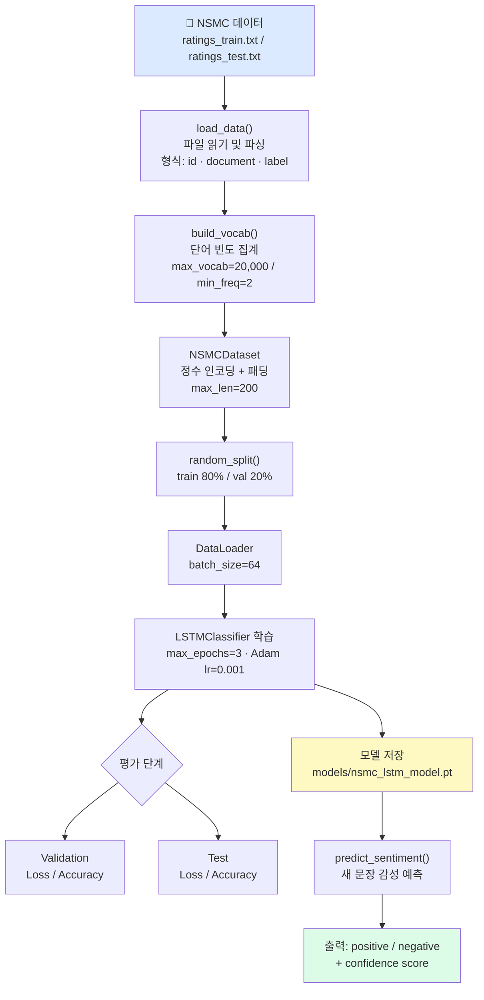
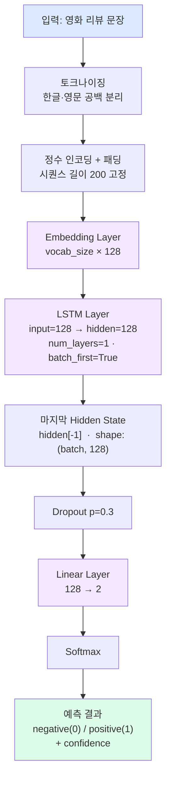
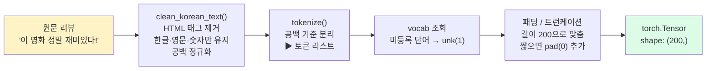

# nlp_model_project

`nlp_model_project`는 자연어 처리 실습용 PyCharm 프로젝트입니다.  
제공된 두 개의 Python 파일을 포함하며, 각각 CNN 기반 스팸 메일 분류와 LSTM 기반 IMDB 영화 리뷰 감성 분류 실습을 수행합니다.

## 1. 프로젝트 구성

```text
nlp_model_project/
│
├─ src/
│  ├─ __init__.py
│  ├─ cnn_spam_classifier.py
│  └─ lstm_imdb_lightning.py
│
├─ assignment/
│  ├─ LSTM_movie_review.py
│  ├─ ratings_train.txt
│  └─ ratings_test.txt
│
├─ data/
│
├─ models/
│  └─ nsmc_lstm_model.pt
│
├─ .gitignore
├─ requirements.txt
└─ README.md
```

## 2. 포함된 Python 파일

### 2.1 `src/cnn_spam_classifier.py`

SMS 스팸 메일 데이터를 사용하여 정상 메일과 스팸 메일을 분류하는 PyTorch CNN 모델입니다.

주요 흐름은 다음과 같습니다.

1. SMS 스팸 데이터셋 다운로드
2. 불필요한 열 제거
3. `ham`, `spam` 라벨을 숫자로 변환
4. 중복 데이터 제거
5. 단어 사전 생성
6. 문장을 정수 시퀀스로 변환
7. 패딩으로 문장 길이 통일
8. `Embedding + Conv1D + GlobalMaxPooling + Linear` 구조의 CNN 모델 학습
9. 테스트 정확도 출력

실행 명령:

```bash
python src/cnn_spam_classifier.py
```

### 2.2 `src/lstm_imdb_lightning.py`

IMDB 영화 리뷰 데이터셋을 사용하여 리뷰가 긍정인지 부정인지 분류하는 LSTM 모델입니다.

주요 흐름은 다음과 같습니다.

1. `torchtext`를 이용한 Field 객체 생성
2. IMDB 데이터셋 로드
3. Vocabulary 생성
4. FastText 임베딩 벡터 사용
5. BucketIterator로 데이터 로더 생성
6. PyTorch Lightning 기반 LSTM 모델 정의
7. Trainer를 이용한 학습 수행

실행 명령:

```bash
python src/lstm_imdb_lightning.py
```

### 2.3 `assignment/LSTM_movie_review.py`

네이버 영화 리뷰(NSMC) 데이터를 사용하여 한글 리뷰의 감성(긍정/부정)을 분류하는 LSTM 모델입니다.  
PyTorch Lightning 기반으로 작성되었으며, `lstm_imdb_lightning.py`를 한글 데이터에 맞게 커스터마이징하였습니다.

실행 명령:

```bash
python assignment/LSTM_movie_review.py
```

---

## 순서도 및 모델 구조

### 전체 파이프라인 순서도



---

### LSTM 모델 구조



---

### 데이터 전처리 흐름



---

### 하이퍼파라미터 요약

| 항목 | 값 |
|---|---|
| max_len | 200 |
| max_vocab_size | 20,000 |
| min_freq | 2 |
| batch_size | 64 |
| embedding_dim | 128 |
| hidden_dim | 128 |
| num_layers | 1 |
| dropout | 0.3 |
| learning_rate | 0.001 |
| max_epochs | 3 |
| val_ratio | 0.2 (80/20 분할) |

---

## 3. Python 버전

이 프로젝트는 Python 3.11 기준으로 구성했습니다.

PyCharm에서 인터프리터를 만들 때 다음과 같이 설정합니다.

```text
Python 3.11
```

## 4. 가상환경 생성 방법

PyCharm 터미널 또는 Windows CMD에서 프로젝트 폴더로 이동한 뒤 실행합니다.

```bash
python -m venv .venv
```

Windows에서 가상환경 활성화:

```bash
.venv\Scripts\activate
```

macOS/Linux에서 가상환경 활성화:

```bash
source .venv/bin/activate
```

## 5. 패키지 설치

```bash
python -m pip install --upgrade pip setuptools wheel
pip install -r requirements.txt
```

## 6. PyTorch 설치 참고

GPU를 사용하는 경우 CUDA 버전에 맞는 PyTorch 설치 명령이 필요할 수 있습니다.  
CPU만 사용하는 경우에도 위의 `requirements.txt` 설치로 대부분 실행 가능합니다.

설치 후 PyTorch 인식 여부는 다음 명령으로 확인할 수 있습니다.

```bash
python -c "import torch; print(torch.__version__); print(torch.cuda.is_available())"
```

## 7. 중요 실행 참고사항

### CNN 스팸 분류 코드

`cnn_spam_classifier.py`는 Python 3.11 환경에서 실행하기 비교적 쉽습니다.  
실행 시 인터넷에서 `spam.csv` 파일을 자동으로 다운로드합니다.

### LSTM IMDB 코드

`lstm_imdb_lightning.py`는 원본 실습 코드 구조를 유지하기 위해 `torchtext.legacy` 기반 코드가 포함되어 있습니다.  
하지만 최신 Python 3.11 및 최신 torchtext에서는 `torchtext.legacy`가 제거되어 실행 오류가 발생할 수 있습니다.

따라서 Python 3.11에서 실행할 경우 다음 중 하나를 선택해야 합니다.

1. 코드를 최신 `torchtext` 또는 일반 PyTorch `Dataset/DataLoader` 방식으로 수정한다.
2. 원본 실습 환경과 호환되는 Python/torchtext 구버전 환경을 별도로 사용한다.

수업 실습에서는 먼저 `cnn_spam_classifier.py`를 실행하여 PyTorch 기반 텍스트 분류 전체 흐름을 확인한 뒤,  
`lstm_imdb_lightning.py`는 RNN/LSTM 구조 학습용 코드로 분석하는 방식을 권장합니다.

## 8. GitHub 업로드 순서

프로젝트 폴더에서 아래 명령을 실행합니다.

```bash
git init
git add .
git commit -m "Initial commit: NLP model project"
git branch -M main
git remote add origin https://github.com/사용자계정/nl_model_project.git
git push -u origin main
```

GitHub에서 `nlp_model_project` 이름으로 빈 리포지토리를 먼저 만든 뒤, 위 명령의 주소를 본인 저장소 주소로 바꾸면 됩니다.

## 9. 학습 결과 파일 관리

학습 중 생성되는 모델 파일, 데이터 파일, 캐시 파일은 GitHub에 올리지 않도록 `.gitignore`에 제외 설정했습니다.

대표 제외 대상은 다음과 같습니다.

```text
spam.csv
*.pt
*.pth
*.ckpt
models/
.vector_cache/
.data/
.cache/
```

## 10. 수업 활용 방법

이 프로젝트는 다음 흐름으로 수업에 활용할 수 있습니다.

1. PyCharm 프로젝트 생성
2. GitHub 리포지토리 생성
3. `.gitignore`, `requirements.txt`, `README.md` 역할 설명
4. CNN 텍스트 분류 코드 실행
5. LSTM 코드 구조 분석
6. GitHub에 최초 커밋 및 푸시


